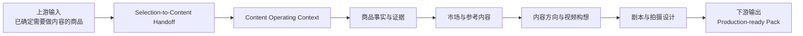
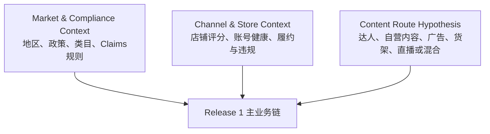
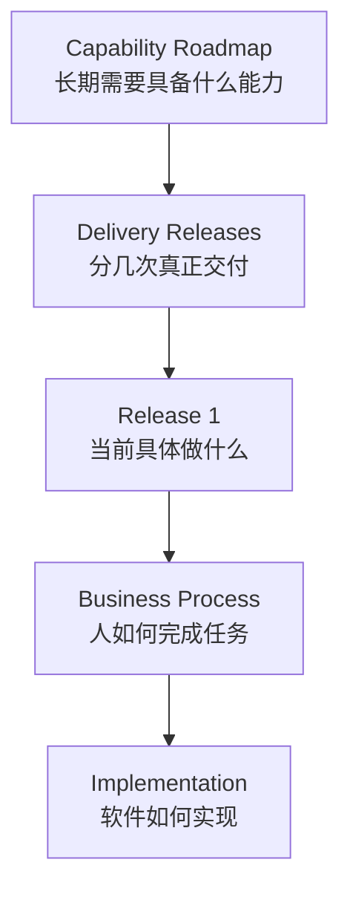
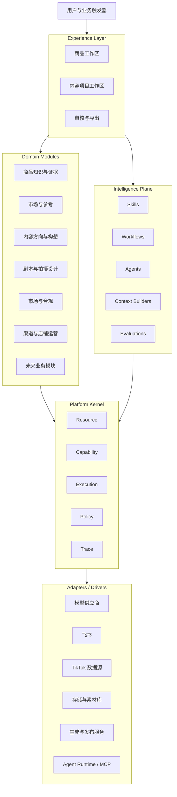
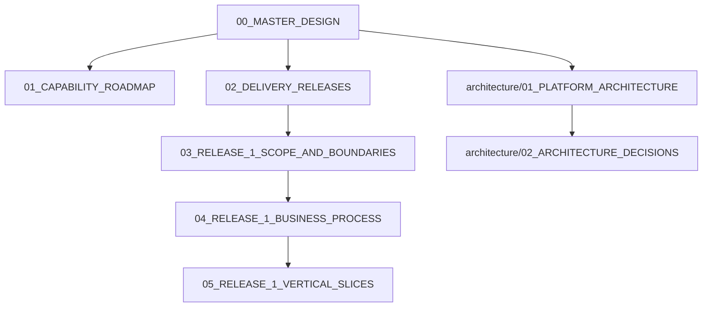

# 00_MASTER_DESIGN

## 1. 文档职责

本文档是项目一级总纲，只冻结系统级方向：

- 项目为什么存在。
- 长期业务价值链。
- 当前从完整价值链中截取哪一段。
- Capability Roadmap 与 Delivery Releases 的区别。
- Platform Kernel、Domain Modules、Intelligence Plane、Adapters 的高层关系。
- 当前交付版本的边界。
- 上游业务可以被跳过，但上游决策输出不能丢失。
- 市场合规、渠道与店铺状态如何作为横向上下文进入当前系统。
- 全局设计原则与禁止项。
- 下层文档的权威关系。

本文档不冻结：

- 详细业务步骤。
- 领域对象最终字段。
- 数据库表、API 和代码目录。
- 页面布局。
- Prompt、Skill 和 Tool 实现。
- LangChain、LangGraph、MCP 或具体模型选型。

---

## 2. 项目背景

当前 TikTok 商品内容生产的核心问题，不是缺少一个会写脚本或生成视频的模型，而是缺少一条稳定、可追溯、可复用的业务链：

- 商品事实、供应商宣称、实物观察和 AI 推断容易混杂。
- 参考视频与自有构想之间缺少证据关系。
- 构想、剧本、拍摄设计和后续生产难以追溯。
- 选品阶段对“这个商品未来靠什么路径销售”的判断，容易在进入内容系统时丢失。
- 店铺健康、地区政策和渠道状态经常被当作临时经验，而不是正式上下文。
- 业务流程经常被单个工具或 Agent 框架反向塑造。
- AI 输出容易被误当成正式业务事实。
- 技术架构扩张速度快于真实业务验证速度。

---

## 3. 长期业务价值链


这张图是长期业务全景，不代表当前必须按顺序开发全部环节。

---

## 4. 当前交付焦点

当前先截取完整价值链中的中段：



当前产品暂定名称：

> **Release 1：内容决策与前期制作工作台**

系统可以从业务链中段开始，但不能把上游选品输出简化成一个 Product ID。

Release 1 至少接收：

- 为什么这个商品进入内容阶段。
- 初始商业化路径假设。
- 内容路径假设。
- 目标市场。
- 地区合规上下文。
- 渠道、店铺和账号上下文。
- 店铺健康状态快照。
- 当前内容投入等级与测试假设。

---

## 5. 两类横向业务上下文



### 5.1 Market & Compliance Context

负责表达：

- 目标市场。
- 平台与类目规则。
- 禁售、限售和认证要求。
- Claims 与广告表达规则。
- 生效日期和规则版本。
- 必要免责声明和风险。

### 5.2 Channel & Store Context

负责表达：

- 店铺与账号。
- 店铺评分和账号健康。
- 违规、履约、退货与差评状态。
- 当前是否适合放大流量。
- 发布和投入限制。

### 5.3 Content Route Hypothesis

负责表达：

- 商品主要依赖达人、自营内容、广告、货架、直播或混合路径。
- 内容在商业路径中承担什么作用。
- 当前要验证什么假设。
- 预期投入强度。

---

## 6. Capability Roadmap 与 Delivery Releases



- Capability Roadmap 是长期能力地图，不是时间表。
- Delivery Releases 是产品交付切片，不要求和完整业务链顺序一致。
- 当前只详细设计 Release 1。
- 后续 Release 只冻结边界，不提前展开字段、页面和代码。

---

## 7. 系统总体结构



---

## 8. Platform Kernel

Kernel 只提供五种高度抽象的稳定机制：

- Resource：资源身份、关系、版本和生命周期。
- Capability：可执行能力的输入输出契约。
- Execution：运行、状态、重试、暂停、恢复和幂等。
- Policy：权限、风险、成本和人工闸门。
- Trace：运行、版本、成本、审批和审计追踪。

Kernel 不认识：

- Product。
- TikTok。
- Script。
- Store Rating。
- US Policy。
- LangGraph。
- OpenAI。

市场政策和店铺状态属于 Domain Context；Kernel Policy 只负责执行允许、拒绝和审批。

---

## 9. 全局设计原则

1. **业务先于技术。**
2. **Release 可以跳过上游模块，但不能丢失上游决策输出。**
3. **Kernel Contract 先定义，Kernel Implementation 按需生长。**
4. **固定 Workflow 优先于自由 Agent。**
5. **AI 输出默认是草稿。**
6. **高风险、高成本、不可逆和对外动作必须进入 Policy 与人工闸门。**
7. **市场政策与店铺状态必须版本化或快照化。**
8. **结构化关系优先于把所有资料塞进 RAG。**
9. **模块化单体优先。**
10. **技术框架通过 Adapter 隔离。**
11. **所有智能运行必须可追踪和可评估。**
12. **每个 Release 必须形成可独立验收的业务闭环。**

---

## 10. 当前禁止项

当前不做：

- 完整通用 Agent OS。
- 自由多 Agent 协商。
- 微服务拆分。
- Kubernetes。
- 复杂事件总线。
- 全球政策自动采集平台。
- 店铺实时监控中心。
- 自动违规预测。
- 复杂长期记忆系统。
- Agent 直接访问数据库。
- LangGraph State 直接作为业务主数据。
- 为未来阶段提前实现全部 Kernel 能力。
- 未经真实业务验证就冻结字段、页面和 API。

---

## 11. 文档权威关系



---

## 12. 当前状态

```yaml
baseline_version: "0.2"
status: BASELINE_CANDIDATE
implementation_allowed: false
next_step: "评审并逐步讨论 04 与 05"
```
