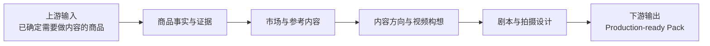
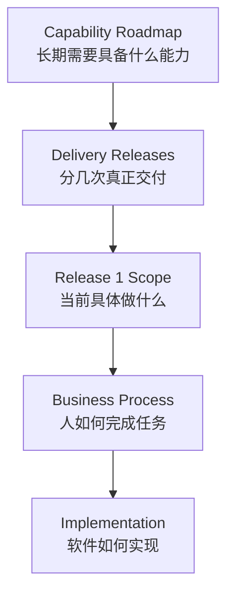
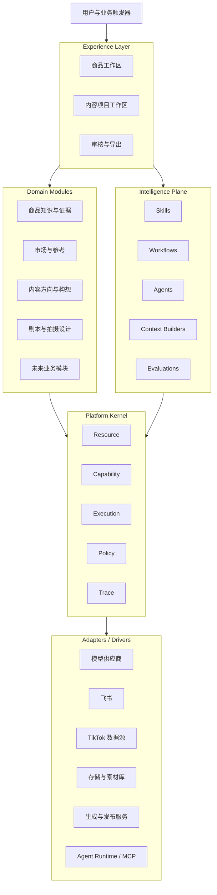
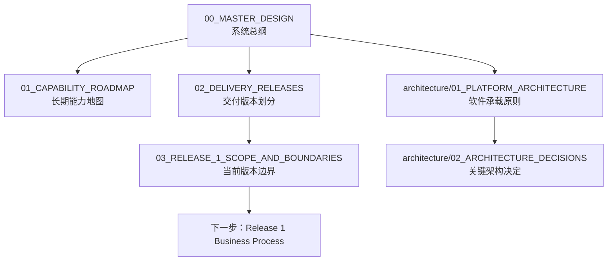

# 00_MASTER_DESIGN

## 1. 文档职责

本文档是项目一级总纲，只冻结系统级方向：

- 项目为什么存在。
- 长期业务价值链。
- 当前从完整价值链中截取哪一段。
- Capability Roadmap 与 Delivery Releases 的区别。
- Platform Kernel、Domain Modules、Intelligence Plane、Adapters 的高层关系。
- 当前交付版本的边界。
- 全局设计原则与禁止项。
- 下层文档的权威关系。

本文档不冻结详细业务步骤、领域对象最终字段、数据库表、API、页面像素、Prompt、Skill 实现、Agent 框架或模型供应商。

## 2. 项目背景

当前 TikTok 商品内容生产的核心问题，不是缺少一个会写脚本或生成视频的模型，而是缺少一条稳定、可追溯、可复用的业务链：

- 商品事实、供应商宣称、实物观察和 AI 推断容易混杂。
- 参考视频与自有构想之间缺少证据关系。
- 构想、剧本和拍摄设计难以追溯。
- 业务流程容易被单个工具或 Agent 框架反向塑造。
- AI 输出容易被误当成正式业务事实。

## 3. 长期业务价值链


这张图是长期业务全景，不代表当前必须按顺序开发全部环节。

## 4. 当前交付焦点



当前产品暂定名称：

> **Release 1：内容决策与前期制作工作台**

当前系统可以从业务链中段开始。上游商品机会与立项、下游生产与发布，先通过人工、飞书、文件导入和导出包衔接。

## 5. Capability Roadmap 与 Delivery Releases



- Capability Roadmap 是长期能力地图，不是时间表。
- Delivery Releases 是产品交付切片，不要求和完整业务链顺序一致。
- 当前只详细设计 Release 1。
- 后续 Release 只冻结边界，不提前展开字段、页面和代码。

## 6. 系统总体结构



### 6.1 Platform Kernel

Kernel 只提供五种高度抽象的稳定机制：

- Resource：资源身份、关系、版本和生命周期。
- Capability：可执行能力的输入输出契约。
- Execution：运行、状态、重试、暂停、恢复和幂等。
- Policy：权限、风险、成本和人工闸门。
- Trace：运行、版本、成本、审批和审计追踪。

Kernel 不认识 Product、TikTok、Script、LangGraph 或 OpenAI。

### 6.2 Domain Modules

Domain Modules 承载全部业务语义，例如 Product、Evidence、Reference、Content Project、Creative Concept、Script Version、Storyboard 和 Shot List。

### 6.3 Intelligence Plane

Agent、Skill、Workflow、Context Builder 和 Evaluation 都属于 Intelligence Plane，而不是 Kernel。

### 6.4 Adapters / Drivers

LangChain、LangGraph、Agent SDK、MCP、模型 API、Scrape Creators、Kling、Seedance、TikTok 等均通过可替换 Adapter 接入。

## 7. 全局设计原则

1. 业务先于技术。
2. Kernel Contract 先定义，Kernel Implementation 按需生长。
3. 固定 Workflow 优先于自由 Agent。
4. AI 输出默认是草稿。
5. 高风险、高成本、不可逆和对外动作必须进入 Policy 与人工闸门。
6. 结构化关系优先于把所有资料塞进 RAG。
7. 模块化单体优先。
8. 技术框架通过 Adapter 隔离。
9. 所有智能运行必须可追踪、可评估。
10. 每个 Release 必须形成可独立验收的业务闭环。

## 8. 当前禁止项

当前不做：

- 完整通用 Agent OS。
- 自由多 Agent 协商。
- 微服务拆分。
- Kubernetes。
- 复杂事件总线。
- 复杂长期记忆系统。
- Agent 直接访问数据库。
- LangGraph State 直接作为业务主数据。
- 为未来阶段提前实现全部 Kernel 能力。
- 未经真实业务验证就冻结字段、页面和 API。

## 9. 文档权威关系



权威顺序：

```text
Master
> Capability Roadmap / Delivery Releases
> Release Scope / Platform Architecture
> Business Process / Domain Model / Product Design
> Data Contract / Implementation Plan
> Code
```

## 10. 当前状态

```yaml
baseline_version: "0.1"
status: BASELINE_CANDIDATE
implementation_allowed: false
next_document: 04_RELEASE_1_BUSINESS_PROCESS.md
```

六份一级文档评审通过后，可标记为 `BASELINE_APPROVED`。在 Release 1 业务流程完成前，不开始正式业务代码。
