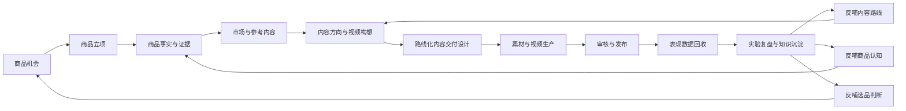
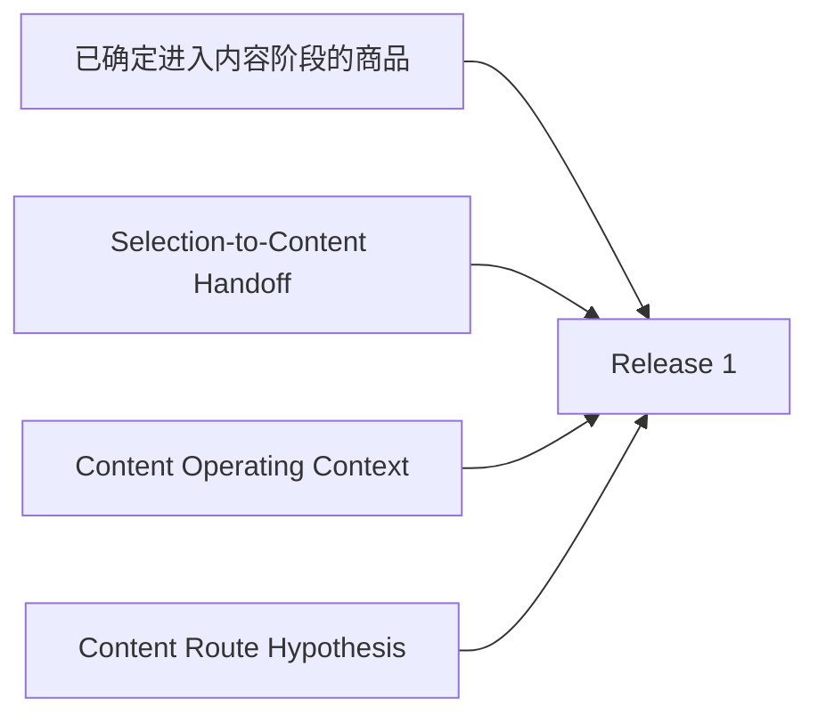
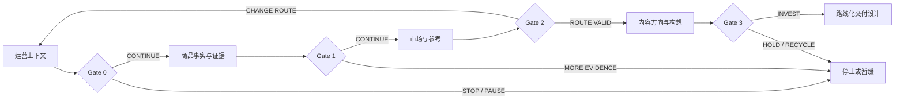
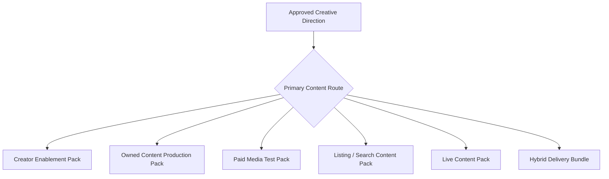
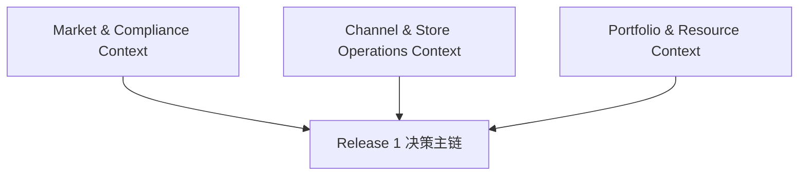
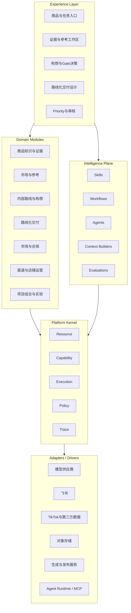
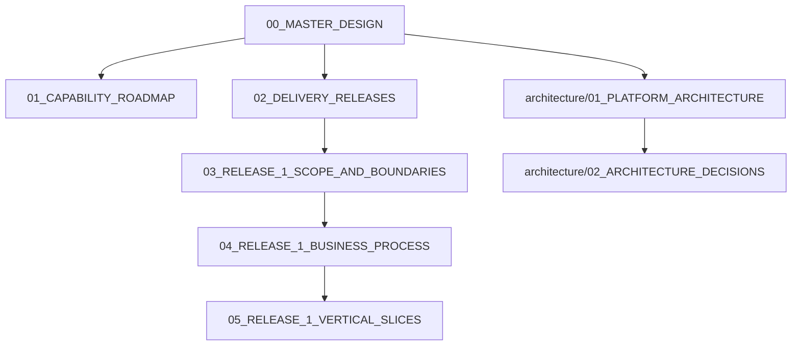

# 00_MASTER_DESIGN

## 1. 文档职责

本文档是项目一级总纲，冻结系统长期方向、当前交付边界和最高层架构原则。

本文档回答：

- 这个系统为什么存在。
- 长期业务价值链是什么。
- Release 1 从完整链路中截取哪一段。
- 上游选品决策如何交接给内容系统。
- 市场、合规、渠道和店铺状态如何影响内容决策。
- 为什么系统不能是一条默认走到剧本的直线流水线。
- Platform Kernel、Domain Modules、Intelligence Plane 与 Adapters 的关系。
- 下层文档的权威关系。

本文档不冻结：

- 数据库字段与表结构。
- API 和代码目录。
- 页面布局。
- Prompt、Skill 和 Agent 实现。
- LangChain、LangGraph、MCP 或模型供应商选型。
- Gate、Route Hypothesis、Priority 和 Experiment Contract 的最终字段。

---

## 2. 系统定位

本系统不是“输入商品后自动生成视频脚本”的工具。

本系统的长期定位是：

> 围绕商品、市场、渠道和经营约束，持续判断应该做什么内容、是否值得继续投入、应走哪条内容路线、如何形成可执行交付物，并通过后续表现数据验证或推翻原始假设。

当前 Release 1 聚焦：

```text
商品进入内容阶段
→ 商品事实与证据
→ 市场与参考内容
→ 内容方向与构想
→ 路线化交付设计
```

---

## 3. 长期业务价值链



这张图是业务全景，不等于实现顺序。

---

## 4. Release 1 入口

Release 1 不能只接收一个 Product ID。

它至少接收：



### 4.1 Selection-to-Content Handoff

说明：

- 为什么这个商品进入内容阶段。
- 初始商业化路径是什么。
- 内容承担什么作用。
- 当前需要验证什么。
- 初始投入等级和责任人。

### 4.2 Content Operating Context

包括：

- Target Market。
- Platform。
- Product Category。
- Market Compliance Profile Snapshot。
- Channel / Store / Account Context。
- Store Health Snapshot。
- 当前风险与投入限制。

### 4.3 Content Route Hypothesis

不是一个分类标签，而是一条可被验证、推翻和修改的业务假设。

---

## 5. 系统不是直线流水线

原始的错误隐含逻辑：

```text
商品进入系统
→ 整理资料
→ 找参考
→ 生成构想
→ 写剧本
```

正确逻辑是阶段工作与决策闸门交替：



统一 Gate 结果：

```text
CONTINUE
PAUSE
STOP
CHANGE_ROUTE
REQUEST_MORE_EVIDENCE
RECYCLE
```

---

## 6. 五条新增系统级原则

### 6.1 阶段必须允许退出

项目进入 Release 1，不代表一定要产出正式剧本或交付包。

### 6.2 Content Route 必须可验证

必须记录依据、反向证据、验证计划、成功标准、停止条件、负责人和复核时间。

### 6.3 不同路线输出不同交付物



### 6.4 单项目可行不等于当前优先

项目通过 Gate 后，还需要进入轻量级 Portfolio Priority 队列，与其他项目争夺有限资源。

### 6.5 实验必须在生产前定义

Release 1 创建 Experiment Contract；Release 3 回收数据并验证原始假设。

---

## 7. 两类横向上下文



### Market & Compliance Context

表达地区、平台、类目、Claims、认证和内容规则。

### Channel & Store Operations Context

表达店铺评分、账号健康、违规、履约、退货、差评和流量限制。

### Portfolio & Resource Context

表达团队当前人力、预算、拍摄产能、WIP 和项目优先级。

这些都属于 Domain Context，不属于 Platform Kernel。

---

## 8. 系统总体结构



---

## 9. Platform Kernel

Kernel 仍只包含五种机制：

- Resource。
- Capability。
- Execution。
- Policy。
- Trace。

以下新增概念仍属于 Domain，不进入 Kernel：

- Gate Decision。
- Content Route Hypothesis。
- Project Priority。
- Experiment Contract。
- Route-specific Delivery Pack。
- Store Health Snapshot。
- Market Compliance Profile。

Kernel Policy 只负责执行允许、拒绝、审批和 Override，不拥有业务规则内容。

---

## 10. 全局设计原则

1. 业务先于技术。
2. Release 可以跳过上游模块，但不能丢失上游决策输出。
3. 每个阶段必须有明确退出与回退路径。
4. 假设必须可被验证和推翻。
5. 不同商业路线不能被强制压成同一种交付物。
6. 单项目 Gate 与跨项目 Priority 必须分开。
7. 实验定义先于数据回收。
8. Kernel Contract 先定义，Implementation 按需生长。
9. 固定 Workflow 优先于自由 Agent。
10. AI 输出默认是草稿。
11. 高风险、高成本、不可逆动作必须经过 Policy。
12. 市场政策和运营状态必须版本化或快照化。
13. 结构化关系优先于全量 RAG。
14. 模块化单体优先。
15. 技术框架通过 Adapter 隔离。

---

## 11. 当前禁止项

当前不做：

- 完整选品平台。
- 完整 Portfolio Management 平台。
- 全球政策自动采集平台。
- 店铺实时监控中心。
- 自动违规裁决。
- 自动项目优先级裁决。
- 精确但缺乏依据的 AI 综合评分。
- 完整通用 Agent OS。
- 自由多 Agent 协商。
- 微服务拆分。
- 为未来阶段提前实现完整 Kernel。
- 把所有 Content Route 都强制生成完整剧本。

---

## 12. 文档权威关系



---

## 13. 当前状态

```yaml
baseline_version: "0.3"
status: BASELINE_CANDIDATE
implementation_allowed: false
next_focus:
  - Gate 0 至 Gate 3 的输入、判断标准和输出
  - Content Route Hypothesis 的最小业务契约
  - 不同 Route 的交付包边界
```
