# 00_MASTER_DESIGN

## 1. 文档职责

本文档是项目的唯一全局总纲，负责冻结：

- 系统为什么存在。
- 系统长期覆盖的业务闭环。
- Platform Kernel 的抽象机制。
- Domain Modules、Intelligence Plane 和 Adapter Layer 的职责边界。
- Agent、Skill、Workflow、Tool、Adapter 与 Kernel 的关系。
- 常见 Agent 技术在系统中的位置。
- 七个阶段的业务能力路线。
- 智能能力如何贯穿所有阶段。
- 当前 Phase 0 与 Phase 1 的系统级边界。
- 阶段进入、退出与冻结逻辑。

本文档不冻结：

- 商品卡、证据库、参考库和构想卡的完整字段。
- 数据库表结构和 DDL。
- API 路径。
- 页面像素级布局。
- Prompt 内容。
- 具体模型或供应商。
- LangChain、LangGraph 或其他框架的具体 API。
- 各 Phase 的详细任务拆解。
- Agent 角色数量。
- 具体 Skill 实现。

后续 Core 文档、Phase 文档、代码和 Agent 行为不得与本文档冲突。

---

## 2. 项目背景

当前 TikTok 商品内容生产的主要问题不是缺少一个“会写脚本”或“会生成视频”的模型，而是业务链路没有形成稳定系统：

- 商品事实、供应商宣称、实物观察和运营判断混在一起。
- 证据、参考视频和自有构想之间缺乏可追溯关系。
- 构想、剧本、素材、视频、发布和表现数据无法完整关联。
- 运营经常从“找到热视频”直接跳到“让模型写脚本”。
- 发布后只看单次播放结果，没有沉淀实验结论。
- AI 输出容易被误当成事实。
- 每引入一个新工具，就重新设计一套流程。
- Agent 技术更新速度快，系统容易被某个框架绑架。

### 2.1 当前常见失败链路

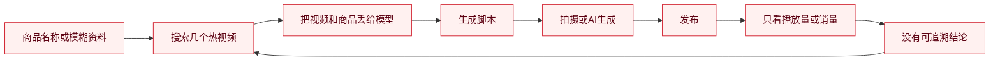

### 2.2 目标业务闭环

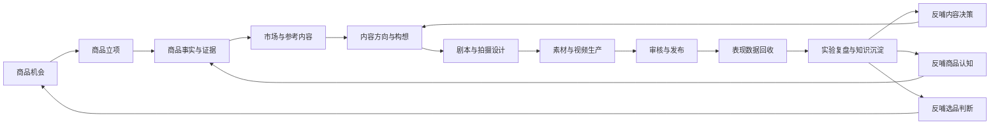

系统最终要形成：

> 从商品与证据出发，以内容构想为决策中枢，以生产和发布为执行链，以表现数据和复盘结论为反馈闭环。

---

## 3. 系统定位

TikTok Video Intelligence Workbench 是一套围绕商品、证据、内容决策、视频生产、发布和数据反馈建立的业务工作台。

它不是：

- 单纯的视频搜索工具。
- 单纯的脚本生成器。
- 一键爆款系统。
- 多 Agent 技术演示。
- 将飞书表格原样复制到网页的后台。
- 第三方选品平台的完全替代品。
- 依赖单一模型、单一供应商或单一 Agent 框架的系统。
- 允许 AI 绕过业务规则自由操作的自治平台。
- 为了“先进”而自研通用 Agent OS 的实验项目。

### 3.1 系统价值层级

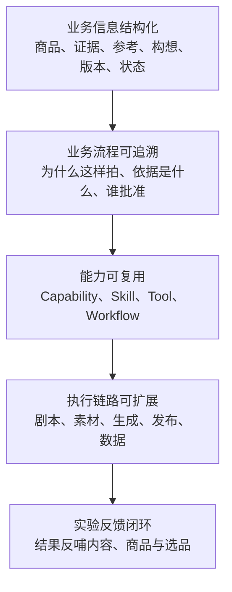

---

## 4. 核心设计原则

### 4.1 内核只提供机制，不承载业务语义

真正的内核不认识：

- TikTok。
- 商品。
- 视频。
- 证据。
- 剧本。
- 选品。
- LangChain。
- LangGraph。
- OpenAI。
- Kling。

内核只提供少量稳定机制。

### 4.2 框架越快变化，越应隔离在系统边缘

技术框架可以替换，系统业务对象和核心运行记录不能跟着重构。

### 4.3 业务语义属于 Domain Modules

Product、Evidence、Creative Concept、Publication 等都属于业务领域模块，不属于 Kernel。

### 4.4 Agent 属于用户态能力

Agent 是一种受控运行角色，不是内核所有者，不是主数据所有者，也不是审批者。

### 4.5 AI 输出默认是草稿

AI 建议、推断和生成内容必须与已确认事实和正式业务状态分离。

### 4.6 关键动作必须受控

高风险、高成本、不可逆和对外动作必须经过 Policy 与人工闸门。

### 4.7 内核稳定，上层能力持续挂载

新业务模块、新 Skill、新 Tool、新 Adapter 可以持续增加，但不应频繁修改 Kernel。

### 4.8 优先固定 Workflow，再逐步引入 Agent

流程清楚的任务优先使用确定性 Workflow。只有确实需要动态判断、工具选择和规划时，才使用 Agent。

---

## 5. 总体系统结构

系统采用四层结构：

1. Domain Applications / UI
2. Domain Modules
3. Intelligence Plane
4. Platform Kernel
5. Adapters / Drivers

### 5.1 系统总图

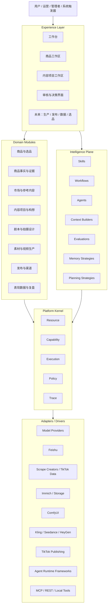

---

## 6. Platform Kernel

Platform Kernel 是系统中最稳定、最小、最高度抽象的部分。

它只包含五类机制：

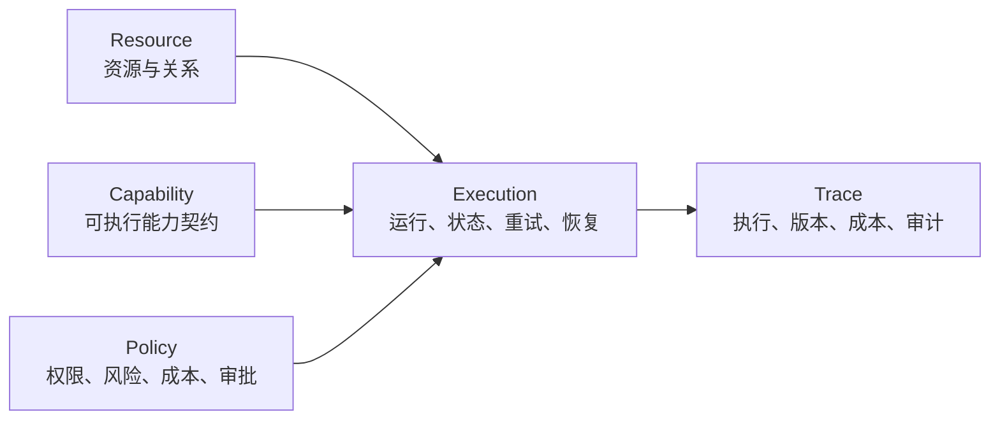

### 6.1 Resource

Resource 表示系统中可被识别、关联、版本化和追踪的对象。

Kernel 不关心资源是商品、视频还是脚本。

高层契约：

```text
resource_id
resource_type
version
status
owner
metadata
relations
created_at
updated_at
archived_at
```

Resource 提供：

- 唯一标识。
- 类型注册。
- 版本引用。
- 状态引用。
- 关系引用。
- 所有权。
- 生命周期。
- 归档。
- 追踪入口。

业务语义由 Domain Modules 定义，例如：

```text
resource_type = product
resource_type = evidence
resource_type = creative_concept
resource_type = video_version
resource_type = publication
```

### 6.2 Capability

Capability 表示一个可执行能力的稳定契约。

它可以由：

- 普通 Python 函数。
- Domain Service。
- Skill。
- Tool。
- Workflow。
- Agent Runtime。
- MCP Tool。
- REST API。
- 外部生成服务。

来实现。

高层契约：

```text
capability_id
version
purpose
input_schema
output_schema
execution_mode
required_permissions
risk_level
cost_policy
timeout_policy
idempotency_policy
implementation_ref
```

Kernel 只关心“这个能力如何被声明和执行”，不关心它背后是 LangChain 还是普通代码。

### 6.3 Execution

Execution 表示一次能力运行。

它统一处理：

- 同步与异步。
- 运行状态。
- 暂停与恢复。
- 重试。
- 超时。
- 幂等。
- 取消。
- 父子运行。
- 检查点。
- 中间结果。
- 人工等待。

高层契约：

```text
run_id
capability_id
initiator
status
input_ref
output_ref
started_at
finished_at
checkpoint_ref
retry_count
timeout_at
idempotency_key
parent_run_id
cancel_reason
```

推荐状态：

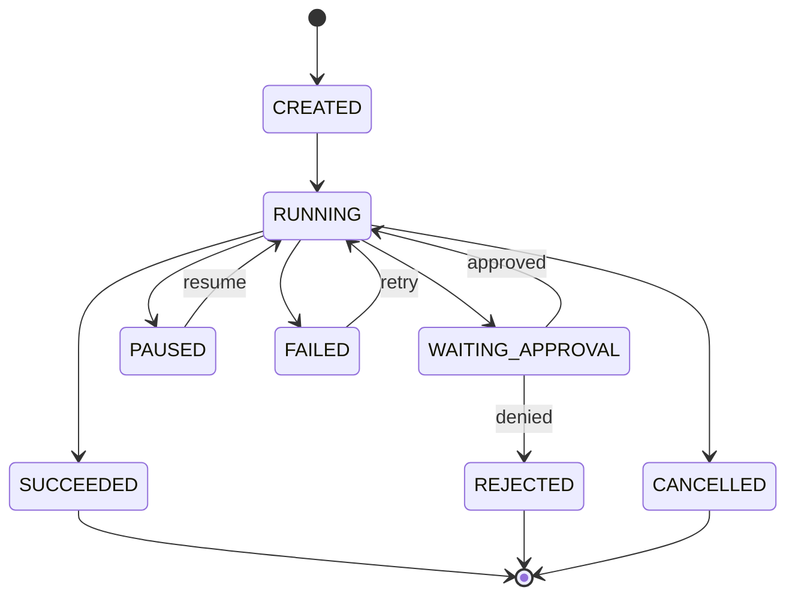

### 6.4 Policy

Policy 统一处理：

- 访问权限。
- 操作权限。
- 风险等级。
- 成本上限。
- 人工审批。
- 对外动作。
- 主数据修改。
- 数据范围。
- 供应商限制。
- 运行沙箱。

高层输入：

```text
actor
capability
target_resource
risk_level
estimated_cost
external_effect
data_scope
```

高层输出：

```text
ALLOW
DENY
REQUIRE_APPROVAL
REQUIRE_ADDITIONAL_CONTEXT
REQUIRE_SANDBOX
```

示例：

```text
读取商品证据
→ ALLOW

AI 修改已确认商品事实
→ DENY

生成付费视频
→ REQUIRE_APPROVAL

发布 TikTok 视频
→ REQUIRE_APPROVAL

读取不属于当前 Workspace 的数据
→ DENY
```

### 6.5 Trace

Trace 统一记录：

- 谁发起。
- 调用了什么 Capability。
- 使用了什么输入。
- 使用了哪些业务上下文。
- 调用了哪些模型和工具。
- 使用了哪个版本。
- 发生了哪些状态变化。
- 经过了哪些审批。
- 消耗了多少成本。
- 修改了哪些 Resource。
- 最终结果是什么。

高层关系：

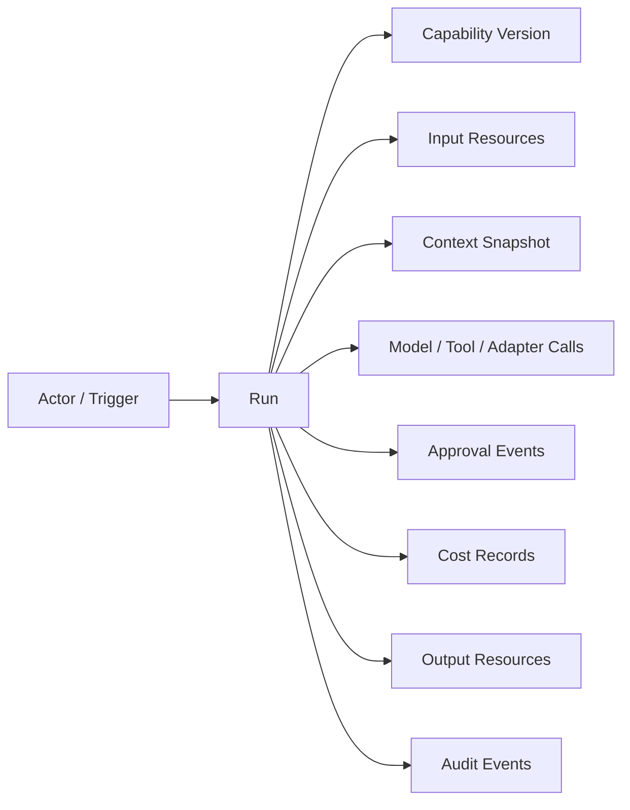

Trace 必须由系统自身保留核心记录。LangSmith、OpenAI Tracing 或其他第三方只作为可选观测 Adapter。

---

## 7. Kernel 不应该包含什么

以下内容禁止进入 Platform Kernel：

- Product、Evidence、Reference 等业务对象定义。
- TikTok 发布逻辑。
- 内容类型分类。
- Script Schema。
- LangGraph State。
- LangChain Memory。
- OpenAI Agent 对象。
- Claude Session。
- MCP Server 名称。
- ReAct Step。
- 某供应商 Prompt。
- 某一模型的特殊字段。
- 某一平台的授权格式。
- 某一数据库的 ORM 模型。

### 7.1 判断标准

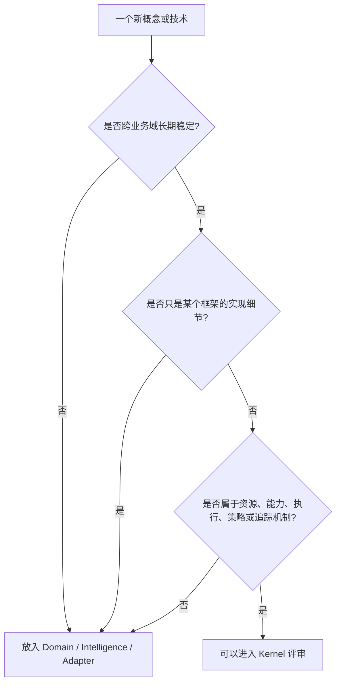

---

## 8. Domain Modules

Domain Modules 承载业务语义。

### 8.1 长期业务域

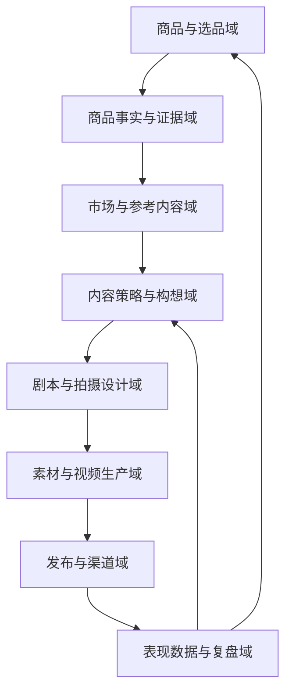

### 8.2 Domain Modules 负责

- 业务对象定义。
- 业务规则。
- 状态机。
- 对象关系。
- 业务命令。
- 业务查询。
- 审核规则。
- 业务不变量。
- 业务事件。
- 与 Kernel Contract 的映射。

例如，`Creative Concept` 属于 Domain Module。Kernel 只把它当作一种 Resource。

### 8.3 核心业务对象高层关系

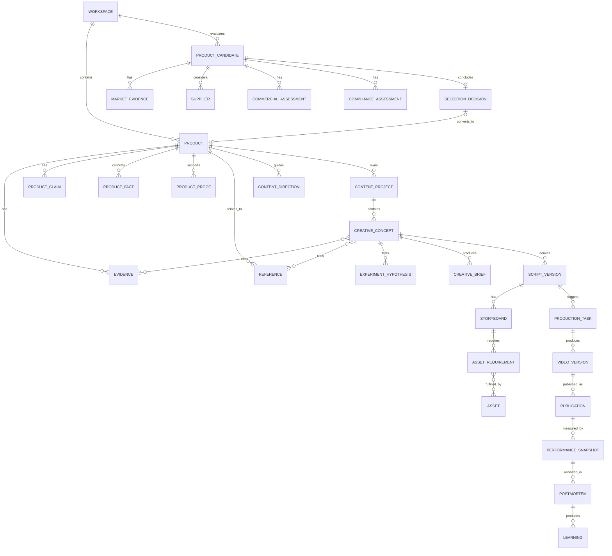

---

## 9. Intelligence Plane

Intelligence Plane 承载所有变化较快的智能能力。

### 9.1 组成

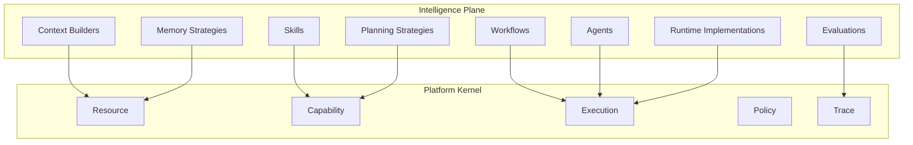

### 9.2 Skill

Skill 是有明确业务目的、输入输出和评估标准的智能能力。

示例：

- `classify_evidence`
- `extract_product_claims`
- `detect_evidence_conflicts`
- `analyze_reference_video`
- `generate_creative_concepts`
- `review_script_factuality`
- `summarize_performance`

每个 Skill 至少声明：

```text
skill_id
version
purpose
input_schema
output_schema
context_requirements
allowed_capabilities
required_permissions
human_gate_policy
cost_policy
evaluation_policy
failure_policy
```

Skill 通过 Capability 注册，不直接访问数据库。

### 9.3 Tool

Tool 是原子操作能力，例如：

- 查询商品证据。
- 创建草稿构想。
- 搜索视频。
- 下载参考素材。
- 提交生成任务。
- 获取发布数据。

Tool 应满足：

- 输入输出明确。
- 副作用明确。
- 权限明确。
- 风险明确。
- 可追踪。
- 尽量原子化。

### 9.4 Workflow

Workflow 是相对确定的步骤编排。

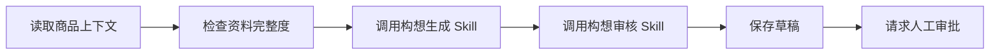

流程已知时优先使用 Workflow，不强行使用 Agent。

### 9.5 Agent

Agent 是一种能够在授权范围内选择 Capability、Skill 和 Tool 的运行角色。

Agent 不负责：

- 拥有数据库。
- 确认业务事实。
- 绕过 Policy。
- 自动批准正式内容。
- 自动发布。
- 自动修改审计记录。

对于 Kernel，Agent 只是：

```text
Execution Initiator
+
Capability Selector
+
Stateful Runtime
```

### 9.6 Context Builder

Context Builder 负责按任务组装最小、可信、可追溯的上下文。

它不应把整个数据库或所有聊天记录直接塞给模型。

### 9.7 Evaluation

Evaluation 负责：

- Schema 合法性。
- 事实一致性。
- 引用完整度。
- 输出质量。
- 业务可执行性。
- 成本效果。
- 人工评分。
- 回归测试。

### 9.8 Memory

Memory 是 Intelligence Plane 的策略，不是 Kernel 的固定能力。

可能包括：

- 当前任务状态。
- 短期对话上下文。
- 历史运行摘要。
- 业务 Learning 检索。
- 用户偏好。

Memory 不能取代正式业务数据和 Trace。

---

## 10. 常见 Agent 技术在系统中的位置

本项目不把任何快速变化的 Agent 技术写死进 Kernel。

### 10.1 技术定位矩阵

| 技术或概念 | 系统定位 | 是否进入 Kernel | 主要用途 |
|---|---|---:|---|
| LangChain | Intelligence Plane 开发框架 | 否 | 模型、Prompt、Tool、Retriever 组合 |
| LangGraph | Workflow / Agent Runtime 实现 | 否 | 状态图、分支、暂停、恢复、检查点 |
| Agent Harness | Agent 运行外壳 | 否 | 上下文、工具、循环、观察、执行管理 |
| OpenAI Agents SDK | Runtime / Provider Adapter | 否 | Agent 执行、Tool 调用、Tracing |
| Claude Agent SDK 等 | Runtime / Provider Adapter | 否 | 供应商特定 Agent 能力 |
| MCP | Tool / Resource 连接协议 | 否 | 对外暴露或接入能力 |
| RAG | Context Builder 策略 | 否 | 检索业务资料 |
| 向量数据库 | Retrieval Adapter | 否 | 相似度检索 |
| 长期记忆框架 | Memory Strategy | 否 | 历史上下文管理 |
| Multi-Agent | Planning / Orchestration Strategy | 否 | 复杂任务分工 |
| Human-in-the-loop | Policy + Execution 稳定需求 | 是，作为机制 | 人工审批、暂停、恢复 |
| Checkpoint / Resume | Execution 稳定需求 | 是，作为机制 | 长任务恢复 |
| Tracing | Trace 稳定需求 | 是，作为机制 | 运行追踪与审计 |
| Sandbox | Policy + Execution 机制 | 可能进入 | 高风险代码或工具隔离 |
| Model Routing | Intelligence Plane 策略 | 否 | 按成本、质量选择模型 |
| Prompt Management | Skill 实现管理 | 否 | Prompt 版本与测试 |

### 10.2 技术隔离结构

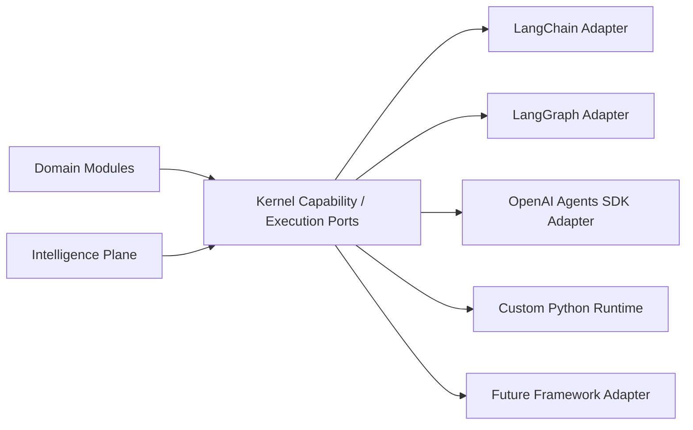

### 10.3 LangChain 的意义

LangChain 对本项目的意义是：

- 快速组合模型、Prompt、Tool 和 Retriever。
- 减少部分集成代码。
- 在原型阶段加速 Skill 实现。

它不是：

- 业务数据模型。
- 系统主架构。
- Kernel。
- 必须长期依赖的基础设施。

### 10.4 LangGraph 的意义

LangGraph 适合出现以下真实需求后再引入：

- 工作流存在复杂分支。
- 任务需要暂停与恢复。
- 需要长时间运行。
- 需要人工审批后继续执行。
- 需要检查点。
- 需要失败恢复。
- 多步骤状态管理越来越复杂。

LangGraph 应实现 `Execution Port`，不能把 LangGraph State 直接变成业务主数据。

### 10.5 Agent Harness 的意义

Agent Harness 是 Agent 的运行外壳，可能负责：

- 工具列表。
- 上下文。
- 运行循环。
- 计划。
- 观察。
- 状态。
- 日志。
- 安全限制。

它属于 Intelligence Plane 或 Runtime Adapter，不属于 Kernel。

### 10.6 MCP 的意义

MCP 适合：

- 对 Agent 暴露标准化 Tool。
- 接入外部 Resource。
- 将已有系统能力包装为统一协议。
- 降低工具接入耦合。

MCP 不应定义内部业务模型。内部 Capability Contract 应先稳定，再决定是否通过 MCP 暴露。

### 10.7 什么时候不该用这些框架

以下情况优先不用 Agent 框架：

- 单次结构化模型调用即可完成。
- 工作流固定。
- 分支很少。
- 无需暂停恢复。
- 不需要动态 Tool 选择。
- 普通 Application Service 更清晰。
- 业务规则比推理更重要。

---

## 11. 框架变化如何反向验证 Kernel

新框架不直接改变 Kernel，但它暴露的稳定问题可以促使 Kernel 完善。

### 11.1 稳定问题映射

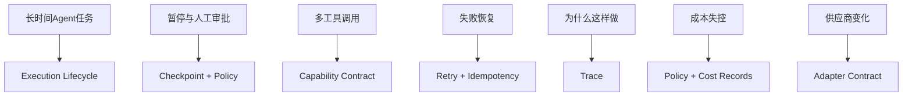

### 11.2 决策原则

> 不是因为 LangGraph 有 Checkpoint，所以 Kernel 必须采用 LangGraph；而是因为暂停、恢复和长任务是稳定问题，所以 Kernel 需要通用 Checkpoint 机制。

---

## 12. Agent 执行时序

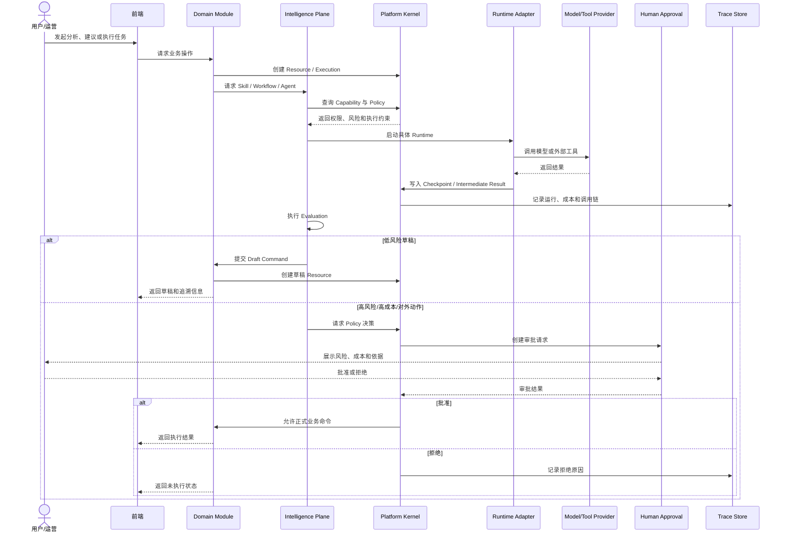

---

## 13. 七阶段路线

七阶段描述业务能力扩展；Platform Kernel 从 Phase 0 开始定义，并保持稳定。

### 13.1 双轴路线

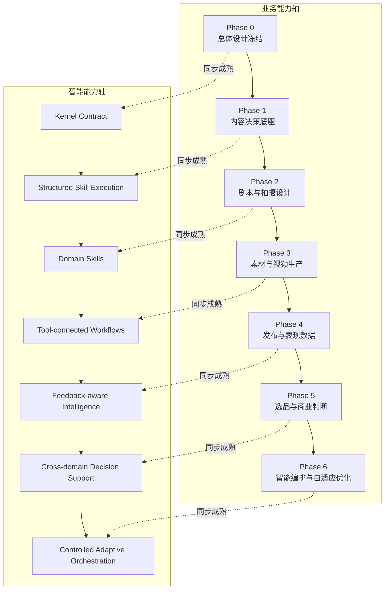

### Phase 0：总体设计冻结

冻结：

- 系统边界。
- Platform Kernel 五类机制。
- Domain Modules 边界。
- Intelligence Plane 边界。
- Adapter 规则。
- 核心对象高层关系。
- 前端信息架构原则。
- 数据治理原则。
- Phase 1 范围。
- 技术框架隔离原则。

不写正式业务代码。

### Phase 1：内容决策底座

业务能力：

- 商品。
- 证据。
- 参考。
- 内容项目。
- 自有视频构想。
- 审核。
- Creative Brief / Script Input Pack 导出。
- 基础版本、来源和审计。

Kernel 最小实现：

- Resource Registry。
- Capability Registry。
- Execution Run。
- Policy Gate。
- Trace Ledger。

Intelligence Plane 最小实现：

- 结构化模型调用。
- 固定 Workflow。
- Context Builder。
- 基础 Skills。
- 基础 Evaluation。
- 只允许 Read、Suggest、Write Draft。

技术建议：

- 普通 Python Application Service。
- 结构化输出。
- 简单任务队列。
- 暂不强制 LangChain。
- 暂不强制 LangGraph。
- 暂不做自由多 Agent。

### Phase 2：剧本与拍摄设计

业务能力：

- Script Input Pack。
- Script Version。
- Storyboard。
- Shot List。
- Production Requirement。
- 多维审核。

智能能力：

- Script Strategy Skill。
- Script Generation Skill。
- Storyboard Skill。
- Factual Claim Review。
- Marketing Claim Review。
- Shootability Review。

当固定 Workflow 变复杂时，再评估 LangGraph。

### Phase 3：素材与视频生产

业务能力：

- Asset Requirement。
- Asset。
- Shooting Task。
- Generation Task。
- Editing Task。
- Video Version。
- Production Review。

Kernel 扩展需求：

- 异步执行。
- Checkpoint。
- Retry。
- Idempotency。
- Cancel。
- 成本策略。

Adapters：

- ComfyUI。
- Kling。
- Seedance。
- HeyGen。
- Storage。

### Phase 4：发布与表现数据

业务能力：

- Platform Account。
- Shop。
- Publish Task。
- Publication。
- Performance Snapshot。
- Commerce Metrics。
- Postmortem。

Kernel 扩展需求：

- 高风险对外动作审批。
- 定时任务。
- 数据回流追踪。
- 运行与发布对象关联。

### Phase 5：选品与商业判断

业务能力：

- Product Candidate。
- Market Signal。
- Supplier。
- Commercial Assessment。
- Compliance Assessment。
- Selection Decision。

智能能力：

- Market Signal Analysis。
- Competitor Landscape Analysis。
- Commercial Model Evaluation。
- Compliance Risk Analysis。
- Product Candidate Scoring。

### Phase 6：智能编排与自适应优化

Phase 6 不负责第一次引入 Agent。

它负责：

- 跨领域任务规划。
- 动态 Capability / Skill 路由。
- 模型路由。
- 成本质量平衡。
- 反馈感知。
- 跨商品知识迁移。
- 半自动实验设计。
- 受控自适应编排。

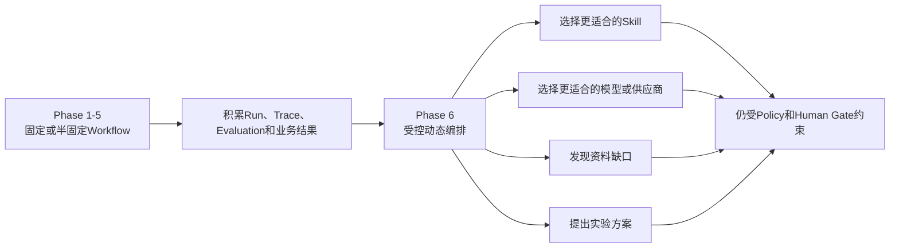

---

## 14. 当前 Phase 1 业务闭环

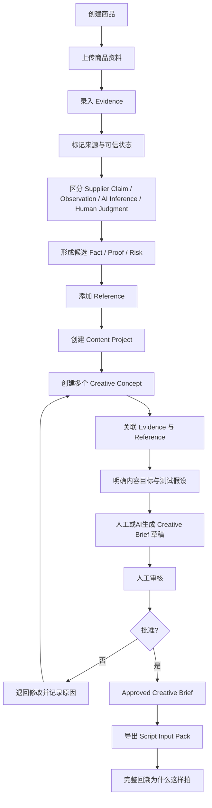

### 14.1 Phase 1 智能辅助点

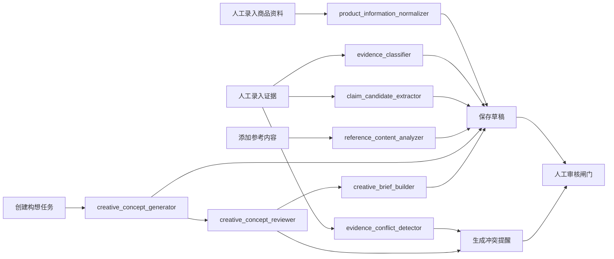

Phase 1 明确不做：

- 自动视频生成。
- 自动发布。
- TikTok 数据回收。
- 自动选品。
- 多 Agent 自由协商。
- Agent 自主确认商品事实。
- Agent 绕过审核修改主数据。
- 为未来需求提前搭建复杂 LangGraph。
- 自研通用 Agent OS。

---

## 15. 前端总体信息架构

前端围绕用户任务组织，不围绕数据库模块平铺菜单。

### 15.1 Phase 1 导航

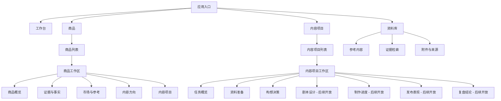

---

## 16. 技术架构原则

### 16.1 模块化单体优先

```mermaid
flowchart TB
    FE[React + TypeScript Frontend]
    API[FastAPI Application API]

    subgraph MOD[Modular Monolith]
        M1[Domain Modules]
        M2[Intelligence Plane]
        M3[Platform Kernel]
        M4[Adapters]
        M5[Audit and Permissions]
    end

    DB[(PostgreSQL)]
    OS[(Object Storage)]
    JOB[Background Jobs]
    OBS[Observability]

    FE --> API
    API --> MOD
    MOD --> DB
    MOD --> OS
    MOD --> JOB
    MOD --> OBS
```

原则：

- 模块化单体优先。
- PostgreSQL 是核心结构化业务数据存储。
- 对象存储管理媒体文件。
- Platform Kernel 是应用内核模块，不提前拆微服务。
- Intelligence Plane 是独立模块，但不独立拥有业务数据。
- 第三方平台通过 Adapter 隔离。
- 异步、高成本和可失败动作必须可追踪、可重试和可人工干预。

### 16.2 当前禁止项

- 微服务拆分。
- Kubernetes。
- 复杂事件总线。
- 通用低代码工作流平台。
- 自研通用 Agent OS。
- 自由多 Agent 通信。
- 复杂长期记忆。
- Agent 直接访问数据库。
- LangGraph State 直接作为业务主数据。
- MCP 直接决定内部领域模型。
- 为了框架而重写业务流程。

---

## 17. 数据治理原则

所有核心业务对象应具备：

- 稳定 ID。
- 来源。
- 创建者和创建时间。
- 更新时间。
- 状态。
- 版本。
- AI 生成标记。
- 人工确认标记。
- 归档状态。
- 审计记录。
- 关联 Run / Trace。

### 17.1 事实形成链

```mermaid
flowchart LR
    S1[原始输入] --> S2[来源记录]
    S2 --> S3[Evidence]
    S3 --> S4[Claim Candidate]
    S3 --> S5[Observation]
    S4 --> S6{验证}
    S5 --> S6
    S6 -- 通过 --> S7[Confirmed Fact / Proof]
    S6 -- 不通过 --> S8[Rejected]
    S6 -- 暂无结论 --> S9[Pending Verification]
    S7 --> S10[可用于构想、脚本和审核]
```

系统必须区分：

- 原始输入。
- 供应商宣称。
- AI 推断。
- 人工判断。
- 实物观察。
- 已确认事实。
- Product Proof。
- 被否定内容。
- 已过期内容。

### 17.2 AI 内容治理

AI 输出默认：

```text
DRAFT
AI_GENERATED = true
HUMAN_CONFIRMED = false
```

未经人工或规则确认，不得进入正式事实、正式构想、正式剧本、正式发布和正式复盘结论。

---

## 18. 外部系统边界

```mermaid
flowchart TB
    SYS[TikTok Video Intelligence Workbench]

    F[飞书]
    GPT[Custom GPT]
    IM[Immich]
    SC[Scrape Creators / Data Platforms]
    GEN[Kling / Seedance / ComfyUI / HeyGen]
    TK[TikTok]
    MODEL[OpenAI / Other Models]
    FRAME[LangChain / LangGraph / Agent SDK]
    MCP[MCP / REST / Local Tools]

    F -->|录入、协作、迁移来源| SYS
    GPT -->|专项分析与草稿| SYS
    IM -->|素材浏览与文件引用| SYS
    SC -->|搜索、市场与参考数据| SYS
    GEN -->|生产能力| SYS
    TK -->|发布与表现数据| SYS
    MODEL -->|模型推理| SYS
    FRAME -->|可替换Runtime实现| SYS
    MCP -->|能力连接协议| SYS
```

边界：

- 飞书不是长期唯一核心数据库。
- Custom GPT 不是主数据、状态、版本和审核系统。
- Immich 管理文件浏览，本系统管理业务关系和状态。
- Scrape Creators 等是数据源。
- Kling、Seedance、ComfyUI、HeyGen 是生产能力供应商。
- TikTok 是发布和数据来源。
- 模型供应商可替换。
- Agent 框架可替换。
- MCP 是协议，不是领域模型。

---

## 19. 技术选型决策规则

### 19.1 何时引入新框架

```mermaid
flowchart TB
    A[出现新框架或技术] --> B{是否解决当前真实问题?}
    B -- 否 --> C[不引入]
    B -- 是 --> D{普通代码能否更简单解决?}
    D -- 是 --> E[先用普通代码]
    D -- 否 --> F{能否通过Adapter隔离?}
    F -- 否 --> G[拒绝或重新设计]
    F -- 是 --> H[做小规模Spike]
    H --> I{是否明显改善可靠性/开发效率/可观测性?}
    I -- 否 --> C
    I -- 是 --> J[通过ADR批准接入]
```

### 19.2 LangGraph 引入条件

满足多个条件时再考虑：

- 复杂分支。
- 长时间运行。
- 暂停与恢复。
- 人工审批后继续。
- 检查点。
- 多步骤失败恢复。
- 动态 Tool 编排。
- 普通 Workflow 已明显难维护。

### 19.3 LangChain 引入条件

- 快速组合多个模型、Tool 和 Retriever。
- 可以减少明显重复代码。
- 不污染 Domain 和 Kernel。
- 可通过 Adapter 替换。

### 19.4 MCP 引入条件

- 需要将已有 Capability 暴露给多个 Agent 或客户端。
- 需要标准化工具连接。
- 内部 Capability Contract 已稳定。
- 不让 MCP Schema 反向支配内部领域设计。

---

## 20. Phase 0 完成标准

```mermaid
flowchart TB
    A[Master 评审] --> B[Kernel Contract]
    B --> C[Domain Boundaries]
    C --> D[Intelligence Plane Boundaries]
    D --> E[Adapter Boundaries]
    E --> F[信息架构]
    F --> G[数据治理]
    G --> H[真实商品 Walkthrough]
    H --> I{是否跑通?}
    I -- 否 --> J[回到相关设计修订]
    J --> H
    I -- 是 --> K[形成 Phase 1 实施计划]
    K --> L[人工批准]
    L --> M[implementation_allowed = true]
```

完成标准：

1. Master 通过评审。
2. Platform Kernel 五类机制清楚。
3. Domain、Intelligence Plane 和 Adapter 边界清楚。
4. Agent 技术不会绑架 Kernel。
5. Phase 1 业务闭环清楚。
6. Phase 1 最小 Kernel 范围清楚。
7. 三个真实商品 walkthrough 跑通。
8. 未决问题都有 owner 和解决条件。
9. Phase 1 实施计划可验收。
10. `implementation_allowed` 经人工批准后改为 `true`。

---

## 21. 当前未冻结内容

以下内容故意不在 Master 中冻结：

- Resource 最终数据库实现。
- Capability Registry 具体表结构。
- Execution Checkpoint 的存储方式。
- Policy DSL。
- Trace 数据保留周期。
- 商品卡完整字段。
- Evidence、Fact、Claim、Proof 的最终落表方式。
- Reference 是否设置统一父对象。
- Content Direction 是否在 Phase 1 独立实现。
- Creative Brief 与 Script Input Pack 的最终边界。
- 前端像素布局。
- API 路径。
- 具体模型。
- 具体 Agent 框架。
- Skill Prompt。
- Tool 与 Adapter 实现。
- 是否采用 LangChain。
- 是否采用 LangGraph。
- 是否通过 MCP 暴露内部能力。
- 是否需要多 Agent。

这些问题必须在后续 Core 和对应 Phase 文档中逐项讨论，禁止由开发 Agent 自行补全并固化。

---

## 22. 当前优先评审问题

Master 阶段只讨论系统级问题：

1. Platform Kernel 是否只保留 Resource、Capability、Execution、Policy、Trace。
2. Domain Modules 是否完全承担业务语义。
3. Intelligence Plane 是否完全承担 Agent、Skill、Workflow、Context、Evaluation。
4. Agent 是否明确属于用户态能力。
5. LangChain、LangGraph、Agent Harness、MCP 等是否全部通过 Adapter 或 Runtime Port 隔离。
6. Phase 1 是否只实现最小 Kernel，不做通用 Agent OS。
7. 固定 Workflow 优先、Agent 后置的原则是否接受。
8. Content Project 是否成为构想、剧本、生产、发布和复盘的主任务容器。
9. Phase 1 终点是否固定为 Approved Creative Brief / Script Input Pack。
10. 哪些动作永久保留人工闸门。
11. 选品候选对象是否需要在 Phase 1 预留最小定义。
12. 模块化单体是否作为当前默认架构。

在这些问题确认前，不进入字段、数据库和页面细节讨论。

---

## 23. 设计状态与下一步

当前状态：

```text
design_version: 0.4
status: DRAFT_FOR_REVIEW
implementation_allowed: false
active_phase: phase_0_design_freeze
```

下一步：

> 逐章评审本 Master Design，先确认 Platform Kernel、Domain Modules、Intelligence Plane 和 Adapter Layer 的抽象，再进入 Core 文档。

不创建完整项目文档包，不开始业务代码，不提前实现 LangChain、LangGraph 或多 Agent。
