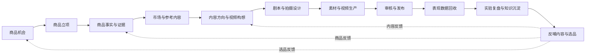
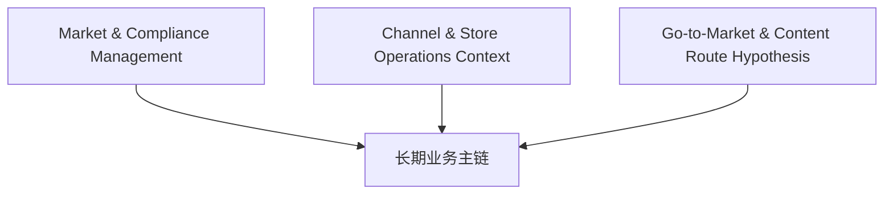
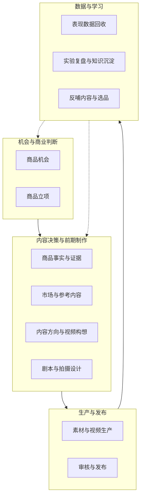

# 01_CAPABILITY_ROADMAP

## 1. 文档职责

本文档定义系统长期需要具备的业务能力，并区分：

- 纵向业务价值链。
- 横向市场、合规、渠道和店铺运营能力。

它不回答：

- 什么时候开发。
- 当前 Release 具体实现什么。
- 页面、字段、API 或技术选型。

---

## 2. 长期能力总图



---

## 3. 横向支撑能力



### 3.1 Market & Compliance Management

长期需要：

- Market。
- Market Compliance Profile。
- 类目、认证、Claims、广告和内容规则。
- 规则生效时间和版本。
- 合规检查与人工复核。

### 3.2 Channel & Store Operations Context

长期需要：

- Channel Account。
- Store。
- Store Health Snapshot。
- 店铺评分、违规、履约、退货、差评和流量限制。
- 投入与发布策略联动。

### 3.3 Go-to-Market & Content Route Hypothesis

长期需要：

- Creator-led。
- Owned-content-led。
- Paid-media-led。
- Listing-search-led。
- Live-led。
- Hybrid。
- Unknown。

---

## 4. 能力分区



---

## 5. 关键能力输出

### 5.1 商品立项

输出不再只是 Selection Decision，还包括：

```text
Selection Decision
+
Initial Go-to-Market Hypothesis
+
Content Route Hypothesis
+
Target Market Context
+
Initial Investment Level
```

### 5.2 商品事实与证据

输出：

```text
Global Product Knowledge
+
Market-specific Compliance Overlay
+
Product Proof
+
Risks / Unknowns
```

### 5.3 市场与参考内容

输出：

```text
Market-specific Reference Intelligence Pack
+
Route-specific Reference Analysis
```

### 5.4 内容方向与视频构想

输出：

```text
Approved Creative Concept
+
绑定的 Content Operating Context Snapshot
```

### 5.5 剧本与拍摄设计

输出：

```text
Production-ready Pack
+
Market / Route / Store Context Snapshot
```

---

## 6. 当前能力覆盖


横向能力在 Release 1 中只做：

- 人工录入或外部导入。
- 保存快照。
- 在内容决策中引用。
- 不做自动采集平台。

---

## 7. 冻结内容

本版本冻结：

- 长期能力链顺序。
- 横向市场合规与店铺运营能力。
- 商品立项必须输出内容路径假设。
- Release 1 覆盖中间四段能力。
- 上下游通过明确输入输出衔接。

本版本不冻结：

- 每个能力的详细流程。
- 领域对象最终边界。
- 技术实现方式。
