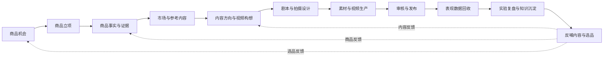
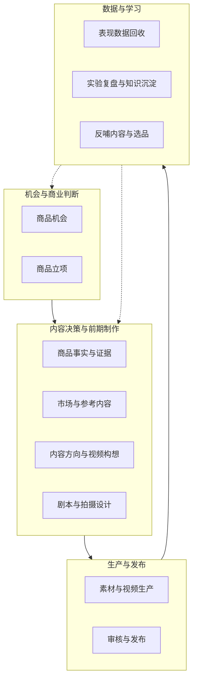

# 01_CAPABILITY_ROADMAP

## 1. 文档职责

本文档定义系统长期需要具备的业务能力。

它回答：

> 未来这套系统最终要覆盖哪些业务环节，以及每个环节的输入、输出和价值是什么？

它不回答什么时候开发、当前 Release 具体实现什么、页面字段、API 或技术选型。

## 2. 长期能力总图

## 3. 能力分区

## 4. 能力说明

### 4.1 商品机会

**目的**：发现值得进一步评估的商品、需求和市场信号。

**输入**：市场趋势、搜索信号、竞品、用户需求、供应链线索。

**输出**：Product Candidate、Opportunity Hypothesis、初步市场证据。

**当前状态**：不属于 Release 1。

### 4.2 商品立项

**目的**：判断候选商品是否值得进入样品、供应链、合规和内容测试。

**输入**：市场证据、供应商、成本利润、合规风险、团队资源。

**输出**：Selection Decision，以及已确定进入内容阶段的商品。

**当前状态**：不属于 Release 1，但 Release 1 接收其输出。

### 4.3 商品事实与证据

**目的**：建立内容生产可以信任的商品知识基线。

**输入**：供应商资料、实物观察、测试记录、图片、视频、说明书、人工判断和 AI 辅助分析。

**输出**：Product Knowledge Baseline、Evidence、Supplier Claims、Confirmed Facts、Product Proof、Risks、Unknowns。

**当前状态**：属于 Release 1。

### 4.4 市场与参考内容

**目的**：理解市场如何表达需求、痛点、场景和卖点，并形成可复用参考。

**输入**：TikTok 视频、竞品内容、评论、搜索结果和市场资料。

**输出**：Reference Intelligence Pack、内容模式、Hook 模式、风险和不适配点。

**当前状态**：属于 Release 1。

### 4.5 内容方向与视频构想

**目的**：决定这次为什么拍、为谁拍、拍什么和验证什么。

**输入**：Product Knowledge Baseline、Reference Intelligence Pack、内容目标、账号定位、受众与市场。

**输出**：Content Direction、Creative Concept Candidates、Experiment Hypothesis、Approved Creative Concept。

**当前状态**：属于 Release 1。

### 4.6 剧本与拍摄设计

**目的**：把已批准构想变成可执行的拍摄与制作输入。

**输入**：Approved Creative Concept、商品事实与证据、内容约束和拍摄资源。

**输出**：Script Version、Storyboard、Shot List、Production Requirements、Production-ready Pack。

**当前状态**：属于 Release 1。

### 4.7 素材与视频生产

**目的**：把前期制作方案转化为真实素材与视频版本。

**输入**：Script & Shooting Pack、实拍素材、供应商素材和 AI 生成能力。

**输出**：Asset、Production Task、Video Version、Production Review。

**当前状态**：不属于 Release 1。

### 4.8 审核与发布

**目的**：确保内容、账号、商品和平台操作在发布前符合要求。

**输入**：Video Version、Caption、账号、商品和合规规则。

**输出**：Approved Publication、Publish Task、Publication Record。

**当前状态**：不属于 Release 1。

### 4.9 表现数据回收

**目的**：把发布结果和商业表现关联回内容与实验。

**输入**：平台数据、店铺数据、广告数据和人工标注。

**输出**：Performance Snapshot、Commerce Metrics、Experiment Result。

**当前状态**：不属于 Release 1。

### 4.10 实验复盘与知识沉淀

**目的**：将一次视频结果转化为可复用业务结论。

**输入**：Performance Snapshot、Creative Concept、Script、Publication Context。

**输出**：Postmortem、Learning、可复用模式和失败原因。

**当前状态**：不属于 Release 1。

### 4.11 反哺内容与选品

**目的**：让历史结果真正影响下一次内容和商品判断。

**输入**：Learning、多商品、多账号和多内容结果。

**输出**：内容策略调整、商品知识更新、选品支持和实验建议。

**当前状态**：后续能力。

## 5. 当前能力覆盖

```mermaid
flowchart LR
    A[商品机会]:::future --> B[商品立项]:::future
    B --> C[商品事实与证据]:::current
    C --> D[市场与参考内容]:::current
    D --> E[内容方向与视频构想]:::current
    E --> F[剧本与拍摄设计]:::current
    F --> G[素材与视频生产]:::future
    G --> H[审核与发布]:::future
    H --> I[表现数据回收]:::future
    I --> J[实验复盘与知识沉淀]:::future
    J --> K[反哺内容与选品]:::future

    classDef current fill:#e6f4ff,stroke:#1677ff,color:#003a8c;
    classDef future fill:#f5f5f5,stroke:#8c8c8c,color:#434343;
```

## 6. 冻结内容

本版本冻结：

- 长期能力链顺序。
- 四个能力分区。
- Release 1 覆盖中间四段能力。
- 上下游通过明确输入输出衔接。

本版本不冻结：

- 每个能力的详细流程。
- 领域对象最终边界。
- 技术实现方式。
