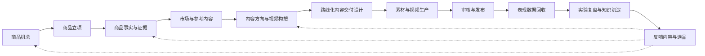
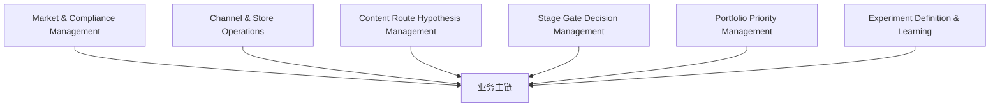

# 01_CAPABILITY_ROADMAP

## 1. 文档职责

本文档定义系统长期需要具备的业务能力。

它区分：

- 纵向业务能力。
- 横向决策与约束能力。
- 当前 Release 与未来 Release 的责任。

它不定义页面、字段、API、数据库或框架选型。

---

## 2. 长期业务能力总图



---

## 3. 横向能力总图



---

## 4. 核心纵向能力

### 4.1 商品机会与立项

输出：

```text
Selection Decision
Initial Go-to-Market Hypothesis
Content Route Hypothesis
Target Market Context
Initial Investment Level
```

### 4.2 商品事实与证据

输出：

```text
Product Knowledge Baseline
Confirmed Facts
Product Proof
Risks
Unknowns
Market-specific Compliance Overlay
```

### 4.3 市场与参考内容

输出：

```text
Route-specific Reference Intelligence Pack
Market Signals
Reference Fit Decisions
Contrary Evidence
```

### 4.4 内容方向与视频构想

输出：

```text
Creative Concept Candidates
Approved Creative Direction
Gate Decision
Project Priority
Experiment Contract
```

### 4.5 路线化内容交付设计

输出不再统一：

- Creator Enablement Pack。
- Owned Content Production Pack。
- Paid Media Test Pack。
- Listing / Search Content Pack。
- Live Content Pack。
- Hybrid Delivery Bundle。

---

## 5. 新增横向能力

## 5.1 Stage Gate Decision Management

负责：

- 定义每个 Gate 的输入。
- 明确判断标准。
- 记录决策结果和理由。
- 记录谁做出决定。
- 允许 Stop、Pause、Change Route、Request More Evidence 和 Recycle。
- 管理 Override 和重新评估。

统一结果：

```text
CONTINUE
PAUSE
STOP
CHANGE_ROUTE
REQUEST_MORE_EVIDENCE
RECYCLE
```

## 5.2 Content Route Hypothesis Management

负责：

- Route 类型。
- 假设和依据。
- Supporting Evidence。
- Contrary Evidence。
- Assumptions。
- Confidence Level。
- Validation Plan。
- Success Criteria。
- Stop Conditions。
- Owner。
- Review Date。
- Status。

## 5.3 Route-specific Delivery Design

负责根据 Primary Route 生成不同交付物，而不是统一脚本包。

## 5.4 Portfolio Priority Management

首版只需要轻量能力：

```text
MUST_DO
NEXT
EXPERIMENTAL
HOLD
STOPPED
```

并记录：

- Business Priority。
- Evidence Readiness。
- Route Confidence。
- Market Timing。
- Store Readiness。
- Expected Value。
- Estimated Effort。
- Budget Limit。
- Priority Reason。
- Next Review Date。

## 5.5 Experiment Definition & Learning

Release 1 定义：

- Business Question。
- Hypothesis。
- Variable Under Test。
- Metrics。
- Baseline。
- Observation Window。
- Success Rule。
- Stop Rule。
- Next Action。

Release 3 回收结果，Release 4 将 Learning 反哺选品。

---

## 6. 能力与 Release 的责任

| 能力 | Release 1 | Release 2 | Release 3 | Release 4 |
|---|---|---|---|---|
| Route Hypothesis | 人工录入、修订、验证设计 | 继承 | 用结果验证 | 正式生成 |
| Stage Gates | 当前流程正式使用 | 生产Gate | 发布Gate | 选品Gate |
| Route-specific Pack | 正式生成 | 执行 | 结果关联 | 作为选品证据 |
| Priority Lite | 当前任务排序 | 生产排期 | 发布资源 | 商品组合 |
| Experiment Contract | 正式创建 | 继承 | 回收结果 | 学习反哺 |
| Store Health | 快照输入 | 生产约束 | 正式同步 | 商业判断 |
| Compliance | 快照输入与内容检查 | 生产检查 | 发布检查 | 立项判断 |

---

## 7. 当前能力覆盖


---

## 8. 冻结内容

本版本冻结：

- 长期能力链。
- Stage Gate、Route Hypothesis、Priority Lite 和 Experiment Contract 是正式能力。
- Release 1 不再默认以统一 Script Pack 为唯一终点。
- Release 1 创建实验契约，Release 3 回收结果。

本版本不冻结：

- 各对象最终字段。
- 优先级算法。
- 自动评分模型。
- Gate 具体阈值。
- 路线交付包完整 Schema。
