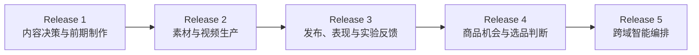
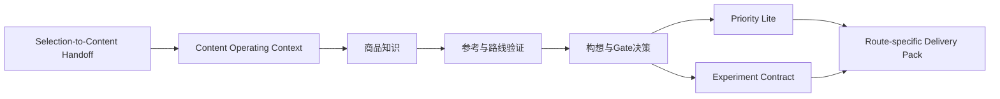
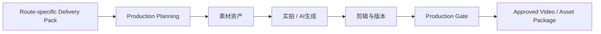
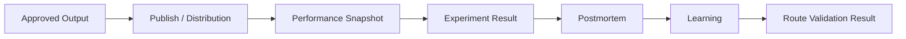
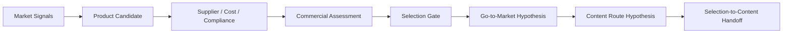
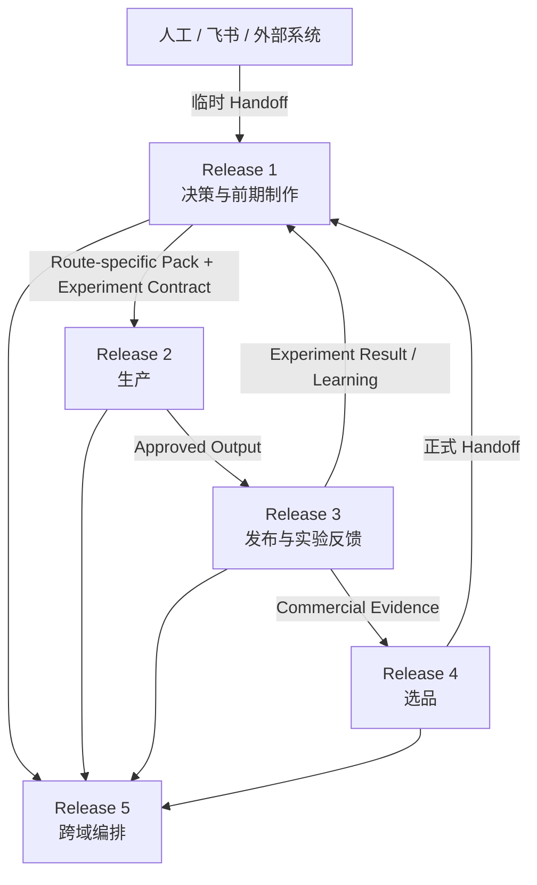

# 02_DELIVERY_RELEASES

## 1. 文档职责

本文档定义长期能力如何拆成可交付、可验收的产品版本。

Release 顺序不等于业务链顺序。当前从中段开始，但不丢失上游决策输出。

---

## 2. 交付版本总图



---

## 3. Release 1：内容决策与前期制作



### Release 1 负责

- 接收并保存上游 Handoff。
- 创建或修订 Content Route Hypothesis。
- 使用 Stage 0～3 Gate。
- 允许 Stop、Pause、Change Route 和 Request More Evidence。
- 进行轻量项目优先级判断。
- 创建 Experiment Contract。
- 生成 Route-specific Delivery Pack。
- 保存 Context、版本、决策和 Trace。

### Release 1 不负责

- 正式选品与商业立项。
- 自动生成可靠的 Route 结论。
- 完整 Portfolio Management。
- 素材和视频生产。
- 发布和表现数据回收。
- 自动证明实验结果。

### Release 1A 与 Release 1B+

完整 Release 1 拆分为：

```text
Release 1A — Content Decision Workspace MVP
Release 1B+ — Decision Governance and Route Expansion
```

Release 1A 先跑通：

```text
Product → Reference → Creative → Owned Pack
```

Release 1A 的实施范围由 [06_RELEASE_1A_MVP_SCOPE.md](06_RELEASE_1A_MVP_SCOPE.md) 定义，实施顺序由 [07_RELEASE_1A_IMPLEMENTATION_PLAN.md](07_RELEASE_1A_IMPLEMENTATION_PLAN.md) 定义。

Gate、Priority、Experiment 和 Route-specific Pack 的完整机制进入后续版本演进，不强行确定 Release 1B 的日期或完整范围。

---

## 4. Release 2：素材与视频生产



Release 2 按不同 Route 执行不同生产流程，而不是把所有 Pack 转换成同一种视频。

---

## 5. Release 3：发布、表现与实验反馈



Release 3 负责：

- 店铺、账号和发布接入。
- 数据回收。
- 将结果关联到 Experiment Contract。
- 判断原始 Hypothesis 是 Supported、Rejected、Inconclusive 或 Invalid。
- 触发后续 Route Review。

---

## 6. Release 4：商品机会与选品判断



Release 4 正式生成当前 Release 1 临时人工录入的上游交接包。

---

## 7. Release 5：跨域智能编排

Release 5 在已有稳定数据、流程、Gate 和评估基础上增加受控动态编排。

不等于首次引入 AI，也不默认采用多 Agent。

---

## 8. Release 间闭环



---

## 9. 冻结规则

当前冻结：

- Release 1 创建 Experiment Contract。
- Release 1 产生 Route-specific Delivery Pack。
- Release 1A 是完整 Release 1 的第一个可运行子版本。
- Release 3 回收并解释实验结果。
- Release 4 正式生成 Handoff 和 Route Hypothesis。
- Release 1 只提供 Priority Lite。

当前不冻结：

- Release 1B+ 的详细范围和日期。
- Release 2～5 的详细状态机。
- 实验统计方法。
- 自动 Priority 算法。
- 多 Agent 方案。
- 具体交付日期。
