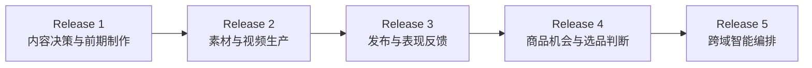
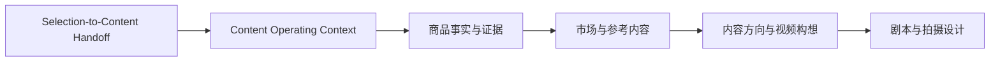
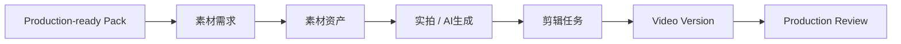
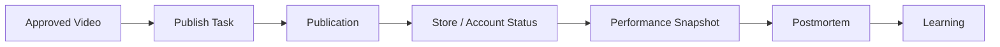
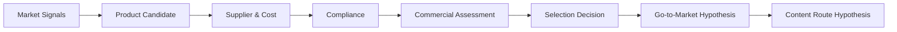
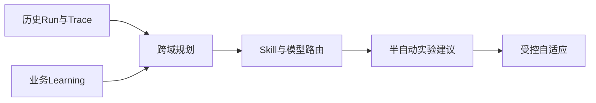
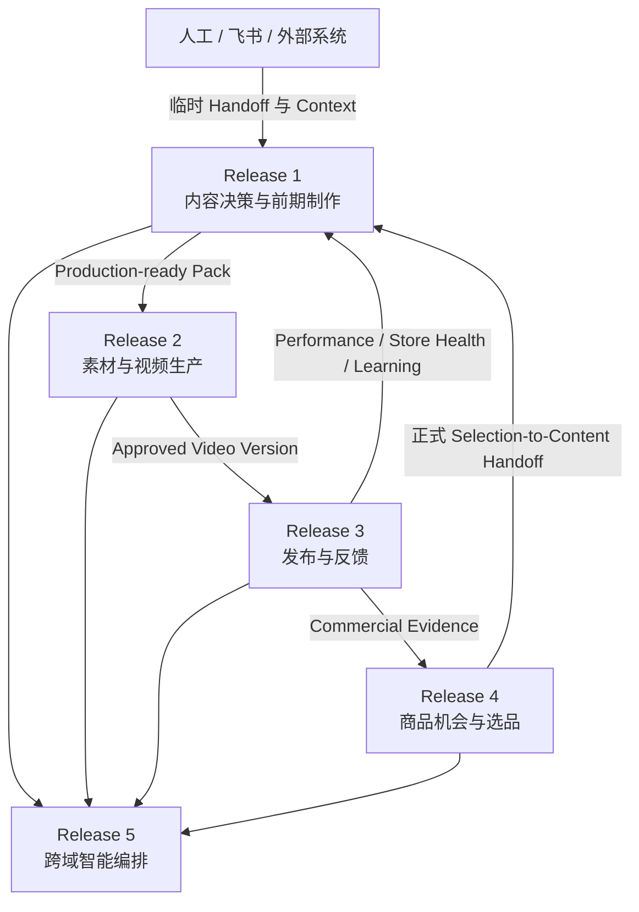

# 02_DELIVERY_RELEASES

## 1. 文档职责

本文档定义长期能力如何被切成真正可交付、可验收的产品版本。

Delivery Release 不等于完整业务链顺序。系统可以从最有现实价值的中段开始，但必须接收上游必要决策输出。

---

## 2. 交付版本总图

---

## 3. Release 1：内容决策与前期制作

Release 1 负责：

- 人工录入或外部导入内容路径假设。
- 人工录入或外部导入市场合规快照。
- 人工录入或外部导入店铺健康快照。
- 在内容决策中使用这些上下文。
- 保存快照和版本。

Release 1 不负责：

- 自动生成 Selection Decision。
- 全球政策自动采集。
- 店铺实时监控。
- 自动发布。

---

## 4. Release 2：素材与视频生产

继承：

- Content Route。
- Market Compliance Snapshot。
- Store / Channel Context。
- Production Constraints。

---

## 5. Release 3：发布与表现反馈

Release 3 正式接入：

- Channel Account。
- Store。
- Store Health。
- 发布权限与风控。
- 平台表现数据。

---

## 6. Release 4：商品机会与选品判断

Release 4 正式生成：

- Selection Decision。
- Go-to-Market Hypothesis。
- Content Route Hypothesis。
- Target Market Context。
- Initial Investment Level。

这些输出正式交接给 Release 1。

---

## 7. Release 5：跨域智能编排

---

## 8. Release 之间的接口

---

## 9. 冻结规则

当前冻结：

- Release 1～5 的高层边界。
- Release 1 为当前优先交付。
- Release 1 临时人工接收上游交接包。
- Release 3 正式接入店铺与账号状态。
- Release 4 正式生成选品到内容交接包。

当前不冻结：

- Release 2～5 的字段、页面、状态机、API 和技术实现。
- Release 5 是否采用多 Agent。
- 各 Release 的具体日期。
