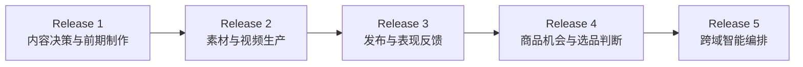
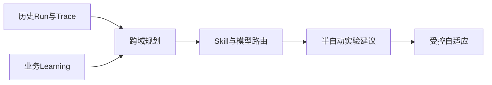
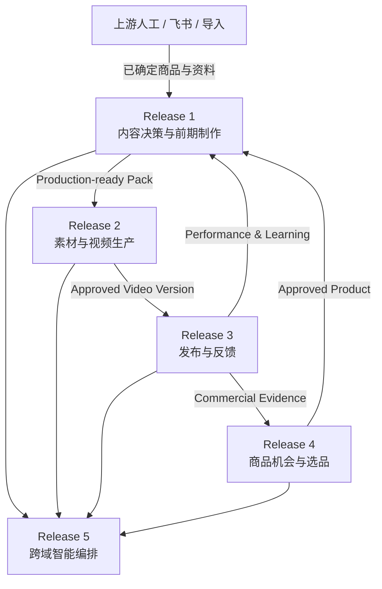

# 02_DELIVERY_RELEASES

## 1. 文档职责

本文档定义长期能力如何被切成真正可交付、可验收的产品版本。

Delivery Release 不等于完整业务链顺序。系统可以从最有现实价值的中段开始，再逐步补齐上下游。

## 2. 交付版本总图

这里的顺序是当前规划，不代表不可调整。每个 Release 必须形成独立业务价值。

## 3. Release 1：内容决策与前期制作

**核心价值**：把一个已确定需要做内容的商品，转化为可交给拍摄或生产团队执行的完整输入包。

**主要输出**：Product Knowledge Baseline、Reference Intelligence Pack、Approved Creative Concept、Script Version、Storyboard、Shot List、Production-ready Pack。

**不包含**：商品机会、商品立项、素材生产、视频生成、发布、数据回收和自动复盘。

## 4. Release 2：素材与视频生产

**核心价值**：将前期设计转化为可审核的视频版本。

**主要能力**：Asset Requirement、Asset Library、Shooting Task、Generation Task、Editing Task、Video Version、Production Review、成本、异步、幂等和失败恢复。

## 5. Release 3：发布与表现反馈

**核心价值**：把发布结果准确关联回构想、剧本和视频版本，形成内容学习闭环。

## 6. Release 4：商品机会与选品判断

**核心价值**：将市场信号和供应链信息转化为可追溯的选品与立项判断。

## 7. Release 5：跨域智能编排

**核心价值**：在稳定业务流程、真实运行数据和评估体系基础上，增加受控的动态编排能力。

Release 5 不是第一次引入 AI 或 Agent，而是升级为跨域、反馈感知和成本质量平衡。

## 8. Release 之间的接口

## 9. Release 冻结规则

当前可冻结：

- Release 1～5 的高层边界。
- Release 1 为当前优先交付。
- Release 2～5 只保留输入、输出和业务价值。

当前不可冻结：

- Release 2～5 的字段、页面、状态机、API 和技术实现。
- Release 5 是否采用多 Agent。
- 各 Release 的具体日期。

## 10. 变更规则

以下变更需要 ADR：

- 调整 Release 1 终点。
- 将新能力加入当前 Release。
- 改变 Release 间的正式接口。
- 将后续能力提前实现。
- 将当前明确排除项重新纳入。
