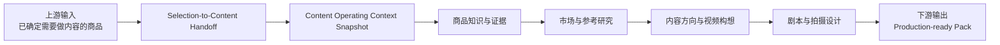
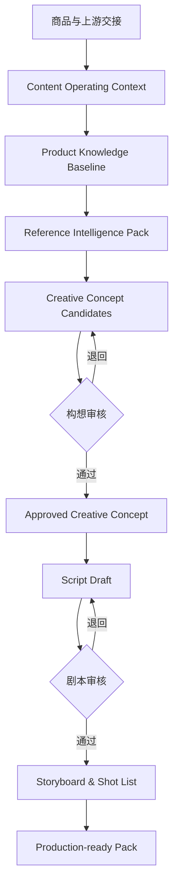

# 03_RELEASE_1_SCOPE_AND_BOUNDARIES

## 1. Release 1 定位

Release 1 是：

> **内容决策与前期制作工作台**

它接收一个已经确定需要制作内容的商品，以及这个商品进入内容阶段时的商业路径、市场、合规和店铺运营上下文，将商品资料、证据和市场参考转化为经过审核的构想、剧本、分镜和拍摄制作输入包。

---

## 2. Release 1 边界总图



---

## 3. 输入边界

Release 1 的输入可以来自人工录入、飞书、文件上传或未来 API。

### 3.1 商品基础输入

- 商品名称与内部标识。
- SKU / 型号。
- 商品图片和说明。
- 供应商资料。
- 已知参数与卖点。
- 实物观察或测试记录。
- 已有参考视频和市场资料。

### 3.2 Selection-to-Content Handoff

至少包括：

- 商品为什么进入内容阶段。
- 初始 Go-to-Market Hypothesis。
- Content Route Hypothesis。
- 内容在商业路径中承担的作用。
- 初始投入等级。
- 当前要验证的假设。
- 决策人和日期。
- 假设置信度。

### 3.3 Content Operating Context Snapshot

至少包括：

- Target Market。
- Platform。
- Product Category。
- Market Compliance Profile Version。
- Channel / Store / Account Context。
- Store Health Snapshot。
- 当前风险等级。
- 当前发布和投入限制。

---

## 4. Content Route 类型

首版支持：

```text
CREATOR_LED
OWNED_CONTENT_LED
PAID_MEDIA_LED
LISTING_SEARCH_LED
LIVE_LED
HYBRID
UNKNOWN
```

`UNKNOWN` 是合法状态，不得伪造确定性。

---

## 5. 业务范围

### Stage 0：内容任务进入与运营上下文确认

输出：

```text
Approved Content Operating Context
```

### Stage A：商品知识准备

输出：

```text
Product Knowledge Baseline
```

### Stage B：参考内容研究

输出：

```text
Reference Intelligence Pack
```

### Stage C：内容方向与视频构想

输出：

```text
Approved Creative Concept
+
Creative Brief
```

### Stage D：剧本与拍摄设计

输出：

```text
Production-ready Script & Shooting Pack
```

---

## 6. 核心业务闭环



---

## 7. 明确不做

Release 1 不做：

- 商品机会发现。
- 商品商业立项。
- 自动生成 Selection Decision。
- 供应商选择和采购决策。
- 全球政策自动采集。
- 店铺实时监控。
- 自动违规预测。
- 素材生产。
- AI 图片或视频生成。
- 视频剪辑。
- TikTok 发布。
- 发布数据回收。
- 自动复盘。
- 自动选品。
- 跨域自适应 Agent。
- 自由多 Agent 协商。
- 通用工作流平台。

---

## 8. 角色边界

| 角色 | 主要责任 |
|---|---|
| 运营 | 录入 Handoff、Context、商品资料、参考和内容任务 |
| 商品负责人 | 确认商品事实、风险和可用 Proof |
| 内容负责人 | 审核内容路径、构想、剧本和拍摄设计 |
| 店铺 / 渠道负责人 | 确认 Store Health 和渠道限制 |
| 合规负责人 | 确认目标市场规则和高风险 Claims |
| AI / Skills | 分类、提取、分析、生成草稿和风险提醒 |
| 系统 | 保存版本、状态、关系、审批与 Trace |

---

## 9. Release 1 完成标准

- 至少 3 个不同商品完整走通。
- Content Route、Market、Compliance 和 Store Health 均可追溯。
- 运营无需开发人员陪同即可完成任务。
- 每个正式结论可追溯到来源、版本和确认人。
- 每个 AI 输出都能识别为草稿。
- 被拒绝的构想和剧本不能生成正式输出。
- 历史导出包不可被后续资料变化静默覆盖。
- 最终输出能直接交给拍摄或生产团队使用。

---

## 10. 当前尚未冻结

- Product、Evidence、Fact、Claim、Proof 的最终对象边界。
- Content Operating Context 是否独立成聚合根。
- Content Project 的精确定义。
- Store Health Snapshot 的最小字段。
- Market Compliance Profile 的最小字段。
- 构想和剧本的完整状态机。
- 页面与交互。
- 字段、Schema、API 和数据库。
