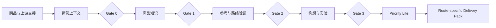

# 03_RELEASE_1_SCOPE_AND_BOUNDARIES

## 1. 文档职责

本文档定义 Release 1 的业务范围、输入边界、正式输出、角色边界和完成标准。

本文档不冻结数据库、API、页面、Prompt、Agent Runtime 或最终字段。

---

## 2. Release 1 定位

Release 1 是：

> **内容决策与前期制作工作台**

它不是默认把每个商品加工成剧本的流水线，而是帮助团队：

- 判断是否值得继续。
- 判断内容路线是否成立。
- 判断是否需要补证据或改变路线。
- 在多个项目之间决定当前优先级。
- 定义准备验证的实验。
- 根据路线生成不同交付包。

---

## 3. Release 1 边界总图



任一 Gate 均可输出：

```text
CONTINUE
PAUSE
STOP
CHANGE_ROUTE
REQUEST_MORE_EVIDENCE
RECYCLE
```

---

## 4. 输入边界

### 3.1 商品与资料

- 商品身份。
- SKU、型号和版本。
- 供应商资料。
- 图片、视频、说明书。
- 实物观察和测试。
- 已有市场与参考资料。

### 3.2 Selection-to-Content Handoff

- 商品为什么进入内容阶段。
- 初始 Go-to-Market Hypothesis。
- 初始 Content Route Hypothesis。
- 内容承担的作用。
- 初始投入等级。
- 当前要验证的业务问题。
- 决策人和日期。

### 3.3 Content Operating Context

- Target Market。
- Platform。
- Product Category。
- Compliance Profile Snapshot。
- Channel / Store / Account Context。
- Store Health Snapshot。
- 当前资源与风险约束。

---

## 5. Content Route Hypothesis 边界

首版支持：

```text
CREATOR_LED
OWNED_CONTENT_LED
PAID_MEDIA_LED
LISTING_SEARCH_LED
LIVE_LED
HYBRID
UNKNOWN
```

但每个 Route 不能只保存枚举值，还必须至少说明：

- Rationale。
- Supporting Evidence。
- Contrary Evidence。
- Assumptions。
- Validation Plan。
- Success Criteria。
- Stop Conditions。
- Owner。
- Review Date。

---

## 6. Release 1 业务范围

### Stage 0：内容任务进入与运营上下文确认

输出：

- Approved Content Operating Context。
- Initial / Revised Content Route Hypothesis。
- Gate 0 Decision。

### Stage A：商品事实与证据

输出：

- Product Knowledge Baseline。
- Gate 1 Decision。

### Stage B：市场与参考、路线验证

输出：

- Reference Intelligence Pack。
- Route Validation Assessment。
- Gate 2 Decision。

### Stage C：内容方向、构想与实验定义

输出：

- Approved Creative Direction。
- Experiment Contract。
- Gate 3 Decision。
- Project Priority。

### Stage D：路线化交付设计

输出：

- Route-specific Delivery Pack。

---

## 7. Release 1 正式输出

根据路线不同：

### Creator-led

```text
Creator Enablement Pack
```

### Owned-content-led

```text
Owned Content Production Pack
```

### Paid-media-led

```text
Paid Media Test Pack
```

### Listing-search-led

```text
Listing / Search Content Pack
```

### Live-led

```text
Live Content Pack
```

### Hybrid

```text
Hybrid Delivery Bundle
```

所有正式输出都必须绑定：

- Approved Creative Direction。
- Content Operating Context Snapshot。
- Content Route Hypothesis Version。
- Experiment Contract。
- Evidence / Proof 引用。
- 审批记录。

---

## 8. Priority Lite 边界

首版只支持：

```text
MUST_DO
NEXT
EXPERIMENTAL
HOLD
STOPPED
```

Priority 是人工决策加简单辅助指标，不是自动综合评分。

Priority 不替代 Gate：

- Gate 判断项目是否具备继续条件。
- Priority 判断项目在有限资源中何时执行。

---

## 9. Experiment Contract 边界

Release 1 负责定义：

- Business Question。
- Hypothesis。
- Variable Under Test。
- Primary Metric。
- Guardrail Metrics。
- Comparison Baseline。
- Observation Window。
- Minimum Sample Expectation。
- Success Rule。
- Stop Rule。
- Next Action。

Release 1 不负责：

- 实际发布。
- 采集实验结果。
- 统计显著性结论。
- 自动证明因果关系。

---

## 10. 明确不做

Release 1 不做：

- 商品机会发现。
- 正式商品商业立项。
- 完整 Portfolio Management。
- 自动项目优先级裁决。
- 自动生成可信 Route 结论。
- 全球政策自动采集。
- 店铺实时监控。
- 素材生产。
- AI 图片或视频生成。
- 剪辑。
- 发布。
- 表现数据回收。
- 自动复盘。
- 自由多 Agent。
- 通用工作流平台。

---

## 11. 角色边界

| 角色 | 责任 |
|---|---|
| 运营 | 创建项目、录入上下文、整理资料和参考 |
| 商品负责人 | 确认商品事实、Proof、风险和证据缺口 |
| 内容负责人 | 审核 Route、Creative Direction 和交付包 |
| 店铺 / 渠道负责人 | 确认 Store Health 和渠道限制 |
| 合规负责人 | 确认市场规则和高风险 Claims |
| 项目 / 业务负责人 | 做 Gate 和 Priority 最终决策 |
| AI / Skills | 生成草稿、分析、检查和建议 |
| 系统 | 保存版本、关系、Gate、Priority、Experiment 和 Trace |

AI 不得：

- 确认正式事实。
- 自动通过 Gate。
- 自动决定 Priority。
- 自动批准 Route。
- 自动证明实验成功。

---

## 12. Release 1 完成标准

- 至少 3 个商品完整走通。
- 至少出现一次 Pause、Stop、Change Route 或 Request More Evidence。
- 至少覆盖两种不同 Route-specific Pack。
- Route Hypothesis 有验证计划和停止条件。
- Experiment Contract 能被 Release 3 使用。
- Priority 队列可以解释团队当前先做什么。
- 正式输出可追溯到 Context、Evidence、Gate 和审批。
- 运营无需开发人员修改数据库。

---

## 13. 当前尚未冻结

- Gate 0～3 的最终判断标准。
- Route Hypothesis 最终 Schema。
- Priority 辅助指标和排序方式。
- 各 Delivery Pack 完整 Schema。
- Experiment Contract 的统计要求。
- 页面、API、数据库和代码实现。
