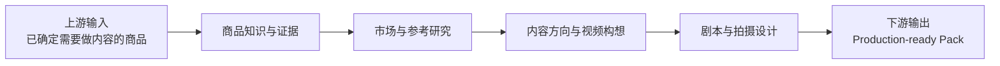
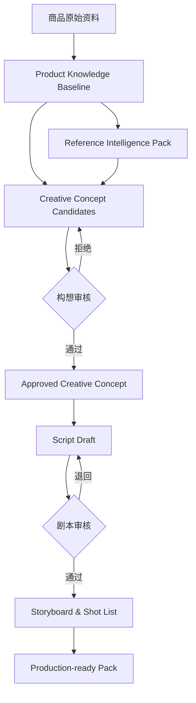

# 03_RELEASE_1_SCOPE_AND_BOUNDARIES

## 1. Release 1 定位

Release 1 是：

> **内容决策与前期制作工作台**

它接收一个已经确定需要制作内容的商品，将商品资料、证据和市场参考转化为经过审核的构想、剧本、分镜和拍摄制作输入包。

## 2. Release 1 边界总图



## 3. 输入边界

Release 1 的输入可以来自人工录入、飞书、文件上传或未来 API。

最低输入包括：

- 商品名称与内部标识。
- SKU / 型号。
- 目标市场与语言。
- 商品图片和说明。
- 供应商资料。
- 已知参数与卖点。
- 实物观察或测试记录。
- 已有参考视频或链接。
- 当前内容目标。

Release 1 不负责证明该商品为什么被选中，也不负责完成商业立项。

## 4. 业务范围

### Stage A：商品知识准备

目标：

- 区分原始资料、供应商宣称、实物观察、AI 推断和人工判断。
- 形成内容生产可以信任的知识基线。
- 明确可以说、需要谨慎说和不能说的内容。

输出：Product Knowledge Baseline、Evidence、Confirmed Facts、Product Proof、Risks、Unknowns。

### Stage B：参考内容研究

目标：

- 保存和分析市场与参考内容。
- 提炼表达结构、Hook、场景、内容形式和可复用机制。
- 标记不适配、不可复制和合规风险。

输出：Reference Intelligence Pack、内容模式与参考结论。

### Stage C：内容方向与视频构想

目标：

- 明确视频目的、目标受众、内容形式和测试假设。
- 创建多个候选构想。
- 关联证据和参考。
- 完成人工审核。

输出：Creative Concept Candidates、Approved Creative Concept、Creative Brief。

### Stage D：剧本与拍摄设计

目标：

- 把已批准构想转化为可执行方案。
- 明确镜头、旁白、动作、证据展示和制作要求。

输出：Script Version、Storyboard、Shot List、Production Requirements、Production-ready Script & Shooting Pack。

## 5. 核心业务闭环



## 6. 输出边界

Release 1 的正式输出：

1. Product Knowledge Baseline
2. Reference Intelligence Pack
3. Approved Creative Concept
4. Creative Brief
5. Script Version
6. Storyboard
7. Shot List
8. Production Requirements
9. Production-ready Script & Shooting Pack

导出包必须是版本快照。上游商品资料后续变化，不得静默修改历史已批准输出。

## 7. 明确不做

Release 1 不做：

- 商品机会发现。
- 商品商业立项。
- 供应商选择和采购决策。
- 素材生产。
- AI 图片或视频生成。
- 实拍任务管理。
- 视频剪辑。
- TikTok 发布。
- 发布数据回收。
- 自动复盘。
- 自动选品。
- 跨域自适应 Agent。
- 自由多 Agent 协商。
- 完整向量知识库平台。
- 通用工作流平台。

## 8. 角色边界

| 角色 | 主要责任 |
|---|---|
| 运营 | 录入资料、整理参考、创建内容项目和构想 |
| 商品负责人 | 确认商品事实、风险和可用 Proof |
| 内容负责人 | 审核内容方向、构想、剧本和拍摄设计 |
| AI / Skills | 分类、提取、分析、生成草稿和风险提醒 |
| 系统 | 保存版本、状态、关系、审批与 Trace |

AI 不得自动确认商品事实、自动批准构想、自动批准剧本或自动修改历史批准版本。

## 9. 最小智能能力

Release 1 可包含：

- `product_information_normalizer`
- `evidence_classifier`
- `claim_candidate_extractor`
- `evidence_conflict_detector`
- `reference_content_analyzer`
- `creative_concept_generator`
- `creative_concept_reviewer`
- `script_generator`
- `storyboard_generator`
- `shootability_reviewer`

权限仅限：

```text
READ
SUGGEST
WRITE_DRAFT
REQUEST_REVIEW
```

## 10. Release 1 完成标准


业务验收标准：

- 至少使用 3 个不同类型商品完整走通。
- 运营无需开发人员陪同即可完成任务。
- 每个正式结论可追溯到来源、版本和确认人。
- 每个 AI 输出都能识别为草稿。
- 被拒绝的构想和剧本不能生成正式输出。
- 历史导出包不可被后续资料变化静默覆盖。
- 最终输出能直接交给拍摄或生产团队使用。

## 11. 当前尚未冻结

需要通过业务 Walkthrough 再确认：

- Product、Evidence、Fact、Claim、Proof 的最终对象边界。
- Content Project 的精确定义。
- Creative Brief 与 Script Input Pack 的边界。
- 构想和剧本的完整状态机。
- 页面与交互。
- 字段与 Schema。
- API 和数据库。
