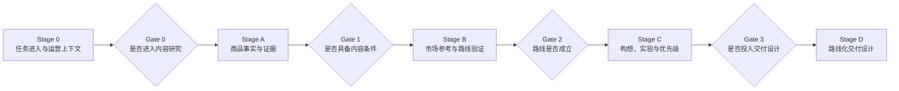
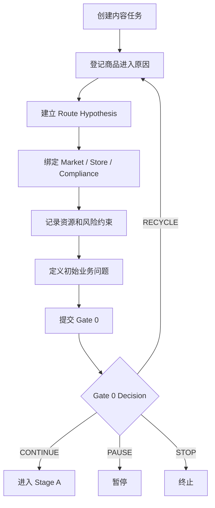
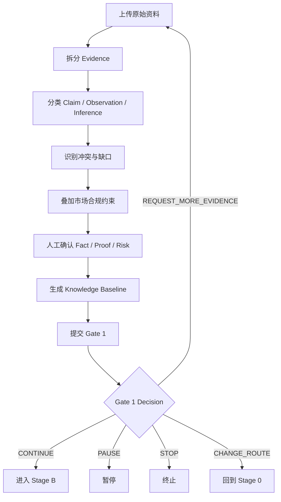
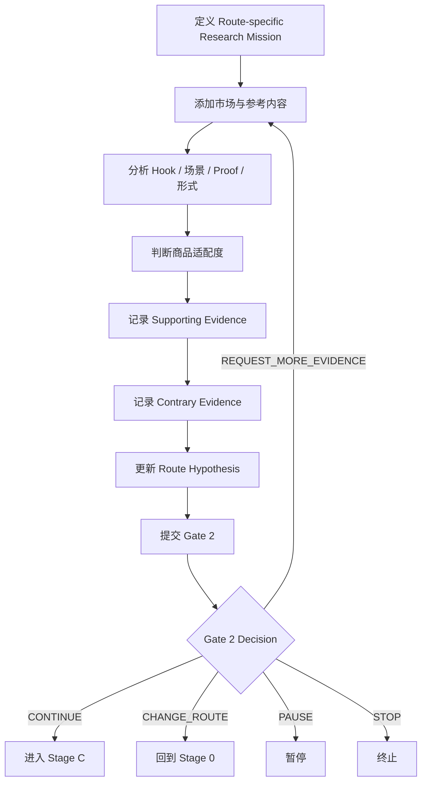
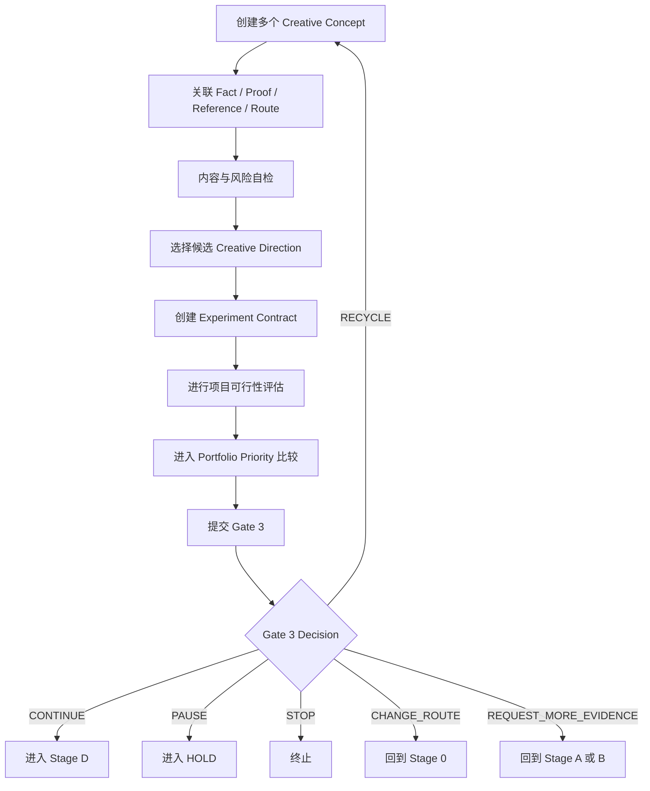
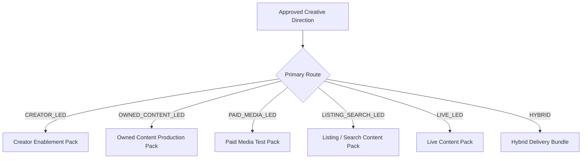
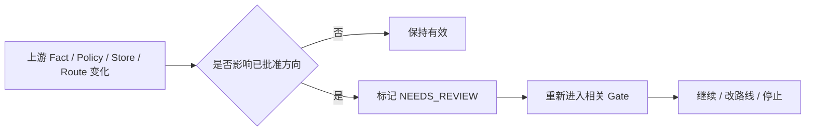

# 04_RELEASE_1_BUSINESS_PROCESS

## 1. 文档职责

本文档描述 Release 1 中人如何完成业务任务、如何作出决策、如何退出、回退和改变路线。

本文档不冻结数据库、API、页面、Prompt、Agent Runtime 或最终字段。

---

## 2. 总体业务过程



---

## 3. 统一 Gate Decision

> Release 1A 注意：Gate 0～Gate 3 当前是长期业务框架。Release 1A 仅实现人工状态和 Decision Record。具体 Gate 规则属于 Provisional Design，需要由真实商品使用数据继续验证。

每次 Gate 必须生成正式记录：

```text
Gate Decision
├── gate_id
├── decision
├── decision_reason
├── evidence_summary
├── risk_summary
├── conditions
├── decision_owner
├── decided_at
├── review_at
└── override_record
```

允许结果：

| 结果 | 含义 |
|---|---|
| CONTINUE | 进入下一阶段 |
| PAUSE | 暂缓，等待时间、资源或外部条件 |
| STOP | 终止当前项目 |
| CHANGE_ROUTE | 回到 Stage 0 修订 Route |
| REQUEST_MORE_EVIDENCE | 回到商品知识或参考阶段 |
| RECYCLE | 保留方向，修改当前阶段产物后重审 |

Gate 不是 AI 自动评分结果，最终由授权责任人决定。

Release 1A 不实现 Gate Engine、自动阻断、复杂条件矩阵、多人会签、Override 机制、Permission Matrix、Gate Score 或可配置 Gate DSL。长期 Gate 演进登记在 [08_LONG_TERM_EVOLUTION_BACKLOG.md](08_LONG_TERM_EVOLUTION_BACKLOG.md)。

---

## 4. Stage 0：任务进入与运营上下文

## 4.1 目的

明确为什么做、在哪个市场做、用什么店铺做、初始路线是什么、当前资源是否支持。

## 4.2 输入

- 商品与上游 Handoff。
- 目标市场和平台。
- Compliance Snapshot。
- Store Health Snapshot。
- 初始 Content Route Hypothesis。
- 团队当前资源。
- 初始投入等级和测试问题。

## 4.3 主流程



## 4.4 Gate 0 判断问题

- 商品是否已有明确进入内容阶段的理由。
- 目标市场、平台和店铺是否明确。
- 当前是否存在明显禁售或不可接受风险。
- 当前店铺和资源是否允许开展研究。
- Route 为 UNKNOWN 时，是否有明确验证计划。
- 当前业务问题是否值得投入最小研究成本。

## 4.5 输出

- Approved Content Operating Context。
- Content Route Hypothesis v1。
- Gate 0 Decision。

---

## 5. Stage A：商品事实与证据

## 5.1 目的

建立可供后续决策使用的 Product Knowledge Baseline。

## 5.2 主流程



## 5.3 Gate 1 判断问题

- 核心商品身份和版本是否明确。
- 是否存在至少一个可用于内容表达的可信 Product Proof。
- 关键 Claims 是否有来源和使用边界。
- 重大冲突是否已解决或明确披露。
- 未知项是否会使后续内容失去基础。
- 当前 Route 是否与可展示 Proof 相匹配。

## 5.4 输出

- Product Knowledge Baseline。
- Gate 1 Decision。

---

## 6. Stage B：市场参考与路线验证

## 6.1 目的

不是简单寻找热门视频，而是验证当前 Content Route 是否有现实依据。

## 6.2 主流程



## 6.3 Gate 2 判断问题

- 市场中是否存在与当前 Route 相符的成功机制或合理信号。
- 当前商品是否能真实复现关键 Proof。
- 参考成功是否可能主要来自投流、达人、账号基础或价格，而不是内容本身。
- 是否存在明显反向证据。
- Route 假设的成功标准和停止条件是否仍合理。
- 是否需要改为 Hybrid、Unknown 或其他 Route。

## 6.4 输出

- Reference Intelligence Pack。
- Route Validation Assessment。
- Revised Content Route Hypothesis。
- Gate 2 Decision。

---

## 7. Stage C：内容方向、构想、实验与优先级

## 7.1 目的

将已验证的路线转化为 Approved Creative Direction，并决定是否值得在当前资源条件下投入交付设计。

## 7.2 主流程



## 7.3 Experiment Contract

至少回答：

- 要验证的业务问题是什么。
- 哪个变量发生变化。
- 主要指标是什么。
- 保护指标是什么。
- 与什么基线比较。
- 观察多久。
- 何时算支持、拒绝或无法判断。
- 下一步行动是什么。

## 7.4 Priority Lite

项目通过可行性判断后，再和其他项目比较：

```text
MUST_DO
NEXT
EXPERIMENTAL
HOLD
STOPPED
```

判断参考：

- Business Priority。
- Evidence Readiness。
- Route Confidence。
- Market Timing。
- Store Readiness。
- Expected Value。
- Estimated Effort。
- Budget Limit。
- Current WIP。

## 7.5 Gate 3 判断问题

- Creative Direction 是否与 Route 一致。
- 是否有足够 Evidence 和 Product Proof。
- Experiment Contract 是否可执行。
- 当前资源是否值得投入。
- 与其他项目相比是否应立即执行。
- 风险是否在可接受范围内。

## 7.6 输出

- Approved Creative Direction。
- Experiment Contract。
- Project Priority。
- Gate 3 Decision。

---

## 8. Stage D：路线化内容交付设计

## 8.1 目的

根据 Primary Route 生成适合真实执行主体的交付包。

## 8.2 路线分支



## 8.3 Creator Enablement Pack

至少包括：

- Creator Brief。
- Product Proof。
- 卖点卡。
- 禁止 Claims。
- 推荐场景和 Hook。
- 使用说明。
- 自由发挥边界。
- 样品注意事项。

## 8.4 Owned Content Production Pack

至少包括：

- Script。
- Storyboard。
- Shot List。
- Voiceover / Dialogue / On-screen Text。
- Product Proof 位置。
- 拍摄和素材要求。
- 风险提示。

## 8.5 Paid Media Test Pack

至少包括：

- Hook Variants。
- CTA Variants。
- Proof Modules。
- 镜头模块。
- 素材组合规则。
- 测试矩阵。
- 与 Experiment Contract 的映射。

## 8.6 Listing / Search Content Pack

至少包括：

- 功能说明。
- 使用步骤。
- FAQ。
- 适用与不适用场景。
- 商品卡内容。
- 搜索表达。
- 预期管理。

## 8.7 Live Content Pack

至少包括：

- Live Talking Points。
- Demonstration Flow。
- FAQ。
- Product Proof。
- Claims 边界。
- 节奏与互动提示。

## 8.8 Hybrid Delivery Bundle

明确：

- Primary Route。
- Secondary Route。
- 资源比例。
- 各 Route 的必要交付物。
- 共用 Proof 和差异化内容。

---

## 9. 变更与失效



不得静默覆盖已批准版本。

---

## 10. 当前待讨论问题

1. Gate 0～3 的硬性条件与建议条件。
2. Gate Decision 的最终责任人。
3. Override 的允许范围。
4. Route Hypothesis 的最小字段。
5. Hybrid 的主次路线和资源比例。
6. Priority Lite 是否在 Gate 3 内完成或独立评审。
7. Experiment Contract 的最小指标要求。
8. Stage D 各交付包最小可用结构。
9. 哪些变化触发 NEEDS_REVIEW。
10. PAUSE、HOLD 和 STOP 的区别。
