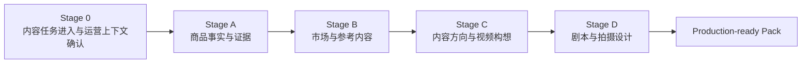
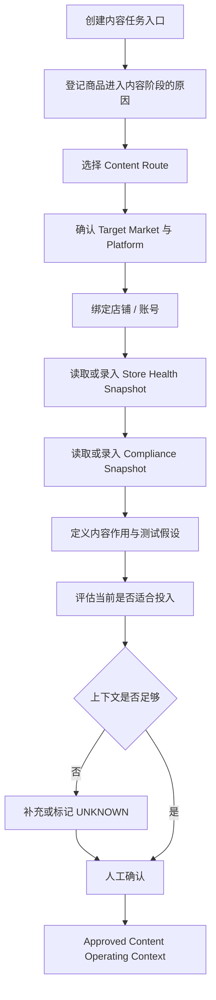
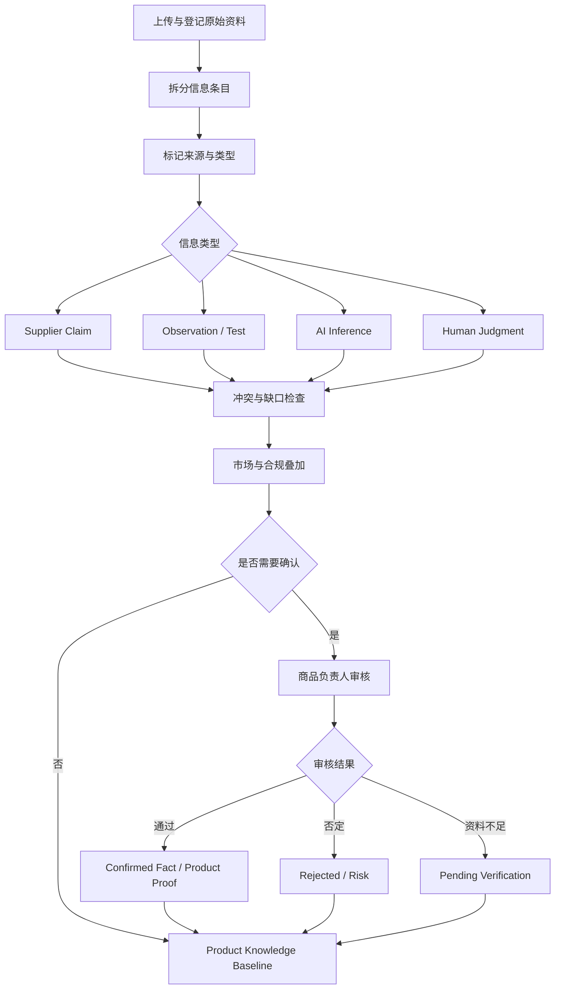
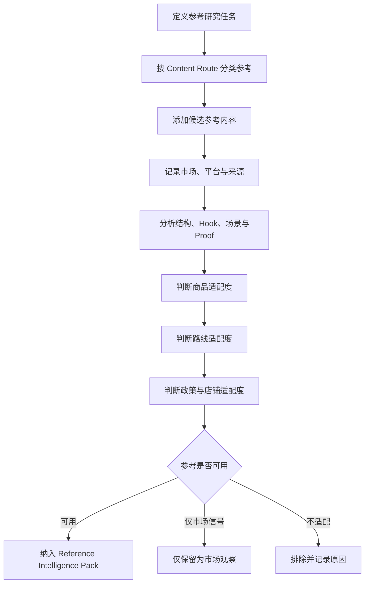
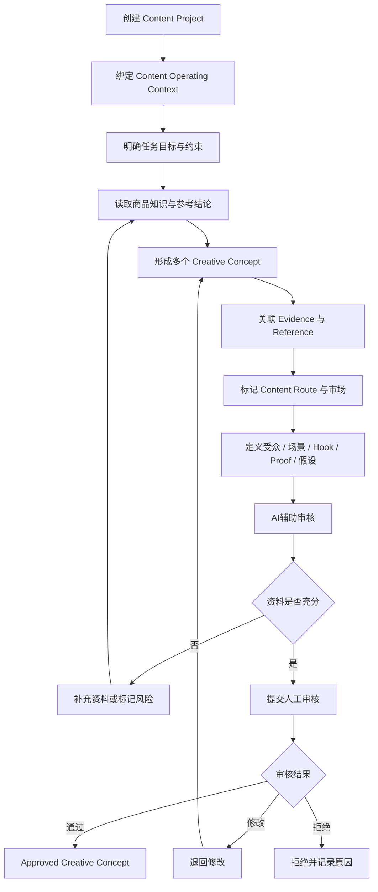
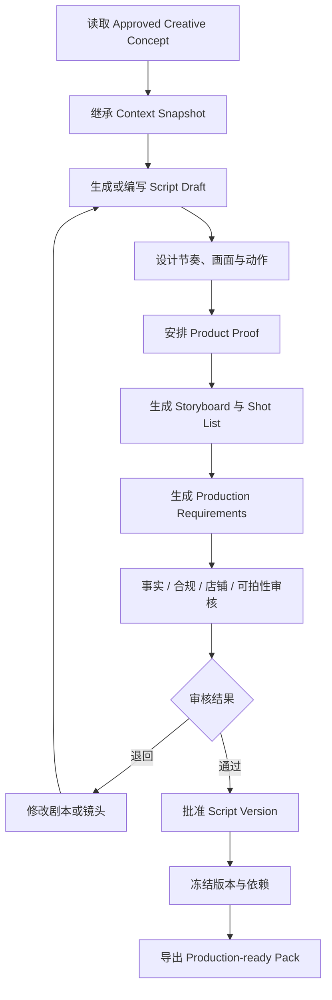
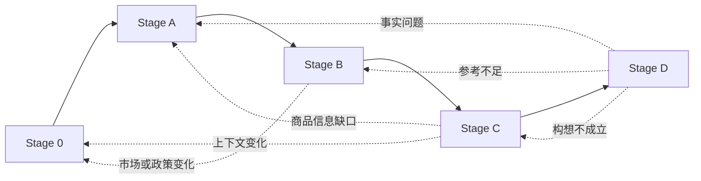

# 04_RELEASE_1_BUSINESS_PROCESS

## 1. 文档职责

本文档只描述 Release 1 中“人和业务如何完成任务”。

它不冻结数据库、API、页面、Prompt、Agent Runtime 或具体 Kernel 实现。

---

## 2. Release 1 业务目标

将：

```text
一个已经确定需要制作内容的商品
+
Selection-to-Content Handoff
+
Content Operating Context
+
商品资料与参考内容
```

转化为：

```text
Approved Creative Concept
+
Approved Script
+
Storyboard
+
Shot List
+
Production Requirements
```

---

## 3. 端到端业务流程



---

# 4. Stage 0：内容任务进入与运营上下文确认

## 4.1 业务目的

在进入商品事实与内容设计前，明确：

- 为什么这个商品现在要做内容。
- 初始商业路径是什么。
- 内容在商业路径中承担什么作用。
- 目标市场和平台是什么。
- 使用哪个店铺或账号。
- 当前店铺是否适合放大流量。
- 地区规则和风险版本是什么。
- 当前要验证什么。
- 预计投入多少。
- 哪些结论仍不确定。

## 4.2 输入

- 商品身份。
- Selection Decision 或人工立项结论。
- 目标市场。
- 初始 Go-to-Market Hypothesis。
- 初始 Content Route Hypothesis。
- 店铺与账号信息。
- Store Health Snapshot。
- Market Compliance Profile Snapshot。
- 当前内容目标与投入等级。

## 4.3 主流程



## 4.4 输出

```text
Approved Content Operating Context
```

包含：

- Product Context。
- Selection-to-Content Handoff。
- Content Route Hypothesis。
- Target Market。
- Platform。
- Compliance Snapshot。
- Store Health Snapshot。
- Content Objective。
- Investment Level。
- Test Hypothesis。
- Risk Tolerance。
- Decision Owner / Date。

## 4.5 完成条件

- 上游决策没有被简化为 Product ID。
- `UNKNOWN` 被允许并明确标记。
- 市场、渠道、店铺和合规上下文可追溯。
- 后续 Content Project 绑定此快照。

---

# 5. Stage A：商品事实与证据

## 5.1 业务目的

建立内容生产可依赖的商品知识基线。

## 5.2 主流程



## 5.3 输出

```text
Product Knowledge Baseline
```

至少包含：

- Supplier Claims。
- Observations。
- Confirmed Facts。
- Product Proof。
- Risks。
- Unknowns。
- Market-specific Restrictions。
- 禁止或谨慎表达项。

---

# 6. Stage B：市场与参考内容

## 6.1 业务目的

按目标市场和内容路径研究参考内容。

## 6.2 主流程



## 6.3 参考分类

- Creator-led Reference。
- Owned-content Reference。
- Paid-media Reference。
- Listing / Search Reference。
- Live Reference。
- Market Signal。
- Risk Case。

## 6.4 输出

```text
Reference Intelligence Pack
```

---

# 7. Stage C：内容方向与视频构想

## 7.1 业务目的

基于商品知识、参考研究和运营上下文，形成并批准可执行构想。

## 7.2 主流程



## 7.3 构想最低要求

- 任务类型。
- Content Route。
- Target Market。
- 目标受众。
- 用户问题。
- 核心内容承诺。
- Hook。
- Product Proof。
- 参考机制。
- 测试假设。
- 为什么值得拍。
- 店铺与政策限制。
- 风险和制作约束。

---

# 8. Stage D：剧本与拍摄设计

## 8.1 业务目的

把已批准构想转化为可执行方案。

## 8.2 主流程



## 8.3 输出

```text
Production-ready Script & Shooting Pack
```

必须继承：

- Content Route。
- Target Market。
- Compliance Profile Version。
- Store Health Snapshot。
- Channel Account Context。

---

# 9. 跨阶段回退与变更



上游上下文变化可能使下游对象进入：

```text
NEEDS_REVIEW
```

---

# 10. 当前待讨论问题

1. Content Operating Context 是否独立成聚合根。
2. Store Health Snapshot 首版最低字段。
3. Market Compliance Profile Snapshot 首版最低字段。
4. Content Route 是否允许多选与主次关系。
5. `UNKNOWN` 如何影响后续审批。
6. 店铺健康较差时是否禁止进入后续阶段。
7. 合规规则由谁确认。
8. Content Project 是否必须绑定单一店铺。
9. 同一商品是否可以针对不同市场建立多个 Project。
10. 同一构想是否允许派生多个渠道版本。

---

## 11. 退出标准

- 使用三个真实商品完成 Walkthrough。
- Stage 0 不会变成完整选品系统。
- 业务人员能解释为什么该商品进入内容阶段。
- 内容路径、市场、政策和店铺状态可追溯。
- 后续构想与剧本继承同一上下文快照。
