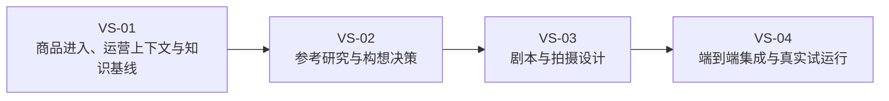
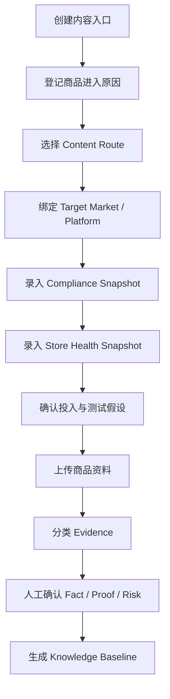
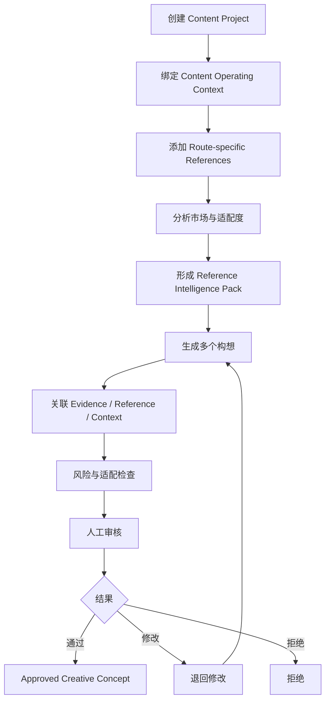
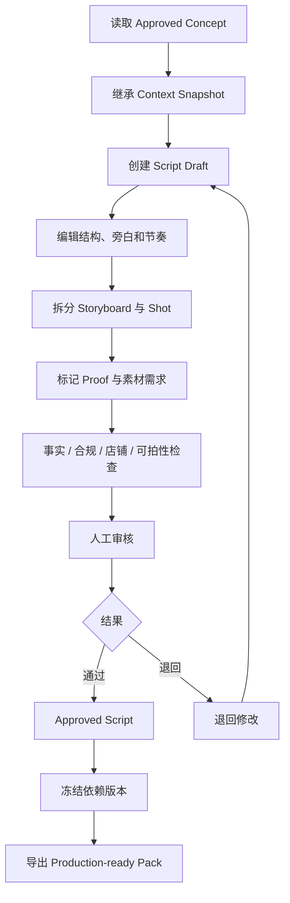
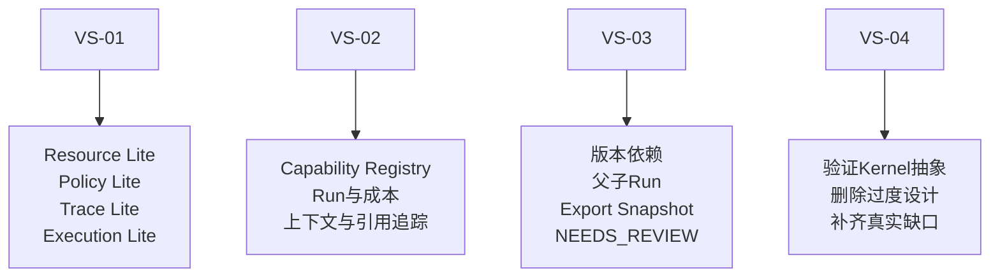

# 05_RELEASE_1_VERTICAL_SLICES

## 1. 文档职责

本文档把 Release 1 的完整业务流程拆成可独立开发、测试和验收的垂直切片。

---

## 2. Release 1 切片总图



---

# 3. VS-01：商品进入、运营上下文与知识基线

## 3.1 业务目标

让运营能够把：

```text
Selection-to-Content Handoff
+
Content Operating Context
+
商品原始资料
```

转化为：

```text
Approved Content Operating Context
+
Product Knowledge Baseline
```

## 3.2 用户主流程



## 3.3 候选领域对象

- Product。
- Selection-to-Content Handoff。
- Content Operating Context。
- Market Compliance Profile Snapshot。
- Channel Account Context。
- Store Health Snapshot。
- Evidence。
- Supplier Claim。
- Observation。
- Confirmed Fact。
- Product Proof。
- Product Risk。
- Review。

## 3.4 最小页面范围

- 商品列表。
- 内容入口创建。
- Handoff 与 Context 表单。
- Market / Store Snapshot 视图。
- 商品资料与来源。
- Evidence 工作区。
- Fact / Proof / Risk 审核。
- Product Knowledge Baseline 只读视图。

## 3.5 最小 Capability

```text
product_information_normalizer
evidence_classifier
claim_candidate_extractor
evidence_conflict_detector
market_policy_context_checker
store_health_context_summarizer
knowledge_baseline_summarizer
```

## 3.6 最小 Kernel 需求

### Resource Lite

- ID。
- 版本。
- 来源。
- 对象关系。
- 状态。

### Policy Lite

- AI 不能确认事实。
- 店铺与合规上下文由授权人员确认。
- 已批准版本修改时创建新版本。

### Trace Lite

- 谁录入 Handoff。
- 谁确认 Context。
- 谁确认 Fact / Proof。
- 使用过哪些 Skill。

### Execution Lite

- AI 运行记录。
- 成功 / 失败。
- 输入输出引用。
- 简单重试。
- 模型与成本。

## 3.7 验收场景

- Content Route 为 `UNKNOWN` 仍可进入，但系统明确风险。
- 店铺评分较低时，能记录“限制投入”结论。
- 合规 Profile 版本可追溯。
- 供应商参数与实物标签冲突时不自动选择一方。
- 商品资料更新后旧 Baseline 仍可追溯。

## 3.8 明确不做

- 自动选品。
- 自动政策采集。
- 店铺实时同步。
- 自动合规结论。
- 大规模 RAG。
- 完整知识图谱。

---

# 4. VS-02：参考研究与构想决策

## 4.1 业务目标

把商品知识、内容路径、市场与店铺上下文转化为多个候选构想，并完成人工决策。

## 4.2 用户主流程



## 4.3 候选领域对象

- Reference。
- Reference Analysis。
- Market Signal。
- Content Project。
- Content Direction。
- Creative Concept。
- Experiment Hypothesis。
- Creative Brief。
- Evidence Citation。
- Reference Citation。
- Review。

## 4.4 最小 Capability

```text
reference_content_analyzer
reference_fit_evaluator
route_fit_evaluator
market_policy_compliance_reviewer
store_context_impact_analyzer
creative_concept_generator
creative_concept_reviewer
creative_brief_builder
duplicate_concept_detector
```

## 4.5 最小 Kernel 增量

### Capability

- Skill 输入输出。
- Skill 版本。
- 权限和风险。
- 实现引用。

### Execution

- Run。
- 父子 Run。
- 失败原因。
- 简单重试。
- 成本。
- 结构化输出校验。

### Policy

- AI 只能写构想草稿。
- 内容负责人批准构想。
- 没有引用可信商品事实的构想不得批准。
- 不符合市场或店铺限制的构想不得批准。

### Trace

- 构想使用哪些 Evidence。
- 参考哪些 Reference。
- 继承哪个 Context Snapshot。
- 使用哪个 Skill、Prompt 和模型版本。

## 4.6 验收场景

- 同一商品针对 Creator-led 和 Owned-content-led 产生不同构想。
- 同一商品针对 US 和 JP 产生不同市场表达。
- 店铺状态不适合放大流量时，构想能降低投入或改变目标。
- 不适配参考被排除并保留原因。
- 被拒绝构想不能进入剧本。

---

# 5. VS-03：剧本与拍摄设计

## 5.1 业务目标

把 Approved Creative Concept 转化为可拍、可审核、可导出的生产输入包。

## 5.2 用户主流程



## 5.3 候选领域对象

- Script Version。
- Script Section。
- Storyboard。
- Shot。
- Voiceover / Dialogue。
- On-screen Text。
- Production Requirement。
- Asset Requirement。
- Script Review。
- Export Snapshot。

## 5.4 最小 Capability

```text
script_generator
script_structure_reviewer
factuality_reviewer
claim_risk_reviewer
market_policy_compliance_reviewer
store_context_impact_analyzer
storyboard_generator
shot_list_builder
shootability_reviewer
production_pack_builder
```

## 5.5 最小 Kernel 增量

### Resource

- 正式版本。
- 历史版本。
- 依赖版本引用。
- Export Snapshot。

### Execution

- 父子 Run。
- 阶段性失败。
- 简单恢复。
- 重试。
- 成本累计。

### Policy

- 只有 Approved Concept 能生成正式剧本。
- AI 不能批准剧本。
- 正式导出前必须审核。
- 上游 Context 重大变化时进入 `NEEDS_REVIEW`。

### Trace

- 剧本来自哪个构想版本。
- 使用哪些 Fact / Proof。
- 继承哪个 Market / Store Snapshot。
- 导出包由哪些版本组成。

## 5.6 是否需要 LangGraph

默认不需要。

只有出现以下真实问题后再做 Spike：

- 流程分支明显增多。
- 多步骤中断后恢复困难。
- 人工审批后需要继续同一个长任务。
- 普通 Application Service 难以维护状态。
- 需要稳定 Checkpoint。

---

# 6. VS-04：端到端集成与真实试运行

## 6.1 主流程


## 6.2 测试商品

- 车载吸尘器。
- 电动泡沫喷壶。
- 无线直发梳或其他个人护理产品。

## 6.3 集成验收指标

- 端到端完成率。
- 运营独立操作率。
- Context 追溯完整率。
- 事实追溯完整率。
- AI 草稿人工修订率。
- 构想与剧本退回原因。
- 单任务耗时。
- 单任务模型成本。
- 导出包可用性评分。
- 多余字段和步骤。

---

# 7. 切片与 Kernel 的演进关系



原则：

> Kernel 不是独立先完成的产品；它由垂直切片拉动实现，并被后续切片不断验证。

---

# 8. 当前待讨论问题

1. VS-01 是否过大，是否需把 Stage 0 作为子里程碑。
2. Store Health Snapshot 首版字段。
3. Market Compliance Snapshot 首版字段。
4. Content Route 是否允许主次多选。
5. Reference 是否按 Route 分池。
6. Content Project 是否绑定单一店铺与市场。
7. 同一 Approved Concept 是否允许派生多个渠道版本。
8. VS-03 是否一次完成 Script、Storyboard 和 Shot List。
9. VS-04 是正式开发切片还是 Pilot Gate。
10. Release 1 是否必须支持飞书导入。

---

## 9. 下一步

当前只讨论并冻结：

- 三个主切片是否合理。
- 每个切片的起点和终点。
- VS-01 是否足以产生独立业务价值。
- VS-02 是否将参考研究和构想决策合并。
- VS-03 是否完整止于 Production-ready Pack。
- VS-04 是否作为强制 Pilot Gate。

在这些问题确认前，不进入数据库、API 和代码实现。
