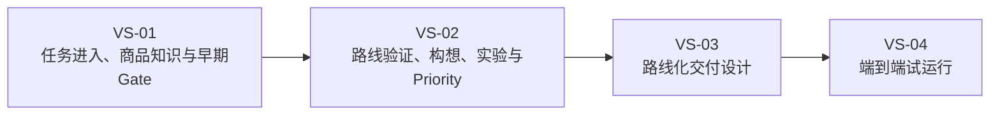
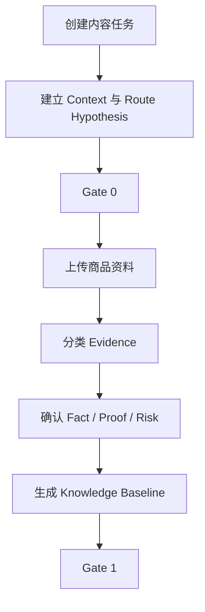
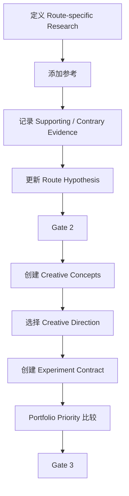
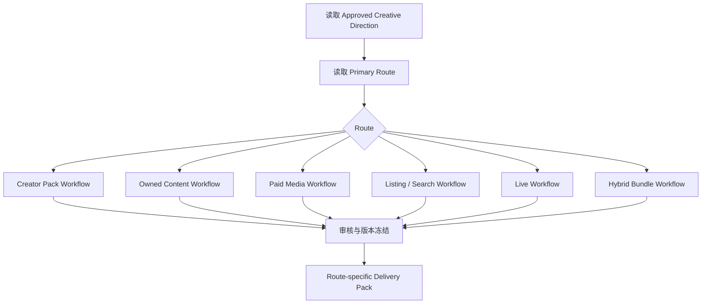
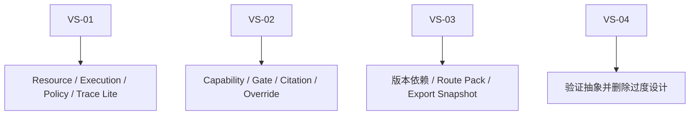

# 05_RELEASE_1_VERTICAL_SLICES

## 1. 文档职责

本文档将 Release 1 业务流程拆为可独立开发、测试和验收的垂直切片。

每个切片必须贯穿：

```text
用户任务
→ 前端
→ API
→ 领域规则
→ 数据
→ AI辅助
→ Gate / Policy
→ Trace
→ 可验收输出
```

---

## 2. Release 1 切片总图



Release 1A 仅实现 MVP 映射切片。原完整 Vertical Slices 保留为长期 Release 1 参考；当前实际实施顺序由 [07_RELEASE_1A_IMPLEMENTATION_PLAN.md](07_RELEASE_1A_IMPLEMENTATION_PLAN.md) 决定。

Release 1A 映射：

| MVP Slice | 名称 | 对应实施重点 |
|---|---|---|
| VS-1A | Product Workspace | Product、Product Version、Evidence |
| VS-1B | Product Knowledge Baseline | Fact / Proof / Risk / Unknown、人工确认 |
| VS-2A | Reference Workspace | Reference 保存、拆解、适配性判断 |
| VS-3A | Creative Concept | Content Project、构想草稿、人工选择 |
| VS-3B | Owned Content Production Pack | Script、Storyboard、Shot List、导出 |
| VS-4A | Three-product Pilot | 车载吸尘器、电动泡沫喷壶、个人护理商品 |

当前不实现完整 Gate / Priority / Experiment，也不实现非 OWNED_CONTENT 的完整 Route Pack。

---

## 3. VS-01：任务进入、商品知识与早期 Gate

## 3.1 业务目标

将：

```text
商品 + Handoff + Operating Context + 原始资料
```

转化为：

```text
Approved Content Operating Context
Content Route Hypothesis v1
Product Knowledge Baseline
Gate 0 Decision
Gate 1 Decision
```

## 3.2 用户流程



## 3.3 候选领域对象

- Product。
- Product Version。
- Selection-to-Content Handoff。
- Content Operating Context。
- Content Route Hypothesis。
- Market Compliance Snapshot。
- Store Health Snapshot。
- Evidence。
- Supplier Claim。
- Observation。
- Confirmed Fact。
- Product Proof。
- Product Risk。
- Gate Decision。
- Review。

## 3.4 最小页面

- 商品与内容任务列表。
- Handoff / Context 表单。
- Route Hypothesis 编辑。
- Gate 0 决策页。
- Evidence 工作区。
- Fact / Proof / Risk 审核页。
- Product Knowledge Baseline。
- Gate 1 决策页。

## 3.5 最小 Capability

```text
product_information_normalizer
evidence_classifier
claim_candidate_extractor
evidence_conflict_detector
market_policy_context_checker
store_health_context_summarizer
route_hypothesis_draft_builder
knowledge_baseline_summarizer
gate_readiness_checker
```

## 3.6 Kernel Lite

- Resource：ID、版本、来源、关系、状态。
- Execution：AI Run、失败、重试、成本。
- Policy：AI 不得确认 Fact 或通过 Gate。
- Trace：Context、Fact、Gate 和审批追踪。

## 3.7 验收场景

- Route 为 UNKNOWN，但有验证计划，Gate 0 可条件通过。
- 明显禁售或店铺严重受限，Gate 0 可 Stop。
- 没有可信 Product Proof，Gate 1 可 Request More Evidence。
- 商品版本变化后旧 Baseline 保留。
- AI 错误分类可被人工纠正。

## 3.8 明确不做

- 自动选品。
- 自动政策采集。
- 店铺实时同步。
- 自动 Gate 通过。
- 完整 Route 评分。

---

## 4. VS-02：路线验证、构想、实验与 Priority

## 4.1 业务目标

将 Product Knowledge Baseline 和 Route Hypothesis 转化为：

```text
Reference Intelligence Pack
Revised Route Hypothesis
Gate 2 Decision
Approved Creative Direction
Experiment Contract
Project Priority
Gate 3 Decision
```

## 4.2 用户流程



## 4.3 候选领域对象

- Reference。
- Reference Analysis。
- Market Signal。
- Route Validation Assessment。
- Content Project。
- Creative Concept。
- Approved Creative Direction。
- Experiment Contract。
- Project Priority。
- Gate Decision。
- Evidence Citation。
- Reference Citation。

## 4.4 最小页面

- Reference 工作区。
- Route Evidence 对比页。
- Gate 2 决策页。
- Creative Concept 看板。
- Creative Direction 审核页。
- Experiment Contract 编辑页。
- Priority 队列。
- Gate 3 决策页。

## 4.5 最小 Capability

```text
reference_content_analyzer
reference_fit_evaluator
route_supporting_evidence_extractor
route_contrary_evidence_extractor
route_hypothesis_reviewer
creative_concept_generator
creative_concept_reviewer
experiment_contract_draft_builder
priority_context_summarizer
gate_readiness_checker
```

## 4.6 Kernel 增量

- Capability Registry。
- 父子 Run。
- 结构化输出校验。
- Gate Policy。
- Context 和 Citation Trace。
- 人工 Override 记录。

## 4.7 验收场景

- Creator-led 假设被参考研究否定，Gate 2 输出 CHANGE_ROUTE。
- 同一商品在 US 与 JP 下产生不同 Creative Direction。
- 两个可行项目争夺资源，一个进入 MUST_DO，一个进入 HOLD。
- Experiment Contract 缺少成功规则时，Gate 3 不通过。
- 被拒绝构想不能进入 VS-03。

## 4.8 明确不做

- 自动决定 Route。
- 自动 Portfolio 优化。
- 精确收入预测。
- 自动证明视频销量归因。
- 多 Agent 自由讨论。

---

## 5. VS-03：路线化交付设计

## 5.1 业务目标

根据 Approved Creative Direction 和 Primary Route 生成正确的交付包，而不是统一 Script Pack。

## 5.2 用户流程



## 5.3 候选领域对象

- Delivery Pack。
- Creator Brief。
- Script Version。
- Storyboard。
- Shot。
- Hook Variant。
- CTA Variant。
- Proof Module。
- Listing Content Module。
- Live Talking Point。
- Asset Requirement。
- Production Requirement。
- Export Snapshot。

## 5.4 最小页面

- Route 交付模板选择。
- Pack 编辑器。
- Evidence / Proof 引用。
- Claims 与可执行性检查。
- 版本历史。
- 审核与导出。

## 5.5 最小 Capability

```text
creator_enablement_pack_builder
script_generator
storyboard_generator
shot_list_builder
paid_media_variant_builder
listing_content_pack_builder
live_content_pack_builder
hybrid_bundle_planner
factuality_reviewer
claim_risk_reviewer
shootability_reviewer
delivery_pack_builder
```

## 5.6 Kernel 增量

- Route-specific Capability。
- 父子 Run。
- 版本依赖。
- Export Snapshot。
- NEEDS_REVIEW。
- Pack 审批 Policy。
- Pack 构成 Trace。

## 5.7 验收场景

- Creator-led 项目不被强制生成完整 Storyboard。
- Owned-content 项目可生成 Script、Storyboard 和 Shot List。
- Paid-media 项目生成多 Hook / CTA 变体和测试矩阵。
- Hybrid 项目明确主次路线和资源比例。
- Product Proof 撤销后相关 Pack 进入 NEEDS_REVIEW。

---

## 6. VS-04：端到端试运行

## 6.1 业务目标

验证前三个切片共同形成真实决策闭环。

## 6.2 主流程


## 6.3 测试要求

至少使用：

- 车载吸尘器。
- 电动泡沫喷壶。
- 无线直发梳或其他个人护理产品。

至少覆盖：

- 两种不同 Content Route。
- 一次 CHANGE_ROUTE。
- 一次 REQUEST_MORE_EVIDENCE。
- 一个 HOLD 或 STOP 项目。
- 一个完整 Experiment Contract。
- 一个非 Script 类型 Delivery Pack。

## 6.4 验收指标

- 端到端完成率。
- 运营独立操作率。
- Gate 决策可解释性。
- Route Hypothesis 可验证性。
- Priority 队列可用性。
- Experiment Contract 完整度。
- Pack 对实际执行团队的可用性。
- 单任务时间与模型成本。
- 多余步骤和字段。

---

## 7. 切片与 Kernel 演进



Kernel 仍由真实切片拉动，不单独先建完整平台。

---

## 8. 当前待讨论问题

1. Gate 0 和 Gate 1 是否都属于 VS-01。
2. Gate 2 与 Gate 3 是否应在同一切片。
3. Priority Lite 是 Gate 3 的组成部分还是独立动作。
4. Experiment Contract 是否允许在 Gate 3 后补全。
5. 首版必须支持哪些 Route。
6. 是否暂缓 Live 和 Listing Route 的完整实现。
7. Hybrid 是否在首版支持。
8. Creator Pack 与 Owned Pack 的最小交付边界。
9. VS-04 是否作为强制 Release Gate。
10. 首版是否需要飞书导入。
