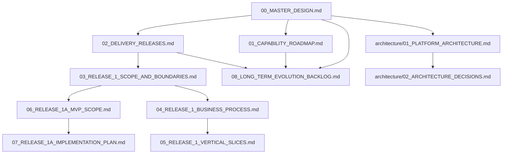

# DOCUMENT_MAP

## 1. Canonical Master

[00_MASTER_DESIGN.md](00_MASTER_DESIGN.md) is the canonical Master Design.

Archived Master drafts are not current authority sources.

## 2. Document Authority Order

1. [00_MASTER_DESIGN.md](00_MASTER_DESIGN.md)
2. [01_CAPABILITY_ROADMAP.md](01_CAPABILITY_ROADMAP.md)
3. [02_DELIVERY_RELEASES.md](02_DELIVERY_RELEASES.md)
4. [03_RELEASE_1_SCOPE_AND_BOUNDARIES.md](03_RELEASE_1_SCOPE_AND_BOUNDARIES.md)
5. [04_RELEASE_1_BUSINESS_PROCESS.md](04_RELEASE_1_BUSINESS_PROCESS.md)
6. [05_RELEASE_1_VERTICAL_SLICES.md](05_RELEASE_1_VERTICAL_SLICES.md)
7. [06_RELEASE_1A_MVP_SCOPE.md](06_RELEASE_1A_MVP_SCOPE.md)
8. [07_RELEASE_1A_IMPLEMENTATION_PLAN.md](07_RELEASE_1A_IMPLEMENTATION_PLAN.md)
9. [08_LONG_TERM_EVOLUTION_BACKLOG.md](08_LONG_TERM_EVOLUTION_BACKLOG.md)
10. [architecture/01_PLATFORM_ARCHITECTURE.md](architecture/01_PLATFORM_ARCHITECTURE.md)
11. [architecture/02_ARCHITECTURE_DECISIONS.md](architecture/02_ARCHITECTURE_DECISIONS.md)

## 3. What Each Document Answers

| Document | Status | Answers |
|---|---|---|
| [00_MASTER_DESIGN.md](00_MASTER_DESIGN.md) | BASELINE_CANDIDATE | Why the system exists, what the long-term direction is, what Release 1 covers, and how top-level architecture boundaries work. |
| [01_CAPABILITY_ROADMAP.md](01_CAPABILITY_ROADMAP.md) | BASELINE_CANDIDATE | Which long-term capabilities the system needs and how capabilities relate to releases. |
| [02_DELIVERY_RELEASES.md](02_DELIVERY_RELEASES.md) | BASELINE_CANDIDATE | How long-term capabilities are split into delivery releases. |
| [03_RELEASE_1_SCOPE_AND_BOUNDARIES.md](03_RELEASE_1_SCOPE_AND_BOUNDARIES.md) | BASELINE_CANDIDATE | What Release 1 includes, excludes, accepts as input, and must output. |
| [04_RELEASE_1_BUSINESS_PROCESS.md](04_RELEASE_1_BUSINESS_PROCESS.md) | DRAFT_FOR_DISCUSSION | How people move through Release 1 decisions, gates, exits, and route changes. |
| [05_RELEASE_1_VERTICAL_SLICES.md](05_RELEASE_1_VERTICAL_SLICES.md) | DRAFT_FOR_DISCUSSION | How Release 1 can be split into verifiable vertical slices. |
| [06_RELEASE_1A_MVP_SCOPE.md](06_RELEASE_1A_MVP_SCOPE.md) | BASELINE_CANDIDATE | What Release 1A MVP is allowed to implement. |
| [07_RELEASE_1A_IMPLEMENTATION_PLAN.md](07_RELEASE_1A_IMPLEMENTATION_PLAN.md) | DRAFT_FOR_REVIEW | How Release 1A implementation preparation and staged delivery should proceed. |
| [08_LONG_TERM_EVOLUTION_BACKLOG.md](08_LONG_TERM_EVOLUTION_BACKLOG.md) | BASELINE_CANDIDATE | Which long-term mechanisms are deferred and what triggers their redesign. |
| [architecture/01_PLATFORM_ARCHITECTURE.md](architecture/01_PLATFORM_ARCHITECTURE.md) | BASELINE_CANDIDATE | How the platform architecture supports the business design. |
| [architecture/02_ARCHITECTURE_DECISIONS.md](architecture/02_ARCHITECTURE_DECISIONS.md) | BASELINE_CANDIDATE | Which architecture and business-architecture decisions have been accepted or proposed. |

## 4. Reading Order

Read documents in the authority order above unless a task is narrowly scoped.

For Release 1 work, read:

1. [00_MASTER_DESIGN.md](00_MASTER_DESIGN.md)
2. [01_CAPABILITY_ROADMAP.md](01_CAPABILITY_ROADMAP.md)
3. [02_DELIVERY_RELEASES.md](02_DELIVERY_RELEASES.md)
4. [03_RELEASE_1_SCOPE_AND_BOUNDARIES.md](03_RELEASE_1_SCOPE_AND_BOUNDARIES.md)
5. [06_RELEASE_1A_MVP_SCOPE.md](06_RELEASE_1A_MVP_SCOPE.md)
6. [07_RELEASE_1A_IMPLEMENTATION_PLAN.md](07_RELEASE_1A_IMPLEMENTATION_PLAN.md)
7. [08_LONG_TERM_EVOLUTION_BACKLOG.md](08_LONG_TERM_EVOLUTION_BACKLOG.md)
8. [04_RELEASE_1_BUSINESS_PROCESS.md](04_RELEASE_1_BUSINESS_PROCESS.md)
9. [05_RELEASE_1_VERTICAL_SLICES.md](05_RELEASE_1_VERTICAL_SLICES.md)
10. [architecture/02_ARCHITECTURE_DECISIONS.md](architecture/02_ARCHITECTURE_DECISIONS.md)

In the current dual-track model:

- [06_RELEASE_1A_MVP_SCOPE.md](06_RELEASE_1A_MVP_SCOPE.md) defines what to implement now.
- [07_RELEASE_1A_IMPLEMENTATION_PLAN.md](07_RELEASE_1A_IMPLEMENTATION_PLAN.md) defines how implementation preparation and staged delivery should proceed.
- [08_LONG_TERM_EVOLUTION_BACKLOG.md](08_LONG_TERM_EVOLUTION_BACKLOG.md) records what to improve later and when to revisit it.

## 5. Document Dependencies

## 6. Change Check Matrix

| Change type | Check these files |
|---|---|
| Top-level purpose or principle | [00_MASTER_DESIGN.md](00_MASTER_DESIGN.md), [01_CAPABILITY_ROADMAP.md](01_CAPABILITY_ROADMAP.md), [architecture/02_ARCHITECTURE_DECISIONS.md](architecture/02_ARCHITECTURE_DECISIONS.md) |
| Release sequence or responsibility | [02_DELIVERY_RELEASES.md](02_DELIVERY_RELEASES.md), [01_CAPABILITY_ROADMAP.md](01_CAPABILITY_ROADMAP.md), [00_MASTER_DESIGN.md](00_MASTER_DESIGN.md) |
| Release 1 boundary | [03_RELEASE_1_SCOPE_AND_BOUNDARIES.md](03_RELEASE_1_SCOPE_AND_BOUNDARIES.md), [02_DELIVERY_RELEASES.md](02_DELIVERY_RELEASES.md), [04_RELEASE_1_BUSINESS_PROCESS.md](04_RELEASE_1_BUSINESS_PROCESS.md) |
| Release 1A implementation scope | [06_RELEASE_1A_MVP_SCOPE.md](06_RELEASE_1A_MVP_SCOPE.md), [07_RELEASE_1A_IMPLEMENTATION_PLAN.md](07_RELEASE_1A_IMPLEMENTATION_PLAN.md), [08_LONG_TERM_EVOLUTION_BACKLOG.md](08_LONG_TERM_EVOLUTION_BACKLOG.md) |
| Release 1 process | [04_RELEASE_1_BUSINESS_PROCESS.md](04_RELEASE_1_BUSINESS_PROCESS.md), [03_RELEASE_1_SCOPE_AND_BOUNDARIES.md](03_RELEASE_1_SCOPE_AND_BOUNDARIES.md), [05_RELEASE_1_VERTICAL_SLICES.md](05_RELEASE_1_VERTICAL_SLICES.md) |
| Vertical slice | [05_RELEASE_1_VERTICAL_SLICES.md](05_RELEASE_1_VERTICAL_SLICES.md), [04_RELEASE_1_BUSINESS_PROCESS.md](04_RELEASE_1_BUSINESS_PROCESS.md), [architecture/01_PLATFORM_ARCHITECTURE.md](architecture/01_PLATFORM_ARCHITECTURE.md) |
| Architecture decision | [architecture/02_ARCHITECTURE_DECISIONS.md](architecture/02_ARCHITECTURE_DECISIONS.md), [architecture/01_PLATFORM_ARCHITECTURE.md](architecture/01_PLATFORM_ARCHITECTURE.md), [00_MASTER_DESIGN.md](00_MASTER_DESIGN.md) |

## 7. Working and Archive Areas

[working/](working/) is for temporary discussion drafts and is not a formal baseline.

[archive/](archive/) is for historical designs that have been replaced and is not a current authority source.

## 8. Next Design Focus

The next design focus areas are:

- Phase I0 -- Release 1A Implementation Preparation.
- Existing System Mapping.
- Minimal code directory design.
- Data and test baseline.
- First vertical slice implementation plan.
