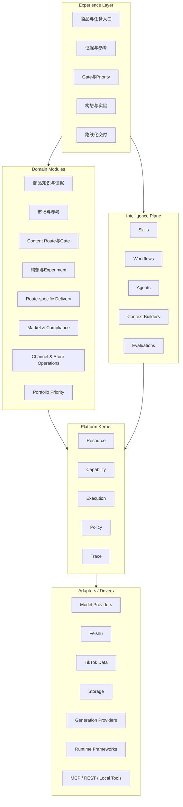
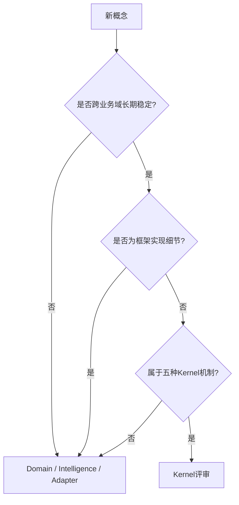

# 01_PLATFORM_ARCHITECTURE

## 1. 文档职责

本文档冻结软件承载业务的高层结构。

本次 v0.3 新增的 Gate、Route Hypothesis、Priority、Experiment Contract 和 Route-specific Pack 不改变 Platform Kernel 的五机制边界。

---

## 2. 四层架构

---

## 3. Platform Kernel

### Resource

- 稳定 ID。
- 类型和版本。
- 状态。
- 关系。
- 来源。
- 生命周期。

### Capability

- 输入输出 Schema。
- 版本。
- 权限。
- 风险。
- 成本策略。
- 实现引用。

### Execution

- Run。
- 同步 / 异步。
- 状态。
- 重试。
- 幂等。
- 父子运行。
- 人工等待。

### Policy

- 权限。
- Gate 审批。
- Override。
- 成本限制。
- 高风险动作限制。

### Trace

- 输入和 Context。
- Capability 和模型版本。
- Gate / Priority / Override。
- 输出和依赖。
- 成本和审批。

---

## 4. 新概念的架构位置

| 概念 | 所属层 |
|---|---|
| Gate Decision | Domain |
| Content Route Hypothesis | Domain |
| Project Priority | Domain |
| Experiment Contract | Domain |
| Route-specific Delivery Pack | Domain |
| Gate 审批执行 | Kernel Policy |
| Gate 运行记录 | Kernel Trace / Execution |
| Route 分支 Workflow | Intelligence Plane |
| Route Pack Builder | Capability |
| 第三方数据 | Adapter |

---

## 5. 架构边界判断

---

## 6. Intelligence Plane

- Skill：实现具体 Capability。
- Workflow：实现确定性或半确定性流程。
- Agent：在授权范围内动态选择 Capability。
- Context Builder：组装最小可信上下文。
- Evaluation：检查结构、事实、风险和可执行性。

AI Evaluation 不等于 Business Experiment Result。

---

## 7. Release 1 技术基线

- 前端：React + TypeScript。
- 后端：Python + FastAPI。
- 数据库：PostgreSQL。
- 对象存储：S3 / MinIO。
- 模块化单体。
- 结构化模型输出。
- 固定 Workflow 优先。
- Release 1 不强制 LangChain。
- Release 1 不强制 LangGraph。
- Release 1 不自研 Agent OS。

---

## 8. 当前不实现

- 通用 Gate Engine。
- 通用 Policy DSL。
- 通用 Portfolio Optimization Engine。
- 通用 Experiment Platform。
- 复杂多 Agent Runtime。
- 分布式 Workflow Engine。

首版应由领域 Application Service 实现清晰、有限的 Gate 和 Route 流程；重复稳定后再抽取。

Release 1A 使用 Kernel Lite，由真实 Product、Reference、Creative 和 Owned Pack 切片拉动。长期能力不提前抽象为通用平台，Platform Kernel 仍只保留 Resource、Capability、Execution、Policy、Trace 五机制。
