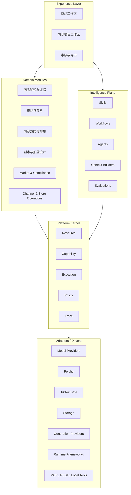
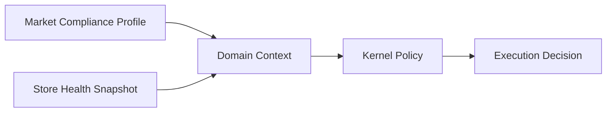
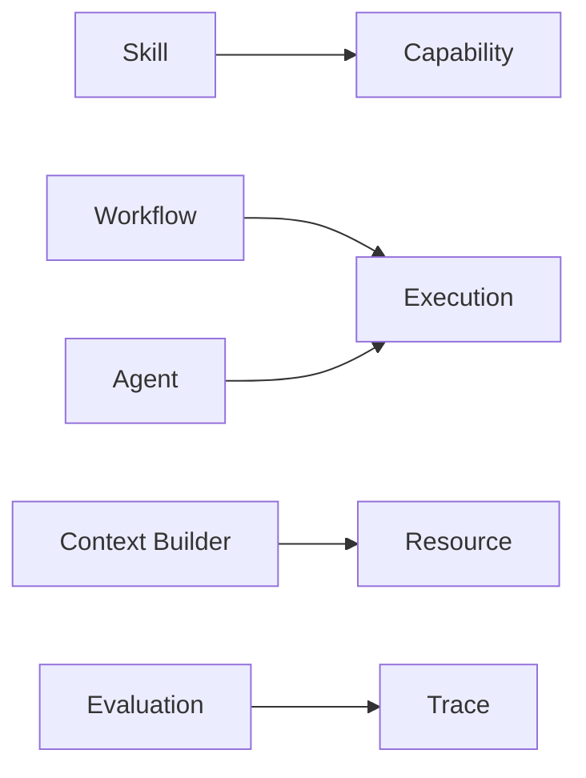
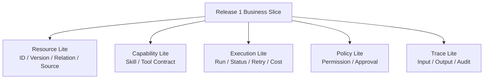

# 01_PLATFORM_ARCHITECTURE

## 1. 文档职责

本文档冻结软件承载业务的高层结构。

它回答：

- 哪些概念属于 Kernel。
- 哪些概念属于业务领域。
- Agent、Skill 和 Workflow 放在哪里。
- 市场政策和店铺状态属于哪里。
- LangChain、LangGraph、MCP 和模型供应商如何隔离。
- 当前 Release 需要实现多厚的 Kernel。

---

## 2. 四层架构



---

## 3. Platform Kernel

Kernel 只提供机制，不承载业务语义。

### 3.1 Resource

- 稳定 ID。
- 类型。
- 版本。
- 状态引用。
- 关系。
- 所有权。
- 生命周期。
- 归档。

### 3.2 Capability

声明可执行能力：

```text
capability_id
version
input_schema
output_schema
execution_mode
required_permissions
risk_level
cost_policy
implementation_ref
```

### 3.3 Execution

- Run。
- 同步与异步。
- 状态。
- 重试。
- 超时。
- 幂等。
- 暂停与恢复。
- 人工等待。
- 父子运行。

### 3.4 Policy

- 谁能做。
- 是否允许。
- 是否需要人工审批。
- 是否超出成本。
- 是否有外部副作用。
- 是否允许修改正式数据。

### 3.5 Trace

- 谁触发。
- 使用了什么输入和上下文。
- 调用了什么 Capability。
- 使用了什么模型或工具。
- 经过什么审批。
- 产生或修改哪些 Resource。

---

## 4. 市场政策与店铺状态的位置



原则：

```text
具体地区规则是什么
→ Market & Compliance Domain

店铺评分和账号状态是什么
→ Channel & Store Operations Domain

规则如何强制执行
→ Platform Kernel Policy
```

禁止把：

- US TikTok Policy。
- Store Rating。
- 违规积分。
- 类目禁售规则。

直接写进 Kernel。

---

## 5. Intelligence Plane



Agent 不得：

- 直接拥有主数据。
- 确认业务事实。
- 自动批准。
- 绕过 Policy。

---

## 6. 常见技术定位

| 技术 | 系统定位 | 是否进入 Kernel |
|---|---|---:|
| LangChain | Skill / Tool 开发框架 | 否 |
| LangGraph | Workflow / Agent Runtime | 否 |
| Agent Harness | Agent 运行外壳 | 否 |
| OpenAI / Claude Agent SDK | Runtime / Provider Adapter | 否 |
| MCP | Tool / Resource 连接协议 | 否 |
| RAG | Context Builder 策略 | 否 |
| 向量数据库 | Retrieval Adapter | 否 |
| Multi-Agent | 编排策略 | 否 |
| Human-in-the-loop | Policy + Execution 机制 | 是 |
| Checkpoint / Resume | Execution 机制 | 是 |
| Tracing | Trace 机制 | 是 |

---

## 7. Release 1 最小 Kernel



当前不需要：

- 通用 Checkpoint Engine。
- 通用 Policy DSL。
- 通用插件市场。
- 复杂多 Agent Runtime。
- 分布式 Workflow Engine。
- 全球政策规则引擎。
- 店铺实时事件流平台。

---

## 8. 技术基线

- 前端：React + TypeScript。
- 后端：Python + FastAPI。
- 数据库：PostgreSQL。
- 对象存储：S3 / MinIO。
- 模块化单体。
- 结构化模型输出。
- 固定 Workflow 优先。
- Release 1 不强制 LangChain。
- Release 1 不强制 LangGraph。
- Release 1 不自研 Agent OS。
