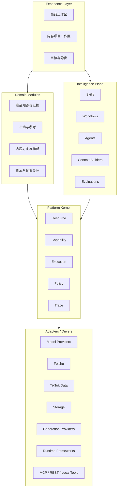
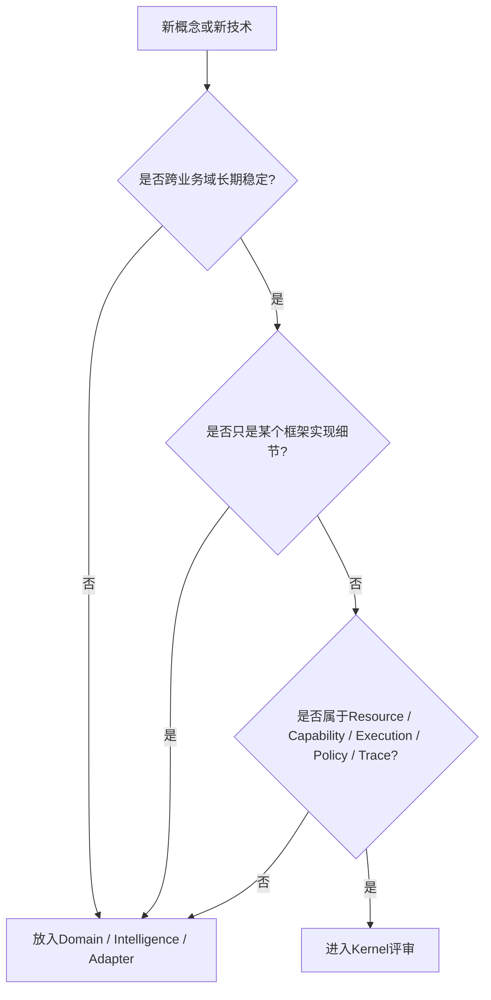
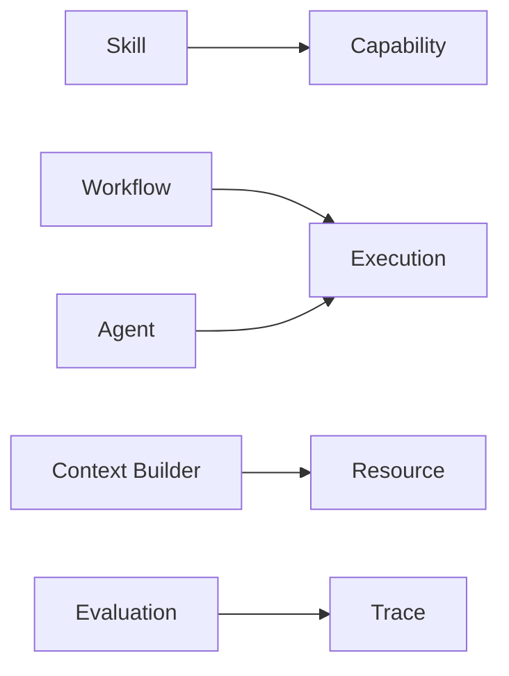
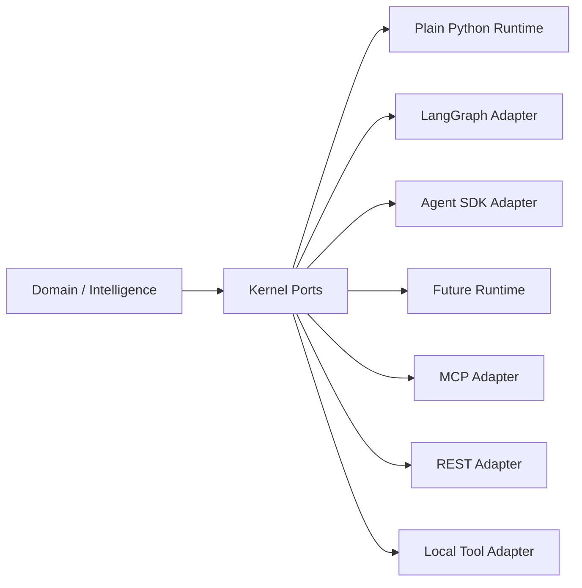
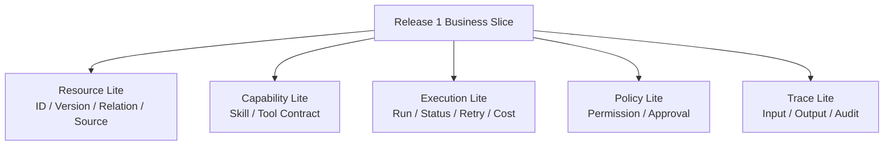
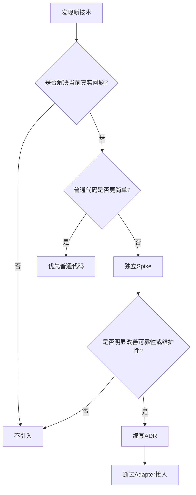

# 01_PLATFORM_ARCHITECTURE

## 1. 文档职责

本文档冻结软件承载业务的高层结构。

它回答：

- 哪些概念属于 Kernel。
- 哪些概念属于业务领域。
- Agent、Skill 和 Workflow 放在哪里。
- LangChain、LangGraph、MCP 和模型供应商如何隔离。
- 当前 Release 需要实现多厚的 Kernel。

它不冻结字段、表结构、API 和框架选型。

## 2. 四层架构



## 3. Platform Kernel

Kernel 只提供机制，不承载业务语义。

### 3.1 Resource

负责稳定 ID、类型、版本、状态引用、关系、所有权、生命周期和归档。

Kernel 不知道 Resource 是 Product 还是 Script。

### 3.2 Capability

负责声明可执行能力：

```text
capability_id
version
input_schema
output_schema
execution_mode
required_permissions
risk_level
cost_policy
implementation_ref
```

Capability 可以由普通代码、Skill、Tool、Workflow、MCP Tool 或外部服务实现。

### 3.3 Execution

负责 Run、同步与异步、状态、重试、超时、幂等、暂停与恢复、人工等待和父子运行。

### 3.4 Policy

负责谁能做、是否允许、是否需要人工审批、是否超出成本、是否有外部副作用和是否允许修改正式数据。

### 3.5 Trace

负责记录谁触发、使用什么输入与上下文、调用什么 Capability、使用什么模型或工具、成本、审批以及产生或修改哪些 Resource。

## 4. Kernel 判断标准



以下禁止进入 Kernel：

- Product、Evidence、Script、TikTok 等业务概念。
- LangGraph State。
- LangChain Memory。
- OpenAI Agent 对象。
- MCP Server 名称。
- Prompt 内容。
- 某供应商 API 字段。
- ORM 模型。

## 5. Intelligence Plane



- Skill：明确业务目的、输入输出、权限和评估标准的智能能力。
- Workflow：确定性或半确定性的步骤编排；流程清楚时优先使用。
- Agent：在授权范围内动态选择 Capability 的运行角色。
- Context Builder：按任务组装最小、可信、可追溯的上下文。
- Evaluation：评估结构合法性、事实一致性、可执行性、成本和人工反馈。

Agent 不是数据库所有者、业务事实确认者、审批者或 Kernel。

## 6. 常见 Agent 技术定位

| 技术 | 系统定位 | 是否进入 Kernel |
|---|---|---:|
| LangChain | Skill / Tool 开发框架 | 否 |
| LangGraph | Workflow / Agent Runtime | 否 |
| Agent Harness | Agent 运行外壳 | 否 |
| OpenAI / Claude Agent SDK | Runtime / Provider Adapter | 否 |
| MCP | Tool / Resource 连接协议 | 否 |
| RAG | Context Builder 策略 | 否 |
| 向量数据库 | Retrieval Adapter | 否 |
| Multi-Agent | 编排策略 | 否 |
| Human-in-the-loop | Policy + Execution 机制 | 是 |
| Checkpoint / Resume | Execution 机制 | 是 |
| Tracing | Trace 机制 | 是 |

## 7. 技术隔离结构



框架变化不能导致 Domain Model 和正式业务数据重构。

## 8. Release 1 最小 Kernel



当前不需要通用 Checkpoint Engine、通用 Policy DSL、通用插件市场、复杂多 Agent Runtime 或分布式 Workflow Engine。

## 9. 技术引入流程



## 10. 当前技术基线

- 模块化单体。
- PostgreSQL。
- 对象存储。
- 明确模块边界。
- 结构化模型输出。
- 固定 Workflow 优先。
- 简单异步任务按需加入。
- Release 1 不强制 LangChain。
- Release 1 不强制 LangGraph。
- Release 1 不自研 Agent OS。
