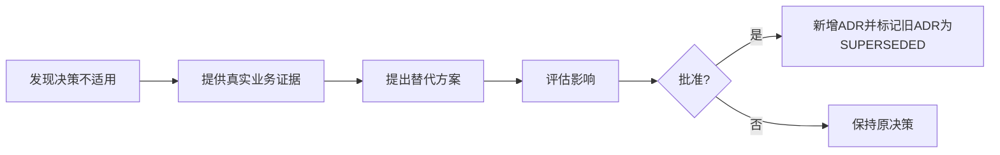

# 02_ARCHITECTURE_DECISIONS

## 1. 文档职责

本文档记录已形成的关键架构和业务架构决策。

状态：

- PROPOSED。
- ACCEPTED。
- SUPERSEDED。
- REJECTED。

本版本中 ADR-016～ADR-020 已在原则层面接受，但字段和实现仍未冻结。

---

## 2. ADR 总览

| ADR | 决策 | 状态 |
|---|---|---|
| ADR-001 | 使用模块化单体 | ACCEPTED |
| ADR-002 | Kernel 仅保留五类机制 | ACCEPTED |
| ADR-003 | 业务语义放入 Domain | ACCEPTED |
| ADR-004 | Agent 属于 Intelligence Plane | ACCEPTED |
| ADR-005 | Agent 框架通过 Adapter 隔离 | ACCEPTED |
| ADR-006 | Release 1 不强制 LangChain / LangGraph | ACCEPTED |
| ADR-007 | 固定 Workflow 优先于自由 Agent | ACCEPTED |
| ADR-008 | AI 默认只能产生草稿 | ACCEPTED |
| ADR-009 | 当前不自研通用 Agent OS | ACCEPTED |
| ADR-010 | Release 1 从业务链中段开始 | ACCEPTED |
| ADR-011 | Kernel Contract 先定义，Implementation 按需生长 | ACCEPTED |
| ADR-012 | 结构化关系优先于全量 RAG | ACCEPTED |
| ADR-013 | Release 1 必须接收 Selection-to-Content Handoff | ACCEPTED |
| ADR-014 | Market Compliance 与 Store Health 属于 Domain Context | ACCEPTED |
| ADR-015 | Content Project 必须绑定运营上下文快照 | ACCEPTED |
| ADR-016 | 每个阶段必须有正式 Gate Decision | ACCEPTED |
| ADR-017 | Content Route 必须建模为可验证假设 | ACCEPTED |
| ADR-018 | 不同 Route 产生不同 Delivery Pack | ACCEPTED |
| ADR-019 | Release 1 提供 Priority Lite | ACCEPTED |
| ADR-020 | Experiment Contract 必须在 Release 1 创建 | ACCEPTED |
| ADR-021 | 采用 Release 1A MVP 与 Long-term Evolution Backlog 双轨推进 | ACCEPTED |

---

## ADR-001～ADR-015

沿用 v0.2 已接受原则：

- 模块化单体。
- 五机制 Kernel。
- Domain / Intelligence / Adapter 分层。
- AI 草稿与人工审批分离。
- Release 1 接收 Handoff、Market 和 Store Context。
- 当前不自研通用 Agent OS。

---

## ADR-016：每个阶段必须有正式 Gate Decision

### Context

原流程默认项目会一路走到剧本，缺少停止、暂停、补证据和改路线的正式出口。

### Decision

Stage 0～C 后均设置 Gate。

允许结果：

```text
CONTINUE
PAUSE
STOP
CHANGE_ROUTE
REQUEST_MORE_EVIDENCE
RECYCLE
```

### Consequences

- 项目不再默认完成全流程。
- Gate 决策必须记录责任人、依据和条件。
- AI 可提供建议，但不能自动通过 Gate。
- 需要 Override 和重新评估机制。

### Status

ACCEPTED

---

## ADR-017：Content Route 必须建模为可验证假设

### Context

单独保存 `CREATOR_LED` 等标签无法支持后续验证和复盘。

### Decision

Content Route Hypothesis 必须记录：

- Rationale。
- Supporting / Contrary Evidence。
- Assumptions。
- Validation Plan。
- Success Criteria。
- Stop Conditions。
- Owner。
- Review Date。

### Consequences

- Route 可以被推翻和修改。
- Release 3 可以将表现结果关联回原始假设。
- 当前不引入伪精确综合评分。

### Status

ACCEPTED

---

## ADR-018：不同 Route 产生不同 Delivery Pack

### Context

统一 Script、Storyboard、Shot List 隐性假设所有商品都走自营内容路线。

### Decision

按 Primary Route 生成：

- Creator Enablement Pack。
- Owned Content Production Pack。
- Paid Media Test Pack。
- Listing / Search Content Pack。
- Live Content Pack。
- Hybrid Delivery Bundle。

### Consequences

- Stage D 更名为“路线化内容交付设计”。
- Script 仍是 Owned Content 的核心产物，但不再代表 Release 1 唯一终点。
- 需要 Route-specific Capability 和审核标准。

### Status

ACCEPTED

---

## ADR-019：Release 1 提供 Priority Lite

### Context

单个项目可行不等于当前应该优先投入。

### Decision

Release 1 增加轻量 Priority：

```text
MUST_DO
NEXT
EXPERIMENTAL
HOLD
STOPPED
```

采用：

```text
硬性Gate
+
人工优先级
+
简单辅助指标
+
明确决策理由
```

### Consequences

- 不建设完整 Portfolio Optimization 平台。
- 不使用自动综合分数替代人类决策。
- Gate 与 Priority 分开。

### Status

ACCEPTED

---

## ADR-020：Experiment Contract 必须在 Release 1 创建

### Context

没有预先定义假设和成功标准，后续数据容易被事后解释。

### Decision

Approved Creative Direction 在投入生产前必须绑定 Experiment Contract。

至少定义：

- Business Question。
- Hypothesis。
- Variable Under Test。
- Metrics。
- Baseline。
- Observation Window。
- Success / Stop Rule。
- Next Action。

### Consequences

- Release 1 负责定义，不负责收集结果。
- Release 3 负责回收数据和形成 Experiment Result。
- Skill Evaluation 与 Business Outcome 必须分开。

### Status

ACCEPTED

---

## ADR-021：采用 Release 1A MVP 与 Long-term Evolution Backlog 双轨推进

### Context

当前设计不断细化 Gate、Route、Priority、Experiment，已经开始阻塞真实代码和业务验证。

### Decision

先实现 Release 1A MVP。复杂机制进入 Evolution Backlog。当前只保留轻量兼容结构。

未来通过真实商品和运营数据触发重新设计。只有批准的 Implementation Scope 构成开发授权。

### Consequences

正向：

- 更快进入真实 Pilot。
- 减少过度设计。
- 长期问题不会丢失。
- 架构仍保留可演进空间。

代价：

- 第一版部分流程依赖人工判断。
- 后期可能需要迁移和重构。
- 必须持续维护 Evolution Backlog。
- 不能把 MVP 临时规则误认为最终模型。

### Status

ACCEPTED

---

## 3. ADR 变更流程


