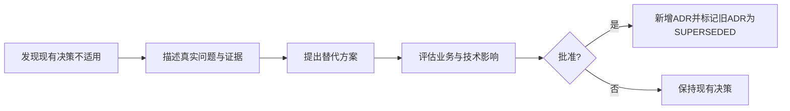

# 02_ARCHITECTURE_DECISIONS

## 1. 文档职责

本文档记录已经形成的关键架构决定。

状态说明：

- `PROPOSED`
- `ACCEPTED`
- `SUPERSEDED`
- `REJECTED`

当前为基线候选。

---

## ADR 总览

| ADR | 决策 | 状态 |
|---|---|---|
| ADR-001 | 使用模块化单体 | PROPOSED |
| ADR-002 | Platform Kernel 仅保留五类机制 | PROPOSED |
| ADR-003 | 业务语义放入 Domain Modules | PROPOSED |
| ADR-004 | Agent 属于 Intelligence Plane | PROPOSED |
| ADR-005 | Agent 框架通过 Runtime Adapter 隔离 | PROPOSED |
| ADR-006 | Release 1 不强制 LangChain / LangGraph | PROPOSED |
| ADR-007 | 固定 Workflow 优先于自由 Agent | PROPOSED |
| ADR-008 | AI 默认只能产生草稿 | PROPOSED |
| ADR-009 | 当前不自研通用 Agent OS | PROPOSED |
| ADR-010 | Release 1 从业务链中段开始 | PROPOSED |
| ADR-011 | Kernel Contract 先定义，Implementation 按需生长 | PROPOSED |
| ADR-012 | 结构化关系优先于全量 RAG | PROPOSED |
| ADR-013 | Release 1 必须接收 Selection-to-Content Handoff | PROPOSED |
| ADR-014 | Market Compliance 与 Store Health 属于 Domain Context | PROPOSED |
| ADR-015 | Content Project 必须绑定运营上下文快照 | PROPOSED |

---

## ADR-001：使用模块化单体

**Decision**

采用模块化单体。

**Reason**

当前业务边界仍在验证，不需要微服务复杂度。

**Consequences**

未来按真实瓶颈拆分。

**Status**

PROPOSED

---

## ADR-002：Platform Kernel 仅保留五类机制

**Decision**

Kernel 仅包含：

- Resource。
- Capability。
- Execution。
- Policy。
- Trace。

**Status**

PROPOSED

---

## ADR-003：业务语义放入 Domain Modules

商品、证据、参考、构想、剧本、市场政策和店铺状态都属于 Domain。

**Status**

PROPOSED

---

## ADR-004：Agent 属于 Intelligence Plane

Agent 是受控运行角色，不是 Kernel。

**Status**

PROPOSED

---

## ADR-005：Agent 框架通过 Runtime Adapter 隔离

LangGraph、Agent SDK、Agent Harness 等不得污染 Domain Model。

**Status**

PROPOSED

---

## ADR-006：Release 1 不强制 LangChain / LangGraph

默认普通 Python Application Service、结构化模型调用和固定 Workflow。

**Status**

PROPOSED

---

## ADR-007：固定 Workflow 优先于自由 Agent

流程已知的任务优先使用确定性或半确定性 Workflow。

**Status**

PROPOSED

---

## ADR-008：AI 默认只能产生草稿

```text
AI_GENERATED = true
HUMAN_CONFIRMED = false
STATUS = DRAFT
```

**Status**

PROPOSED

---

## ADR-009：当前不自研通用 Agent OS

不建设通用 Agent Runtime、插件市场、自由多 Agent 通信和复杂记忆平台。

**Status**

PROPOSED

---

## ADR-010：Release 1 从业务链中段开始

```text
商品事实与证据
→ 市场与参考内容
→ 内容方向与视频构想
→ 剧本与拍摄设计
```

**Status**

PROPOSED

---

## ADR-011：Kernel Contract 先定义，Implementation 按需生长

只实现当前垂直切片需要的 Kernel Lite。

**Status**

PROPOSED

---

## ADR-012：结构化关系优先于全量 RAG

事实、状态、版本和对象关系使用关系数据库和显式关联。

**Status**

PROPOSED

---

## ADR-013：Release 1 必须接收 Selection-to-Content Handoff

**Context**

不能把选品输出简化为 Product ID。

**Decision**

Release 1 的入口必须包括：

- Go-to-Market Hypothesis。
- Content Route Hypothesis。
- Target Market。
- Initial Investment Level。
- Test Hypothesis。

**Consequences**

完整选品模块可以后置，但上游关键决策不能丢失。

**Status**

PROPOSED

---

## ADR-014：Market Compliance 与 Store Health 属于 Domain Context

**Decision**

- Market Compliance Profile 属于 Market & Compliance Domain。
- Store Health Snapshot 属于 Channel & Store Operations Domain。
- Kernel Policy 只执行规则，不拥有规则内容。

**Status**

PROPOSED

---

## ADR-015：Content Project 必须绑定运营上下文快照

**Decision**

Content Project 至少绑定：

- Content Route Hypothesis。
- Target Market。
- Compliance Profile Version。
- Store Health Snapshot。
- Channel Account Context。

**Reason**

保证后续能解释当时为什么选择该内容路线。

**Status**

PROPOSED

---

## ADR 变更流程


