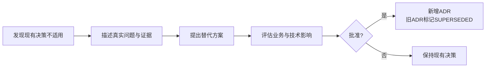

# 02_ARCHITECTURE_DECISIONS

## 1. 文档职责

本文档记录已经形成的关键架构决定。

状态说明：

- `PROPOSED`：待评审。
- `ACCEPTED`：已接受并进入基线。
- `SUPERSEDED`：被后续 ADR 替代。
- `REJECTED`：明确拒绝。

当前所有条目为基线候选。六份一级文档评审通过后统一转为 `ACCEPTED`。

## 2. ADR 总览

| ADR | 决策 | 状态 |
|---|---|---|
| ADR-001 | 使用模块化单体 | PROPOSED |
| ADR-002 | Platform Kernel 仅保留五类机制 | PROPOSED |
| ADR-003 | 业务语义放入 Domain Modules | PROPOSED |
| ADR-004 | Agent 属于 Intelligence Plane | PROPOSED |
| ADR-005 | Agent 框架通过 Runtime Adapter 隔离 | PROPOSED |
| ADR-006 | Release 1 不强制 LangChain / LangGraph | PROPOSED |
| ADR-007 | 固定 Workflow 优先于自由 Agent | PROPOSED |
| ADR-008 | AI 默认只能产生草稿 | PROPOSED |
| ADR-009 | 当前不自研通用 Agent OS | PROPOSED |
| ADR-010 | Release 1 从业务链中段开始 | PROPOSED |
| ADR-011 | Kernel Contract 先定义，Implementation 按需生长 | PROPOSED |
| ADR-012 | 结构化关系优先于全量 RAG | PROPOSED |

## ADR-001：使用模块化单体

**Context**

当前业务边界仍在验证，团队规模和流量尚不足以支撑微服务复杂度。

**Decision**

前后端采用模块化单体。通过清晰模块边界隔离 Domain、Intelligence Plane、Kernel 和 Adapters。

**Reason**

- 降低部署和调试成本。
- 支持快速调整业务模型。
- 避免分布式一致性和接口治理负担。

**Consequences**

未来出现明确瓶颈时，可以按模块拆分，但当前不预设微服务。

**Status**：PROPOSED

## ADR-002：Platform Kernel 仅保留五类机制

**Decision**

Kernel 仅包含 Resource、Capability、Execution、Policy 和 Trace。

**Reason**

这些是跨业务域、跨框架、长期稳定的机制。

**Consequences**

Product、Evidence、Script、Agent、LangGraph 等不得进入 Kernel。

**Status**：PROPOSED

## ADR-003：业务语义放入 Domain Modules

**Decision**

商品、证据、参考、构想、剧本和发布等全部由 Domain Modules 定义。

**Reason**

业务语义变化频繁，不应污染稳定 Kernel。

**Consequences**

Domain Module 必须通过 Kernel Contract 使用资源、执行、策略和追踪机制。

**Status**：PROPOSED

## ADR-004：Agent 属于 Intelligence Plane

**Decision**

Agent 是受控运行角色，不是 Kernel 组成部分。

**Reason**

Agent 技术和规划策略变化快；固定 Workflow 和普通代码同样可以使用 Kernel。

**Consequences**

Agent 不得直接拥有主数据、批准业务状态或绕过 Policy。

**Status**：PROPOSED

## ADR-005：Agent 框架通过 Runtime Adapter 隔离

**Decision**

LangGraph、Agent SDK、Agent Harness 和未来框架均通过 Runtime Adapter 接入。

**Reason**

避免业务对象和运行记录被特定框架绑定。

**Consequences**

业务层只依赖 Capability / Execution Ports。

**Status**：PROPOSED

## ADR-006：Release 1 不强制 LangChain / LangGraph

**Decision**

Release 1 默认使用普通 Python Application Service、结构化模型调用和固定 Workflow。

**Reason**

当前业务流程尚在验证，框架价值尚未通过真实复杂度证明。

**Consequences**

出现复杂分支、暂停恢复和长任务需求后，再通过 Spike 与 ADR 评估 LangGraph。

**Status**：PROPOSED

## ADR-007：固定 Workflow 优先于自由 Agent

**Decision**

流程已知的任务使用确定性或半确定性 Workflow。

**Reason**

固定 Workflow 更易测试、追踪、控制成本和承担责任。

**Consequences**

只有确实需要动态工具选择和规划时，才引入 Agent。

**Status**：PROPOSED

## ADR-008：AI 默认只能产生草稿

**Decision**

所有 AI 输出默认：

```text
AI_GENERATED = true
HUMAN_CONFIRMED = false
STATUS = DRAFT
```

**Reason**

防止模型输出被误当成商品事实或正式业务决定。

**Consequences**

正式事实、批准构想、正式剧本和对外发布必须经过人工或明确规则确认。

**Status**：PROPOSED

## ADR-009：当前不自研通用 Agent OS

**Decision**

不建设通用 Agent Runtime、插件市场、自由多 Agent 通信和复杂记忆平台。

**Reason**

当前目标是交付内容决策与前期制作业务闭环，而不是研发通用平台。

**Consequences**

只实现 Release 1 真实需要的最小 Kernel 和 Intelligence Plane。

**Status**：PROPOSED

## ADR-010：Release 1 从业务链中段开始

**Decision**

当前从：

```text
商品事实与证据
→ 市场与参考内容
→ 内容方向与视频构想
→ 剧本与拍摄设计
```

开始。

**Reason**

这是当前团队最紧迫、最能形成独立价值的业务切片。

**Consequences**

商品机会、立项、生产、发布和反馈先通过人工或外部系统衔接。

**Status**：PROPOSED

## ADR-011：Kernel Contract 先定义，Implementation 按需生长

**Decision**

先冻结 Kernel 的抽象边界，不提前实现完整通用 Kernel。

**Reason**

脱离真实业务实现平台，容易陷入 Platform-first Trap。

**Consequences**

Release 1 只实现 Resource Lite、Capability Lite、Execution Lite、Policy Lite 和 Trace Lite。

**Status**：PROPOSED

## ADR-012：结构化关系优先于全量 RAG

**Decision**

明确事实、状态、版本和对象关系优先使用关系数据库和显式关联。

**Reason**

商品事实、证据和审核需要准确、可追溯，不应依赖模糊语义召回。

**Consequences**

RAG 和向量检索只用于非结构化资料搜索、相似参考、历史 Learning 等明确场景。

**Status**：PROPOSED

## 3. ADR 变更流程


