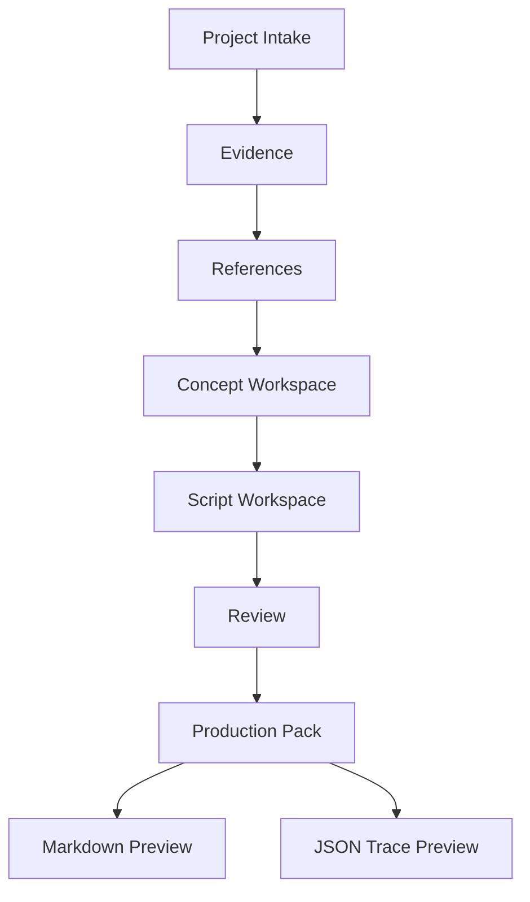
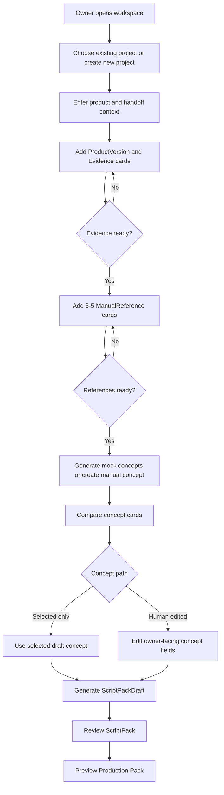
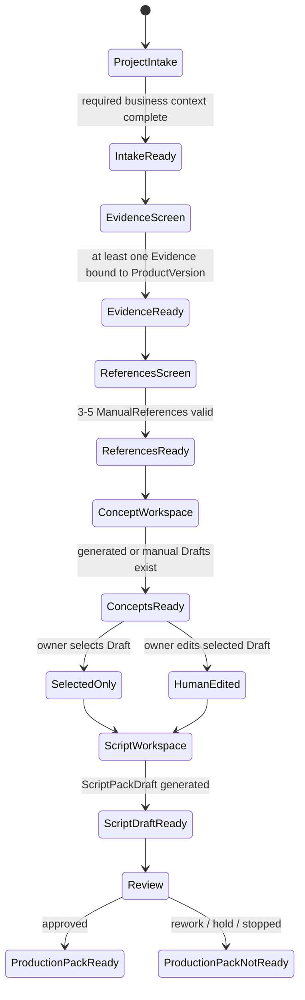

# Minimum Workspace Screen Spec

This screen spec supports the next planning note, [../working/NEXT_ITERATION_MINIMUM_WORKSPACE.md](../working/NEXT_ITERATION_MINIMUM_WORKSPACE.md). It is a UX/workflow design document only. It does not authorize backend code, tests, database persistence, API implementation, formal frontend implementation, AI provider integration, RAG, Agent Runtime, Workflow Engine, TikTok Search, or generation orchestration.

The purpose is to define the Minimum Usable Workspace before any frontend or persistence work begins.

## 1. Design Principle

The workspace must not be a generated UI over backend objects.

Backend concepts such as `ContentProject`, `ProductVersion`, `Evidence`, `KnowledgePack`, `ManualReference`, `CreativeConceptDraft`, `ScriptPackDraft`, `ReviewDecision`, and `ProductionPackExport` matter because they preserve business meaning and traceability. They should not become the visible navigation model.

The visible navigation model should be owner/operator work:

```text
Intake -> Evidence -> References -> Concepts -> Script -> Review -> Production Pack
```

## 2. Screen Flow



## 3. User Flow



## 4. State Machine



## 5. Screen Structure

### Project Intake

Primary task:

- create or select a `ContentProject`.
- enter business handoff context.
- define product and current `ProductVersion`.

Primary fields:

- project name.
- target market.
- platform.
- content objective.
- selection rationale.
- test question.
- product name.
- product version label.
- product context summary.
- handoff summary.

Hidden by default:

- `ContentProject.id`.
- `Product.id`.
- `ProductVersion.id`.

Next action:

- disabled until required handoff context and ProductVersion label exist.

### Evidence

Primary task:

- add source material scoped to the current `ProductVersion`.

UI shape:

- card-based Evidence input.
- one card per Evidence item.
- visible source, category, summary, and optional collected date.

Trace panel:

- shows `Evidence.id` and `ProductVersion.id`.

Next action:

- disabled until at least one Evidence card is valid.

### References

Primary task:

- enter 3-5 `ManualReference` items.

UI shape:

- card-based Reference input.
- required cards for Reference 1-3.
- optional cards for Reference 4-5.

Visible fields:

- title.
- source URL or source identifier.
- platform/source type.
- summary.
- observed pattern.
- content notes.
- usage notes.

Hidden/fixed:

- intake method is fixed to manual.
- project and ProductVersion bindings are generated from current context.

Next action:

- disabled unless reference count is 3-5 and all visible business fields are valid.

### Concept Workspace

Primary task:

- generate deterministic/mock concept drafts or create owner manual concept.
- compare concept cards.
- select one concept.
- optionally edit owner-facing fields.

UI shape:

- concept comparison cards.
- each card shows angle, title, hook, rationale, draft status, generation method.
- selected concept is visually distinct.

Paths:

- selected-only path: selected Draft goes directly to Script Workspace.
- human-edited path: owner edits angle/title/hook/rationale before Script Workspace.

Hidden by default:

- `CreativeConceptDraft.id`.
- evidence refs.
- manual reference refs.
- KnowledgePack id/version.

Next action:

- disabled until exactly one concept is selected.

### Script Workspace

Primary task:

- generate and inspect `ScriptPackDraft`.

Visible sections:

- script.
- storyboard.
- shot list.
- target duration.
- aspect ratio.
- visual requirements.
- asset requirements.
- generation notes.
- risk notes.

Trace panel:

- `ScriptPackDraft.id`.
- selected concept id.
- evidence refs.
- manual reference refs.
- KnowledgePack id/version.

Next action:

- disabled until a ScriptPackDraft exists.

### Review

Primary task:

- record human `ReviewDecision`.

Allowed decisions:

- approved.
- rework.
- hold.
- stopped.

Visible fields:

- decision.
- reviewer note.

Rule:

- approved maps to `generation_ready`.
- rework, hold, and stopped map to `not_generation_ready`.

Next action:

- disabled until reviewer note and decision exist.

### Production Pack

Primary task:

- preview final `ProductionPackExport`.

UI shape:

- export preview tabs:
  - Markdown.
  - JSON trace.

Markdown tab:

- optimized for human production handoff.
- readable without inspecting raw IDs first.

JSON tab:

- system-readable trace preview.
- inspectable but not primary UI.

Trace panel:

- project id.
- ProductVersion id.
- evidence refs.
- manual reference refs.
- selected concept id.
- ScriptPackDraft id.
- ReviewDecision.
- production readiness.

## 6. Information Hierarchy

Primary UI:

- owner decisions.
- business context.
- evidence summaries.
- reference patterns.
- concept comparison.
- script content.
- review decision.
- production handoff preview.

Secondary UI:

- generated IDs.
- trace refs.
- raw JSON.
- internal object names.

The owner should never need to understand every backend object field to move to the next step.

## 7. UX Rules

The workspace must follow these rules:

- no giant all-fields form.
- no backend-object CRUD layout.
- progressive disclosure by task readiness.
- card-based Evidence input.
- card-based ManualReference input.
- concept comparison cards.
- clear selected-only and human-edited paths.
- export preview tabs.
- disabled next-step actions until prerequisites are satisfied.
- system IDs hidden by default.
- trace refs available in collapsible debug/review panel.
- owner-facing labels use business language, not code variable names.

## 8. Explicit Out-of-Scope

This screen spec does not authorize:

- FastAPI unless later explicitly approved.
- database implementation.
- formal React frontend.
- AI provider integration.
- RAG.
- prompt system.
- TikTok Search.
- Agent Runtime.
- Workflow Engine.
- Gate Engine.
- Platform Kernel.
- GenerationPlan, RenderBatch, RenderJob.
- ComfyUI, Seedance, Kling, or generation orchestration.

## 9. Acceptance Criteria

The UX spec is acceptable when:

- owner can understand what to do next on each screen.
- each screen has one primary task.
- trace is available but not primary UI.
- Markdown export is readable as production handoff.
- JSON export is inspectable as system trace.
- selected-only and human-edited concept paths are both represented.
- prerequisites and disabled next-step actions are explicit.
- the spec does not imply backend persistence, API, formal frontend, AI, RAG, Agent Runtime, Workflow Engine, TikTok Search, or generation orchestration.

## 10. Implementation Review Checklist

Before any implementation task begins, review:

- [../working/NEXT_ITERATION_MINIMUM_WORKSPACE.md](../working/NEXT_ITERATION_MINIMUM_WORKSPACE.md).
- [../working/ACTIVE_ITERATION.md](../working/ACTIVE_ITERATION.md).
- whether the task starts from owner/operator work rather than backend fields.
- whether it preserves `ProductVersion`-scoped `Evidence`.
- whether it keeps trace secondary but inspectable.
- whether it avoids formal frontend or persistence unless explicitly approved later.
