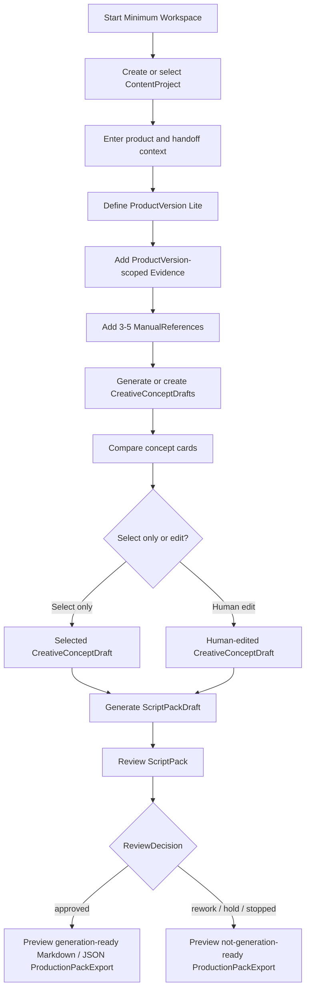
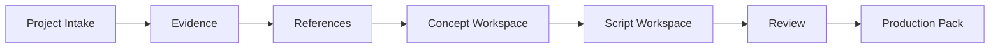
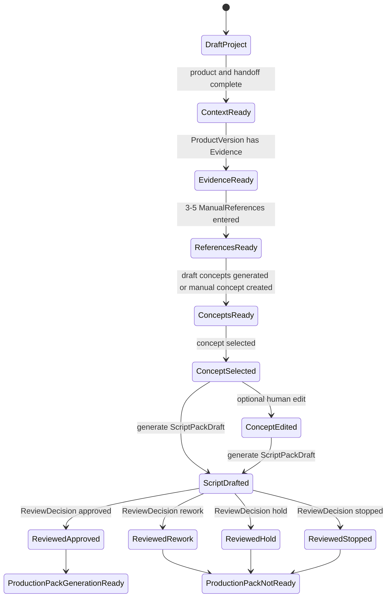

# Next Iteration: Minimum Usable Workspace

This is a planning note for the next iteration after the verified WS-0 + WS-1 car vacuum cleaner walking skeleton. It is design/documentation only. It does not authorize code, persistence, frontend implementation, AI integration, RAG, Agent Runtime, Workflow Engine, TikTok Search, or generation orchestration.

Related documents:

- [ACTIVE_ITERATION.md](ACTIVE_ITERATION.md)
- [../01_MVP_WALKING_SKELETON.md](../01_MVP_WALKING_SKELETON.md)
- [../02_DOMAIN_MODEL.md](../02_DOMAIN_MODEL.md)
- [../ux/MINIMUM_WORKSPACE_SCREEN_SPEC.md](../ux/MINIMUM_WORKSPACE_SCREEN_SPEC.md)

## 1. Iteration Intent

The next iteration should be the Minimum Usable Workspace.

It is not a formal product frontend. It is not a backend expansion. It is a workflow and UX definition step that turns the verified in-memory chain into an owner-usable workspace shape.

The current Streamlit smoke harness proves the flow works, but it is still a development harness. A naive UI generated from backend domain objects would become an all-fields CRUD surface. That would not help the owner make content decisions.

The Minimum Usable Workspace must start from owner/operator tasks:

- What does the owner need to decide now?
- What input is needed to move forward?
- What trace should be visible now?
- What trace can stay hidden until debugging or review?
- What action should be disabled until prerequisites are satisfied?

It must not start from backend fields, database tables, or object CRUD screens.

## 2. Current Verified Baseline

Current implemented capability from the completed walking skeleton:

- `ContentProject` creation from Selection-to-Content Handoff.
- `ProductVersion`-scoped `Evidence`.
- `KnowledgePack v0.1`.
- 3-5 `ManualReference` inputs.
- 3 deterministic/mock `CreativeConceptDraft` items.
- owner manual concept creation.
- concept selection and optional human edit.
- deterministic/mock `ScriptPackDraft`.
- `ReviewDecision`.
- in-memory Markdown and JSON-compatible `ProductionPackExport`.
- E2E acceptance test through approved Production Pack export.
- local Streamlit full smoke harness manually validated by owner.

This baseline is sufficient to design a usable workspace. It is not sufficient to start broad product frontend implementation.

## 3. Primary User Tasks

The Minimum Usable Workspace must support these owner/operator tasks in order:

1. Create or select a content project.
2. Enter product and handoff context.
3. Enter `ProductVersion` and `Evidence`.
4. Enter 3-5 `ManualReference` items.
5. Generate, create, select, and edit `CreativeConceptDraft`.
6. Generate `ScriptPackDraft`.
7. Review `ScriptPackDraft`.
8. Preview Markdown and JSON-compatible `ProductionPackExport`.

Each task should answer "what is missing before I can continue?" without requiring the owner to inspect raw backend fields.

## 4. User Flow

## 5. Screen Flow

Screen ownership:

- Project Intake: business context and ProductVersion setup.
- Evidence: source material for the ProductVersion.
- References: manual inspiration and pattern inputs.
- Concept Workspace: generation/create/select/edit concept decisions.
- Script Workspace: draft script pack preview and regeneration boundary.
- Review: human decision and reviewer notes.
- Production Pack: Markdown / JSON preview and trace inspection.

## 6. State Machine

## 7. Information Hierarchy

Primary visible information:

- project name and content objective.
- product name and current sample/version.
- evidence summary, source, and category.
- manual reference title, source, observed pattern, and usage notes.
- concept angle, hook, rationale, and draft status.
- script, storyboard, shot list, visual requirements, asset requirements, risk notes.
- review decision and reviewer note.
- Markdown production handoff preview.

Hidden by default:

- system-generated IDs.
- full trace refs.
- raw JSON structures.
- ProductVersion and KnowledgePack internal IDs.

Always available in collapsible debug/review panels:

- `ContentProject.id`.
- `ProductVersion.id`.
- `Evidence` refs.
- `ManualReference` refs.
- `KnowledgePack.id` and version.
- selected concept id and generation method.
- `ScriptPackDraft.id`.
- `ReviewDecision` trace.
- JSON-compatible `ProductionPackExport`.

## 8. UX Rules

The Minimum Usable Workspace must follow these rules:

- No giant all-fields form.
- No backend-object CRUD layout.
- Start screens from owner/operator tasks, not dataclass or database fields.
- Use progressive disclosure.
- Use card-based `Evidence` and `ManualReference` input.
- Use concept comparison cards.
- Use clear disabled next-step actions until prerequisites are satisfied.
- Keep system IDs hidden by default.
- Keep trace refs visible in a collapsible debug panel.
- Use export preview tabs for Markdown and JSON.
- Separate selected-only and human-edited concept paths.
- Make draft, approved, rework, hold, and stopped status visible at decision points.

## 9. Explicitly Out of Scope

This next iteration planning does not authorize:

- FastAPI unless later explicitly approved.
- database implementation.
- formal React frontend.
- AI provider integration.
- RAG.
- prompt system.
- TikTok Search.
- Agent Runtime.
- Workflow Engine.
- Gate Engine.
- Platform Kernel.
- GenerationPlan, RenderBatch, RenderJob.
- ComfyUI, Seedance, Kling, or generation orchestration.

## 10. Acceptance Criteria for This UX Planning Step

This planning step is acceptable when:

- owner can understand what to do next on each screen.
- the flow starts from tasks, not backend field lists.
- trace is available but not the primary UI.
- Markdown export is readable as production handoff.
- JSON export is inspectable as system trace.
- selected-only and human-edited concept paths are both represented.
- disabled actions and prerequisites are defined.
- out-of-scope implementation remains explicit.

## 11. What To Review Before Any Implementation

Before any implementation task is approved, review:

- whether the task matches [../ux/MINIMUM_WORKSPACE_SCREEN_SPEC.md](../ux/MINIMUM_WORKSPACE_SCREEN_SPEC.md).
- whether the implementation can stay local/minimum without formal frontend or persistence.
- whether the owner can complete the task without seeing backend object CRUD.
- whether the task preserves `ProductVersion`-scoped `Evidence`.
- whether `CreativeConceptDraft` and `ScriptPackDraft` remain draft until human review.
- whether export trace remains inspectable.

No implementation should begin from this document alone. A later human instruction must authorize each concrete step.
